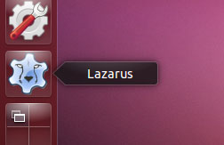
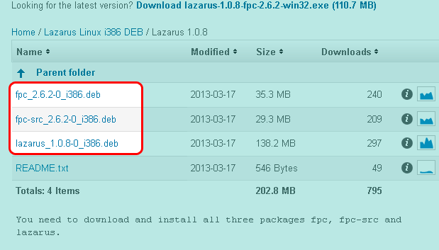
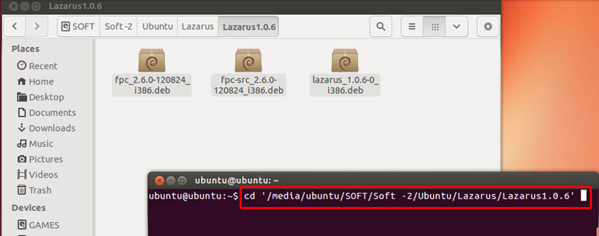
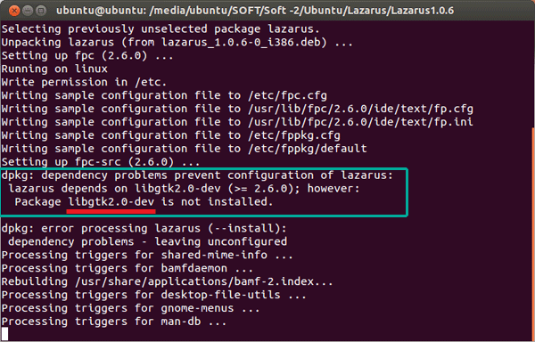
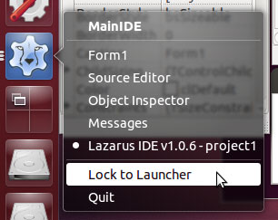

Ubuntu 13.04 has been released recently but its repo has an outdated version of Lazarus (0.9.30.4). Lazarus is at version 1.0.8 stable with FPC 2.6.2. This guide serves you as an installation guide to having the best of both worlds. Learn how to get the Latest Lazarus running in your latest Ubuntu.
<!-- more -->
  
  
[Ubuntu 13.04 (Raring Ringtail)](http://releases.ubuntu.com/13.04/) has been [released](https://wiki.ubuntu.com/RaringRingtail/ReleaseNotes) recently with some mouth watering features. Also as a fan of Lazarus Project, I presume that you want to use Lazarus 1.0.8 in your new installation. We look at the way you can easily install the latest Lazarus version in your latest Ubuntu and hopefully in Xubuntu, Lubuntu or Linux Mint too with slight modification of this guide.  
  

> As you know that [Lazarus 1.0.10 has been released](http://lazplanet.blogspot.com/2013/06/lazarus-1010-with-fpc-262-released.html) a few days ago. This guide can also be used to install this newer version, 1.0.10 in \*Ubuntu. So carry on...!

  

### Why use Lazarus on Ubuntu or any Linux?

Lazarus is really impressive at creating dependency-free executables. I have created a modem connect GUI application, with Lazarus. It runs on every linux imaginable- Lubuntu, Xubuntu, Linux Mint, Knoppix, Debian LXDE, Puppy Linux, Slitaz and more. You just compile once and forget about dependencies and run the same software on different distros without recompiling. That's just so cool!  
  
And to be more cool, the same project (or code) can be compiled in Other Operating Systems, Windows, MacOS, Raspbian etc. If you don't use OS dependent code then you don't even need to touch the code. Roughly 90% of the code found on the internet can be cross-compiled on supported platforms without change. For the 10% that needs change, you can just add in a {$IFDEF ...}{$ENDIF} line to detect platforms and exclude some parts from compiling it or write a workaround for the code.  
  
You can [learn more about Multi-Platform Programing from this article](http://wiki.freepascal.org/Multiplatform_Programming_Guide).  
  

### The problem with the Ubuntu Repository

  
Unfortunately, the 13.04 repository has version 0.9.30.4. It is an old release, not even 1.x. If we want to have the latest version installed then we will have to do the following. And remember you need at least 1 GB of space (or more depending on how many dependencies are needed to install) in your linux partition/filesystem.  
  
\[ You can [look here for a brief tutorial for Installing Lazarus on all platforms.](http://lazplanet.blogspot.com/2013/03/how-to-install-lazarus.html) \]  
  

### Step-1: Uninstall any existing installation

  
First see if you have previous installations in your system. If you don't have any Lazarus installation in your system then proceed to the next step. If you have, then uninstall it.  
  
Use the following commands to remove Lazarus from your system:  

    sudo apt-get purge fpc lazarus  
    sudo rm -Rf /usr/lib/fpc  
    sudo rm -Rf /usr/lib/lazarus  
    sudo rm -Rf /usr/share/fpcsrc  
    sudo rm -f ~/.fpc  
    sudo rm -Rf ~/.lazarus

  

### Step-2: Downloading the latest DEBs

  
If you are searching for a [PPA](http://en.wikipedia.org/wiki/Personal_Package_Archive) for Lazarus, then the fact is there is none. So you will have to download and install the DEBs yourself. But we've got you covered, it's not that hard.  
  
First determine if you are using a 32 bit of 64 bit processor / cpu. Click the cog icon at the right top side of the screen and then select "About this computer". In the dialog box that appears, you will see your OS Type. It can be either 32-bit or 64-bit.  
  
If you can't find the menu item then you can also run the command below in terminal:  
uname -m  
  
If it returns any number which ends with 86 then you are using 32 bit, or else 64 bit OS.  
  
You can go to the [Sourceforge.net download page](http://sourceforge.net/projects/lazarus/files/?source=navbar) to download the DEB files for either Linux i386 for 32 bit or Linux amd64 DEB files for 64 bits. For your convenience here are the links for your OS architecture:  
  
(The links below is for version 1.0.8. If you want to download the debs for 1.0.10 then click [here for 32 bit](http://sourceforge.net/projects/lazarus/files/Lazarus%20Linux%20i386%20DEB/Lazarus%201.0.10/) and [here for 64 bit](http://sourceforge.net/projects/lazarus/files/Lazarus%20Linux%20amd64%20DEB/Lazarus%201.0.10/).)  
  
**32-Bit:** [http://sourceforge.net/projects/lazarus/files/Lazarus%20Linux%20i386%20DEB/Lazarus%201.0.8/](http://sourceforge.net/projects/lazarus/files/Lazarus%20Linux%20i386%20DEB/Lazarus%201.0.8/)  
**64-Bit:** [http://sourceforge.net/projects/lazarus/files/Lazarus%20Linux%20amd64%20DEB/Lazarus%201.0.8/](http://sourceforge.net/projects/lazarus/files/Lazarus%20Linux%20amd64%20DEB/Lazarus%201.0.8/)  
  

  
  
Download the 3 deb files from the above link: **fpc\_2.6.2-0\_i386.deb**, **fpc-src\_2.6.2-0\_i386.deb** and **lazarus\_1.0.8-0\_i386.deb**. Store them in a folder. Name the folder something like "Lazarus 1.0.8 Debian".  
  
**NOTE**: In case you want to apply this to latest ones, from Lazarus 2.0.0 the fpc debian package has been renamed to fpc-laz.  
  
If you cannot access SourceForge.net then try the mirrors [here](http://mirrors.iwi.me/lazarus/), [here](ftp://freepascal.dfmk.hu/pub/lazarus/releases/) and [here](http://michael-ep3.physik.uni-halle.de/Lazarus/releases/).  
  

### Step-3: Installing the DEB files

  
Open a terminal and cd to the "Lazarus 1.0.8 Debian" directory (for easier access you can open terminal, type cd followed by a space, then drag and drop the folder on the terminal window).  
  

  
  
Run the command below:  
**sudo dpkg -i \*.deb**  
  
  
It may show errors and require you to install further packages.  
  

  
Install them through sudo apt-get install packagename and then run the above command again. If everything went well you will see no error messages and Lazarus will be installed. I usually require libgtk2.0-dev package in my Ubuntu setups (so I do a **sudo apt-get install libgtk2.0-dev** and the rest goes smooth).  
  

### Step-4: Preparing to use

If you have followed the above steps, then Lazarus is installed, but you cannot access Lazarus from the Ubuntu Dash. In this situation if you want to run Lazarus from terminal (or Alt+F2 Run dialog) then you will have to run:  
startlazarus  
  
But you will not see Lazarus icon in the Dash/Launcher this way. You will have to reboot.  
  

 Dash")

  
After the Reboot, go to Dash and search for Lazarus. You will see the Lazarus Icon in your Dash. Click it to start Lazarus. Lazarus will start on your screen.  
  

")

  
  
Now to make the Launcher icon stay on the Launcher, right click the Lazarus icon in the Launcher, then select Lock to Launcher.  
  

  
  
There you go! Your Lazarus installation is now in your latest Ubuntu (or your favorite Linux!)  
  
You can install Lazarus in previous versions as well- 11.04, 11.10, 12.04 LTS, 12.10 etc. You can also install Lazarus in any debian based linux distros based on this guide. You can [also try the RPM versions](http://sourceforge.net/projects/lazarus/files/) for a RPM based linux distro. For other distros and platforms [see this article](http://lazplanet.blogspot.com/2013/03/how-to-install-lazarus.html).