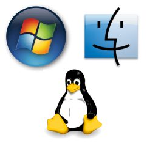
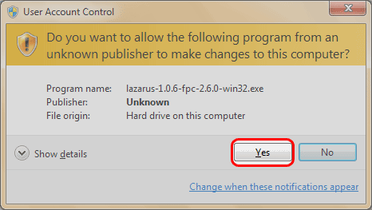

Lazarus is a cross-platform IDE. It runs on Windows, Ubuntu/Linux, Mac OS and BSD Operating systems.  
  
Below is a guide of how to install Lazarus in Windows and Ubuntu (Linux).  
  
  
  

### Installing Lazarus in Windows

  
  
  
  
  
  
Notice that Lazarus is installed in C:Lazarus directory. You can choose any other drives if you want (like D:Lazarus) but you should not install it in a folder with spaces in its name (such as C:lazarus ide).  
  
The rest of the installation is self-explanatory. For  starters, it is better that you select Full Installation.  
  
You can keep a shortcut in the desktop or not. ;-)   
  
The install will take a couple of minutes. After all it is installing more than 700 MB of data.  
  
Click Finish, and the installation is complete.  
Double click the icon in  the desktop to run  Lazarus.  
  
Lazarus running in Windows:  
  

### Installing \*Latest\* Lazarus in Ubuntu (or any other Linux)

  
  

Download the 3 .deb files that are available. For example, fpc\_2.6.2-0\_i386.deb, fpc-src\_2.6.2-0\_i386.deb, lazarus\_1.0.8-0\_i386.deb . (The filenames may differ based on the version chosen.)  
  
**NOTE:** Since Lazarus 2.0, the fpc debian package has been renamed to fpc-laz. It's the same, just a name change. Please use fpc-laz instead for 2.0 or later versions.  
  
Save those 3 files in a separate folder. It will help you in the installation process.

  

#### Step-2: Installing

If you already have lazarus installed then uninstall it first.  
  

Press Ctrl+Alt+T to open a terminal. Run the following commands to uninstall:  

>     sudo apt-get purge fpc lazarus  
>     sudo rm -Rf /usr/lib/fpc  
>     sudo rm -Rf /usr/lib/lazarus  
>     sudo rm -Rf /usr/share/fpcsrc  
>     sudo rm -f ~/.fpc  
>     sudo rm -Rf ~/.lazarus

  
Now we are going to install Lazarus. Type cd  followed by a space.

  

Drag the folder (inside which you have saved the 3 .deb files) in the terminal window. Press enter.

  

Then run:

> sudo dpkg -i \*.deb

  

You will probably see a message saying that some library is not installed (such as libgtk2.0-dev). Install the dependent libraries. For example,

> sudo apt-get install libgtk2.0-dev

Then run the above command again

> sudo dpkg -i \*.deb

Now it is going to install. It takes a bit of a time. It will require about 1.5 GB of space in your linux partition to install Lazarus in Linux.  
  
To run lazarus you can use the dash menu or on a command prompt run "startlazarus". When Lazarus runs, you can right click the Launcher icon of Lazarus and Click "Lock to Launcher". It will place the Lazarus icon in the Launcher for your convenience.  
  
  

### Installing Lazarus in MacOS X

[Click here](http://wiki.freepascal.org/Installing_Lazarus_on_MacOS_X) for an excellent guide for installing Lazarus in Mac OS. Lazarus is one of the two options of developing Carbon applications in Mac OS. So go on...!  
  
  

### Installing Lazarus in BSD

For [FreeBSD instructions](http://wiki.freepascal.org/Installing_Lazarus#Installing_Lazarus_under_FreeBSD) click here  
For [instruction on PC-BSD click here](http://wiki.freepascal.org/Installing_Lazarus#Installing_Lazarus_under_PC-BSD_1.0rc1.2B).  
  

### Installing Lazarus in Raspberry Pi

Lazarus can also be installed in a Raspberry Pi, a credit-card-sized computer motherboard. Go here to find out an installation guide: [http://wiki.freepascal.org/Lazarus\_on\_Raspberry\_Pi](http://wiki.freepascal.org/Lazarus_on_Raspberry_Pi)  

