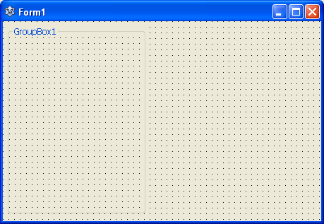
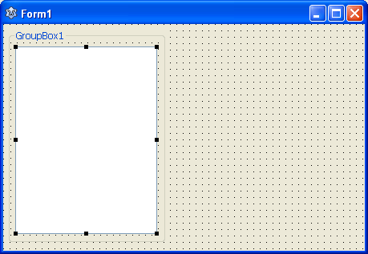
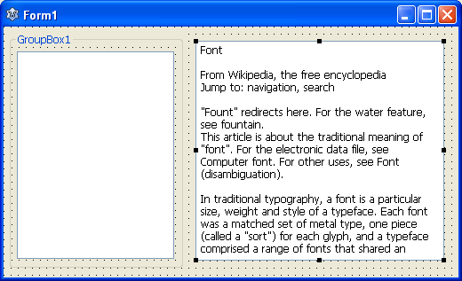
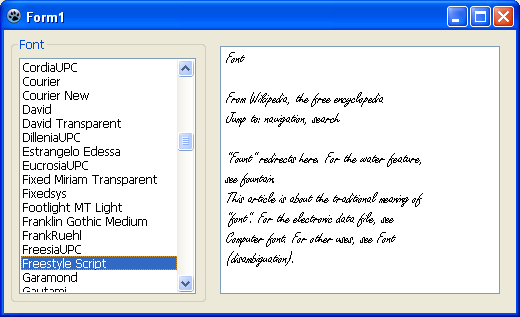
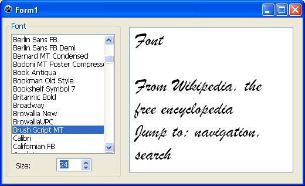

Fonts are a very attractive customization option. It is essential in text editing programs. Changing the font by code is easy, but listing them? Today we'll see how to list all the fonts in a TListBox.
<!-- more -->


Lazarus has an example code project in `(lazarus_dir)\examples\fontenum`. It shows how to list system fonts. It has complex code in it. It is because the program allows you to view [different kinds of fonts](http://forum.lazarus.freepascal.org/index.php?topic=20193.0) separately. But what if you just want a plain simple list of all fonts, and nothing else? You just have to use `TScreen`. `TScreen` has a handy `TScreen.Fonts()` procedure which can help us to get all the font names of the system.

For a list of all the fonts, we could just draw a `TComboBox` or a `TListBox` in the form then write the code:

```pascal
ComboBox1.Items.Assign(Screen.Fonts);
```

The `Screen` is a `TScreen` object created by default by Lazarus. So we can use it directly.

Now let's do a fancy sample program.


### Tutorial


Start [Lazarus](https://lazarus-ide.org/).
Create a new Application Project (**Project -> New Project -> Application -> OK**).

Draw a `TGroupbox` on the form.





Now we have to create a `TListBox` to hold our fonts. While drawing a `TListBox`, start drawing from inside the Groupbox. If you do that the groupbox will be a container for the ListBox. To prove my point, if you move the groupbox then the ListBox will move as well.





Now draw a `TMemo` on the form and put some text in its `Lines` property. I have put some text from [Font wikipedia article](http://en.wikipedia.org/wiki/Font).





Now, we'll have to load all the font names in the List Box when the program starts. So double click on the form and enter:

```pascal
procedure TForm1.FormCreate(Sender: TObject);
begin
    ListBox1.Items.Assign(Screen.Fonts);
end;
```

Then we'll have to change the font of the Memo when the user clicks on the font names or in other words the list items. Double click the ListBox. It will create a procedure for the `OnClick` event. Now enter:

```pascal
procedure TForm1.ListBox1Click(Sender: TObject);
begin
  Memo1.Font.Name := ListBox1.Items[ListBox1.ItemIndex];
end;
```

Oops! I forgot to set the `Caption` of the groupbox. Set its `Caption` to something like "`Font:`".

Now click **Run -> Run** (or press **F9** from keyboard) to run the program.





You will see all the fonts being listed in the listbox on the left. If you click on the items, the font is set for the Memo.

There is a problem. Sometimes the fonts are of really small size. It would've been better if we had font size, right?

So go ahead and resize the ListBox to make room for a font size spinner.

Now draw a `TSpinEdit` (from Misc Tab) under the list box. Set its `MinValue` to `8`. The `MaxValue` is `100` by default which is OK for fonts. Set its Value as `10` as the default font size for Memo is `10`. Now double click the SpinEdit. A procedure for `OnChange` event will be created. Now enter:

```pascal
procedure TForm1.SpinEdit1Change(Sender: TObject);
begin
  Memo1.Font.Size := SpinEdit1.Value;
end;
```

Now draw a `TLabel` on the left of the spinner and set its Caption as "`Size:`". Now run the project again (**F9** or **Run -> Run**).





You can select the font size now.

**Ref:**
[http://www.codefoot.com/delphi/fonts\_system.shtml](http://www.codefoot.com/delphi/fonts_system.shtml)
