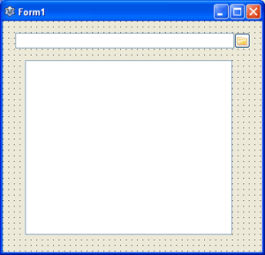
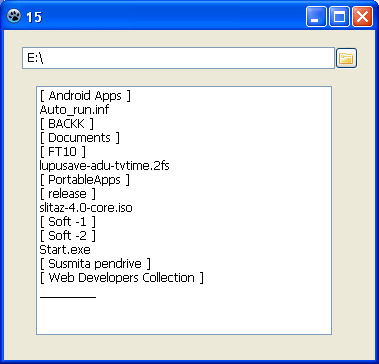
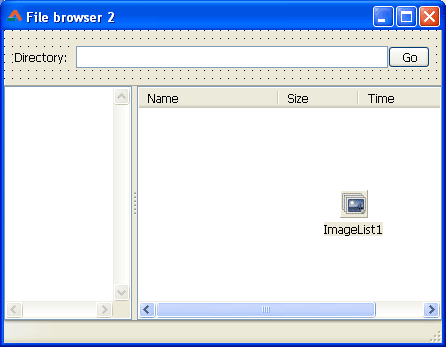
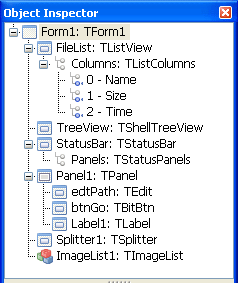
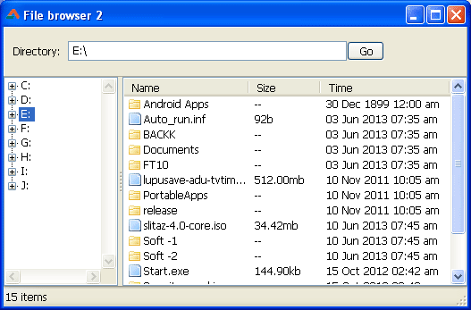

We all have these gigabytes and terabytes of hard disks in our computers. But what's the use of this huge storage if we cannot see where our files are and in which folder they are located? Of course we can. With our very own IDE, Lazarus!
<!-- more -->


There are many file managers out there. Ther's a file manager made with Lazarus which is being served in the internet, named [Double commander](http://sourceforge.net/projects/doublecmd/). And I am sure there are many others made with Lazarus. But as a programer you would want a file manager of your own, right? The one with fancy stuff that you care about and design the interface you always like. That's when this may help you.

If you are interested in ready made component that list the files in a directory then you can use TShellListView under the Others tab in the top toolbar. You can also use ! But its not that much customizable.


### Fun in Console!

We would create a file manager in a minute. But first you can try the file listing code in the console. The basics are pretty same, but you can have a clear idea of how it can be done.

Start [Lazarus](http://www.lazarus.freepascal.org/).

Create a new Program Project (**Project -> New Project -> Program -> OK**).

Now paste the following code:

```pascal
program ListFiles;

{$mode objfpc}{$H+}

uses
  {$IFDEF UNIX}{$IFDEF UseCThreads}
  cthreads,
  {$ENDIF}{$ENDIF}
  Classes, sysutils
  { you can add units after this };

var
  Info : TSearchRec;
  Count : Longint;

begin

  Count:=0;

  // if we have found a file...
  If FindFirst ('*',faAnyFile and faDirectory,Info)=0 then
  begin

    repeat

      // we increase the count so that we can show it later
      Inc(Count);

      // we do stuff with the file entry we found
      with Info do
      begin
        If (Attr and faDirectory) = faDirectory then
          Write('Dir : ');

        Writeln (Name:40,Size:15);
      end;

    until FindNext(info)<>0;

  end;

  // we are done with file list
  FindClose(Info);
  Writeln ('Finished search. Found ',Count,' matches');
  ReadLn;
end.
```

The above code has been polished from the code available [here](http://lazarus-ccr.sourceforge.net/docs/rtl/sysutils/findfirst.html).

Now Run the project (**F9** or **Run -> Run**).


If you haven't saved the project yet, then the project is temporarily saved in the temp directory of your Operating System. The program will be listing the files in the temp directory.

**Explanation:**
Now we go through what we have done to get the program to work.

```pascal
var
  Info : TSearchRec;
```

Info is a `TSearchRec` or in human terms it is a search record which can hold the file names and their info in it. When we will search the files inside a folder/directory it will have all the information of the files:

```pascal
type TSearchRec = record
  Time: LongInt; //Timestamp of the file.
  Size: Int64; //Size of the file.
  Attr: LongInt; //Attributes of the file.
  Name: TFilename; //File name (no directory part)
  ExcludeAttr: LongInt; //Attributes to exclude from search (do not use).
  FindHandle: Pointer; //Internal OS handle (do not use).
  Mode: TMode; //Unix File mode. Only used on Unix systems.
  PathOnly: AnsiString; //Path component of the file
end;
```

Then...

```pascal
  Count : Longint;
```

Count is for holding the file count.

```pascal
begin
  Count:=0;
```

We haven't found a file yet. So we assume that we have 0 files.

```pascal
  If FindFirst('*',faAnyFile and faDirectory,Info)=0 then
```

We try to find the file that is in the folder. To find the first file we have to use `FindFirst`. It has the following syntax:

```pascal
function FindFirst(
  const Path: ;
  Attr: LongInt;
  out Rslt: TSearchRec
):LongInt;
```

We see the parameters one by one:

(1) When we use `FindFirst` we have to specify a pattern, which also works with a path. For example, if we wanted to list all the text files in a directory, we could set it to `'\*.txt'`. In our example code we want all files so we used `'*'` as a pattern. We can also use, for example, `'C:\Windows\*.bmp'`, which will list all the `.bmp` bitmap files inside the `C:\Windows` directory.

(2) `Attr` is the type of the file we want. We want files and directories so we used `faAnyFile and faDirectory`. You may use other constants as well:

```
faReadOnly:    The file is read-only.
faHidden:    The file is hidden. (On unix, this means that the filename starts with a dot)
faSysFile:    The file is a system file (On unix, this means that the file is a character, block or FIFO file).
faVolumeId:    Drive volume Label. Not possible under unix, and on Windows-like systems, this works only for plan FAT (not Fat32 of VFAT) filesystems.
faDirectory:    File is a directory.
faArchive:    file needs to be archived. Not possible on Unix
```

(3) The `Rslt` is the `TSearchRec` variable that will have the file info of the first item (not all of them). To get the rest of the items one by one, we would need to use `FindNext`, like this:

```pascal
repeat

  // we increase the count so that we can show it later
  Inc(Count);

  //...
  //...

until FindNext(info)<>0;
```

We repeat until the `FindNext` function returns `0` (zero). It will return `0` when there are no more files on the list. So it will get the file information in the `Info` `TSearchRec` variable every time there is an item. We increase the `Count` variable each time we get a new file to later show the total number of files we found.

```pascal
// we do stuff with the file entry we found
with Info do
begin
    If (Attr and faDirectory) = faDirectory then
      Write('Dir : ');
    Writeln (Name:40,Size:15);
end;
```

We have used `with...do` statement here so that we don't have to write `Info` everytime we use something from the `Info`. (Like: `Info.Name`, `Info.Size`, `Info.Attr` etc.) We list all the `Name`s and `Size`s of the files we found. When we have a directory, we would just add a prefix `Dir : ` before the name, but not for files. This is to distinguish the difference between files and directories. That's it! Its not that hard, is it?


### The Graphical Way...


Start [Lazarus](https://lazarus-ide.org).

Create a new Application Project (**Project -> New Project -> Application -> OK**).

Drop a `TDirectoryEdit` (from Misc tab) and also drop a `TListBox` (from the Standard tab) in the form.





Now switch to Code view (**F12**) and enter the following procedure after the "`{$R *.lfm}`" line:

```pascal
procedure TForm1.ShowDirectory(ListDir:string);
var
  Info : TSearchRec;
  Count : Longint;

begin

  Count:=0;
  ListBox1.Clear;

  // if we have found a file...
  If FindFirst (ListDir+'\*',faAnyFile and faDirectory,Info)=0 then
  begin

    repeat

      // we increase the count so that we can show it later
      Inc(Count);

      // we do stuff with the file entry we found
      with Info do
      begin

        // If we find a folder
        if (Attr and faDirectory) <> 0 then
            ListBox1.Items.Add('\[ '+Name+' \]')
        // if we find a file
        else
            ListBox1.Items.Add(Name);

      end;

    until FindNext(info)<>0;

  end;

  // we are done with file list
  FindClose(Info);
  Caption:=inttostr(Count);
end;
```

Now move your cursor on the procedure name then press **Ctrl+Shift+C** to declare it at the top. The procedure is useless if you don't declare it.

Double Click the `TDirectoryEdit` and enter:

```pascal
procedure TForm1.DirectoryEdit1Change(Sender: TObject);
begin

  ShowDirectory(DirectoryEdit1.Directory+'');

end;
```

Now Run the project (**F9** or **Run -> Run**). Now open some directory and you will see the list in the List box.





It is a very basic example. You can use `TListview` to show file name, size and modified date etc. I have made such a project for you. It is available from the download at the end of the post. In our , we don't actually get the file list in our code. All the file list viewing is done with communicating between the components. But if we use `FindFirst`, `FindNext`, `FindClose` method, we really get the file names. We can do many things with it. We can only show the jpg files in a folder. We can also draw the image thumbnails in a `TPaintbox` to emulate a really cool image thumbnail app.

The form layout is as follows:





The components are:





And a screenshot of it on runtime:





The above one is very much of understandable interface. While the first one is pretty much elementary. So it is better to choose to show files in a `TListView`. You can show your own icons for the folders and files.

So what I have done is I have dropped a `TListView` and made 3 columns (by clicking \[...\] button in `Columns` property and then setting its `Caption` and `Width` with the **Object Inspector**). I have dropped a `TShellTreeView` to show the drives in a tree.

I have a `ShowDirectory` procedure like below:

```pascal
procedure TForm1.ShowDirectory(ListDir:string);
var
  Info: TSearchRec;
  Count: Longint;
  li: TListItem;
  FileTime: TDateTime;

begin

  ListDir:=AddBackSlash(ListDir);
  edtPath.Text:=ListDir;
  CurrentDirectory:=ListDir;
  Count:=0;
  FileList.Items.Clear;

  FileList.Items.BeginUpdate;

  // This is a try block which finally runs EndUpdate
  try

    // if we have found a file...
    If FindFirstUTF8 (ListDir+'*',faAnyFile and faDirectory,Info)=0 then
    begin

      repeat

        // we increase the count so that we can show it later
        Inc(Count);

        // we do stuff with the file entry we found
        with Info do
        begin

          if (Name <> '.') and (Name <> '..') then begin

            li := FileList.Items.Add;
            li.Caption:=Info.Name;

            // If we find a folder
            if (Attr and faDirectory) <> 0 then begin
                li.ImageIndex:=1;
                li.SubItems.Add('--'); // folders can't show size
            end
            // if we find a file
            else begin
                li.ImageIndex:=2;
                li.SubItems.Add(FileSizeFormat(Info.Size));
            end;

            FileTime := FileDateToDateTime(Info.Time);
            li.SubItems.Add(FormatDateTime('dd mmm yyyy hh:nn am/pm',FileTime));
            // for help with the format:
            // http://lazarus-ccr.sourceforge.net/docs/rtl/sysutils/formatchars.html

          end;

        end;

      until FindNextUTF8(info)<>0;

    end;

  finally
    FileList.Items.EndUpdate;
  end;

  // we are done with file list
  FindCloseUTF8(Info);
  StatusBar.SimpleText:=inttostr(Count)+' items';
end;
```

We use the `FindFirstUTF8`,  `FindNextUTF8` and `FindCloseUTF8` functions. What's the reason? If we have some file name which is written in unicode characters then using `FindFirst` etc. will not render it correctly, because they don't support UTF-8. `FindFirstUTF8` on the other hand does. So we use it for better compatibility.

We have access to the file size information, but it is in bytes. Can you understand how many megabytes a file is when it is of `2621440` bytes? It is actually awkward for the user to see the file size in bytes all the time. So we have to convert the file size information to get an expected output:

```pascal
function TForm1.FileSizeFormat(bytes:Double):string;
begin
  // below 1024 bytes
  if bytes < 1024 then
    Result:=floattostr(bytes) + 'b'
  // kilobytes; 1kb = 1024bytes
  else if (bytes >= 1024) and (bytes < 1024*1024) then
    Result:=FormatFloat('0.00', bytes/1024)+'kb'
  // megabytes; 1mb = 1024*1024bytes
  else if (bytes >= 1024*1024) and (bytes < 1024*1024*1024) then
    Result:=FormatFloat('0.00', bytes/1024/1024)+'mb'
  // gigabytes; 1gb = 1024*1024*1024bytes
  else if (bytes >= 1024*1024*1024) and (bytes < 1024*1024*1024*1024) then
    Result:=FormatFloat('0.00', bytes/1024/1024/1024)+'gb'
  // for everything above, we show it in terrabytes
  else
    Result:=FormatFloat('0.00', bytes/1024/1024/1024/1024)+'tb';
end;
```

For the file modified date and time we use the following code (in the ShowDirectory procedure mentioned above):

```pascal
FileTime := FileDateToDateTime(Info.Time);
li.SubItems.Add(FormatDateTime('dd mmm yyyy hh:nn am/pm',FileTime));
```

li is the `TListItem` we will add. You can change the date format if you want. If you want to, you can get some help [here about the date and time formatting](http://lazarus-ccr.sourceforge.net/docs/rtl/sysutils/formatchars.html).

We also have to go inside a folder when the user double clicks a folder in the `TListView`. And we also need to run a file with the default program when the user double clicks a file name. So we add this to the `OnDoubleClick` event of `TListView`:

```pascal
procedure TForm1.FileListDblClick(Sender: TObject);
begin
  if FileList.Selected.ImageIndex = 1 then
    ShowDirectory(AddBackSlash(AddBackSlash(CurrentDirectory)+FileList.Selected.Caption))
  else
    ShellExecute(Form1.Handle, PChar('open'),
         PChar(AddBackSlash(CurrentDirectory)+FileList.Selected.Caption),
         PChar(''), PChar(''), 1);
end;
```

**NOTE:** The [wiki suggests](http://wiki.freepascal.org/Executing_External_Programs#MS_Windows_:_CreateProcess.2C_ShellExecute_and_WinExec) to use `TProcess` instead of Shell Execute. Because this command will only work on windows. [TProcess](http://wiki.freepascal.org/Executing_External_Programs#TProcess) on the other hand works on all platforms.
