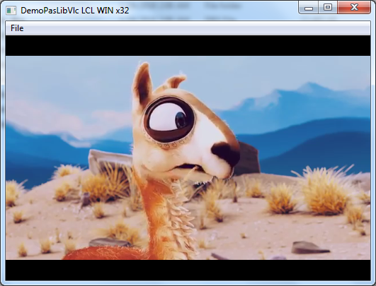
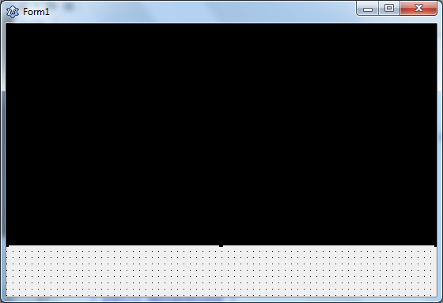
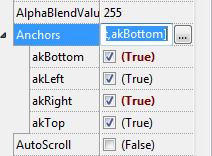
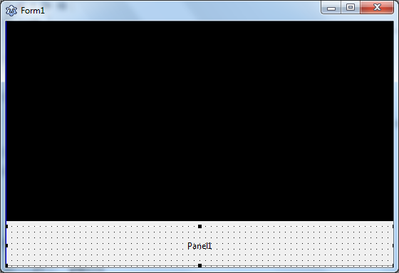
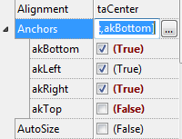
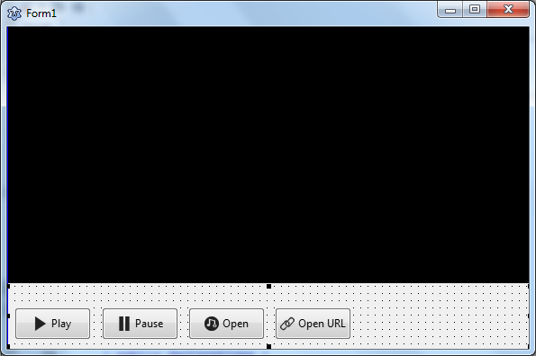
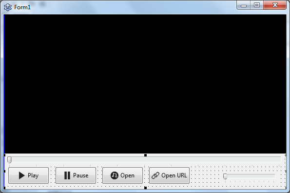
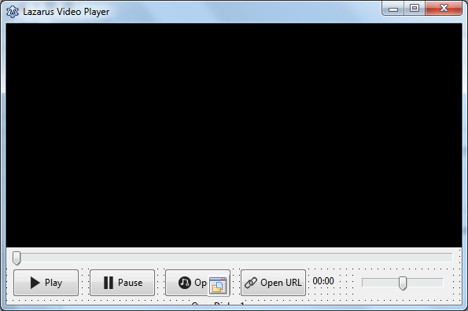
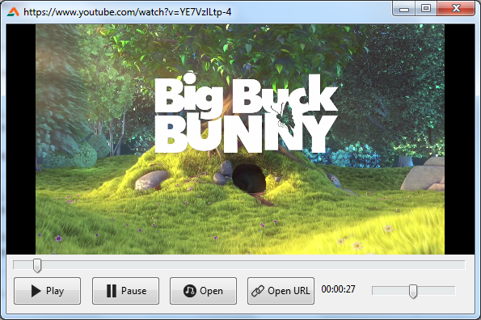

We like to watch videos. How about playing videos on our own player? In this article, we are going to create a fun, simple video player.
<!-- more -->
  
Video players always fascinate me. I used to code with my brother to create many kinds of video players. We had fun creating them. We used Visual Basic 6 back then, because it was popular back then and easy to learn. We got to design our video players how we want them and used to implement creative features that we thought was cool. Such as, video players that change color, had custom themes, ID3 tagging, audio visualizers etc. Fun times!  
  
There has been many years since I have worked on a video player. Writing this tutorial sure brings back a bit of those memories for me.  
  
There are many libraries for video playback in Lazarus. They are listed here:  
[http://wiki.freepascal.org/Video\_Playback\_Libraries](http://wiki.freepascal.org/Video_Playback_Libraries)  
  
Some of them are cross platform, some are not. From them, I found PasLibVlc to be easier and more relatable. Although it requires VLC Media Player to be installed in the system but the plus point is that you can also run your video player on any system you can install VLC on, such as, windows, mac or linux/bsd. I am writing this for Windows, but you can adopt it easily for your platform.  
  
Many of you guys requested for this tutorial with our Contact page and Facebook page. So wrote this one for you. Hope it helps!  
  

### Step 1: Install VLC Media Player

As we are using VLC's library, we would need to have VLC player installed.  
Get it from here: [https://www.videolan.org/vlc/](https://www.videolan.org/vlc/)  
Make sure you have the latest version installed.  
  

### Step 2: Prepare

**Note:** It is better to try it on Lazarus 32 bit, even if you are using 64 bit Windows. Things install easily on 32 bit Lazarus. I have tried with Lazarus 32 bit and it works. 64 bit might not work as expected.  
  
Go to here: [https://prog.olsztyn.pl/paslibvlc/](https://prog.olsztyn.pl/paslibvlc/)  
Scroll down to "**Change Log**" on that. You will find a link to a file something like: **PasLibVlc\_x.y.z.zip**. Download the file and extract it to a folder named **PasLibVlc**. Copy the folder to **C:lazaruscomponents** so that the contents are in the folder: **C:lazaruscomponentsPasLibVlc**  
  
If you go inside the folder, you will see many folders. Go to **FreePascal** folder, then double click **PasLibVlcPlayer.lpk**. It will launch Lazarus with a window titled **Package PasLibVlcPlayer Vx.y.z**.  
  
Click **Compile**. Once finished, click **Use - Install**, click **Yes**. This will rebuild and restart Lazarus.  
  
After restart, you should see a new tab in the top toolbar named **PasLibVlc**.  
  

### Step 3: Check Sample projects (optional)

You can find very useful examples on "C:lazaruscomponentsPasLibVlcFreePascal". To try something basic, I would recommend "DemoPasLibVlc" for checking out basic playback. Just double click "DemoPasLibVlc.lpi" and Run - Run (or F9).  
  

  
Open a file and it should play. You will notice that it is slow and not responsive. To solve this, you can run the "DemoPasLibVlc.exe" outside Lazarus, from the project directory and it should run fine.  
  
For more detailed example of what it can do, you can try "DemoPasLibVlcPlayer". Just click on the Editbox there, open a file and click play.  
  

### Step 4: Tutorial project

Now's the fun part, creating our own!  
  
Start Lazarus.  
Create a new Application Project (Project->New Project->Application->OK).  
  
Resize the form a bit to make some room. Click on **PasLibVlc** tab on toolbar and draw a **TPasLibVlcPlayer** on the form. It will be named **PasLibVlcPlayer1** by default. What a mouthfull! Change its Name property to **vlcPlayer**.  
  

  
  
Set its **akBottom**, **akRight** Anchors to **True**.  
  

  
Switch to **General** tab. Draw a **TPanel**. Position it at the bottom. This will have our buttons and controls.  
  

  
Set all the **Anchors** to **True** except **akTop**.  
  

  
Empty its **Caption** and set **BevelOuter** to **bvNone**.  
Go to **Additional** tab on toolbar. Draw a **TBitBtn**. You can also use TButton, but TBitBtn gives us the ability to set an icon for the button. I have collected some icons to be used in this project from aiconica.net. They should be in the project download ZIP file.  
  
Create **TBitBtns** for **btnPlay**, **btnPause**, **btnOpen**, **btnOpenURL**. Give them appropriate **Caption** and set their icons with **Glyph** property.  
  

  
Go to **Common Controls** tab, and Draw 2 **TTrackBars** on the form, big one for position and smaller one for volume.  
  

  
Name the bigger one **trkPosition** and smaller one **trkVolume**. Set **Max** for trkVolume to 200, **Min** to 1 and **Position** to 100. Set **TickStyle** for both of them to **tsNone**.  
  
For **trkPosition**, set all the **Anchors** to **True** except **akBottom**. For **trkVolume**, set **akBottom** and **akLeft** to **False** and others to **True**.  
  
Draw a **TLabel** somewhere on the form and Name it **lblTime**. This is to show the playing time.  
  
Oh! I almost forgot. Go to **Dialogs** tab and place a **TOpenDialog** on the form somewhere. (Don't worry, it will not show on the form when run.) This will help us to show the Open dialog.  
  
Now your form should look something like this:  
  

  
Now, there is a draw issue when the form is maximized and restored again. So right click the **vlcPlayer** component and Choose **Z-Order - Move to Front**.  
  
Now to fun part, the coding...  
Double click the **Play** button and write something like:  
  

procedure TForm1.btnPlayClick(Sender: TObject);  
begin  
  vlcPlayer.Resume();  
end;

  
See? writing a video player is not hard after all. Play button code is just one line!  
  
Switch to Form view (F12) and double click the **Pause** button and enter:  
  

procedure TForm1.btnPauseClick(Sender: TObject);  
begin  
  vlcPlayer.Pause();  
end;

  
Double click on **Open** button and enter:  
  

procedure TForm1.btnOpenClick(Sender: TObject);  
begin  
  if OpenDialog1.Execute then begin  
    vlcPlayer.Play(WideString(OpenDialog1.FileName));  
    Caption := OpenDialog1.FileName;  
  end;  
end;

  
Double click on **Open URL** button and enter:  
  

procedure TForm1.btnOpenURLClick(Sender: TObject);  
var  
  url: string;  
begin  
  url := InputBox('Media URL', 'Please enter media URL/MRL', '');  
  if url <> '' then begin  
    vlcPlayer.Play(WideString(url));  
    Caption := url;  
  end;  
end;

  
We create an inputbox to get the media url from the user. We just see if the Input is empty. If not, we send it to vlcPlayer component to be played. That's it. That's all there's to it. You would be able to enjoy online streams, YouTube, online radio streams right on your video player! How cool is that!  
  
Now select the **vlcPlayer**, go to **Events** tab from **Object Inspector** (on the left). We would create an event procedure for OnMediaPlayerLengthChanged. This would set the Maximum value for the seekbar (trkPosition) and would let us seek properly. So click **OnMediaPlayerLengthChanged** (you can resize Object Inspector or the column border if you can't see the whole name). Click the **\[...\]** button beside it and enter:  
  

procedure TForm1.vlcPlayerMediaPlayerLengthChanged(Sender: TObject; time: Int64  
  );  
begin  
  trkPosition.Max := vlcPlayer.GetVideoLenInMs();  
end;

  
Now create a similar event for **OnMediaPlayerTimeChanged** and enter:  
  

procedure TForm1.vlcPlayerMediaPlayerTimeChanged(Sender: TObject; time: Int64);  
begin  
  if trkPosition.Tag = 0 then // not dragging with mouse  
    trkPosition.Position := vlcPlayer.GetVideoPosInMs();  
  lblTime.Caption:=vlcPlayer.GetVideoPosStr('hh:mm:ss');  
end;

  
This will change the position to show how much the media has played on the seekbar when it plays. We are checking "trkPosition.Tag" with "if trkPosition.Tag = 0 then". We would make trkPosition.Tag to 1 when the user is dragging trkPosition. Because we don't want the position to change while the user is seeking the position bar.  
  
We could've used a variable for this, but trkPosition.Tag is convenient, so we can use it here. trkPosition.Tag can only have integer values, so we would set it to either 0 or 1.  
  
To make it work let's set the Tag correctly. Select **trkPosition** and create an **OnMouseDown** event and enter:  
  

procedure TForm1.trkPositionMouseDown(Sender: TObject; Button: TMouseButton;  
  Shift: TShiftState; X, Y: Integer);  
begin  
  trkPosition.Tag := 1;  
end;

  
Then create an **OnMouseUp** event and enter:  
  

procedure TForm1.trkPositionMouseUp(Sender: TObject; Button: TMouseButton;  
  Shift: TShiftState; X, Y: Integer);  
begin  
  vlcPlayer.SetVideoPosInMs(trkPosition.Position);  
  trkPosition.Tag := 0;  
end;

  
This should set the Tag correctly and manage the seeking (dragging the position).  
  
Select **trkVolume** and create an **OnChange** event, then enter:  
  

procedure TForm1.trkVolumeChange(Sender: TObject);  
begin  
  vlcPlayer.SetAudioVolume(trkVolume.Position);  
end;

  
And... you are done! Now hit Run - Run (or press F9).  
  

")

  
You can hit Open to open a media from your hard disk, or click Open URL button to open any stream URL to play in the player. For example, click Open URL and enter **https://www.youtube.com/watch?v=YE7VzlLtp-4** and it should play it for you! Awesome!  
  

  
You can do all sorts of stuff with it. You can also research on the player component. This is just a basic for this component. There are lots of other useful features. Maybe it can simplify your daily tasks somehow, who knows!  
  

### Download Sample Code ZIP

You can download the above example tutorial project's source code from [here](https://www.dropbox.com/s/c4w0c9vnetwktcy/vlc_video_player.zip?dl=0).  
Or [here](https://drive.google.com/uc?export=download&id=1yufROefQsbAXVjwAK9F0xvGJSBB4dmdz).  
Size: 630KB  
The package contains compiled executable EXE file.