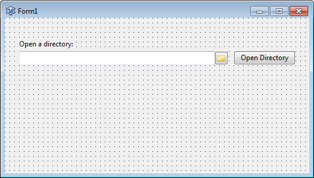
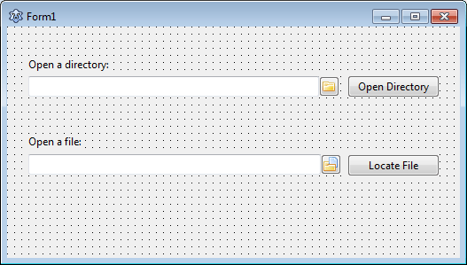
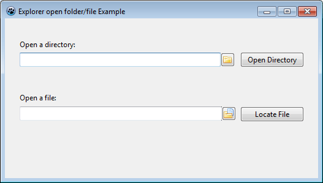

We often need to open a directory/folder in a File Manager to show its contents. Today we learn how to run [Windows Explorer](http://en.wikipedia.org/wiki/File_Explorer) to automatically show the content of a directory of our choice.
<!-- more -->
  
  
Directories are directories. They make our lives simpler. We can partition our hard disks to categorize which part of our hard disk we want to use for what. Then we have directories (or how [Redmond](http://en.wikipedia.org/wiki/Redmond,_Washington#Economy) wants to call it -- folders.) [Directories](http://en.wikipedia.org/wiki/Directory_%28computing%29) let us categorize even more. We can keep files in different directories to differentiate them. I don't know what we would do if there were no directories. Keep thinking!  
  
As a programmer we need to work with directories and files. After we are done with our processing, showing our result by opening the folder in the explorer is a good idea. In this article we will learn how to open the [explorer](http://en.wikipedia.org/wiki/File_Explorer) with a certain directory opened.  
  
After that we will also see how to open a certain directory and select a file. (Just as Firefox points to the downloaded file after clicking "Open Containing Folder".)  
  

### How explorer.exe Command line works

Windows Explorer can be found at C:Windowsexplorer.exe. But running it opens the Library. We don't want that. We want to open a folder of our choice. So how can we do it? We can of course navigate to the directory with mouse clicks. But there should be an easier way, right? There is. We have command line to do just that.  
  
Usually when we want to open a file with a exe program, we just add the file in a command line parameter. For example,  
**notepad C:exampletext.txt**  
opens the C:exampletext.txt in Notepad. (We can omit the ".exe" extension from "notepad.exe".)  
  
**firefox http://www.wikipedia.org**  
opens the Firefox with the Wikipedia website opened.  
  
Similarly, if we run explorer.exe with a parameter of the directory, it will open the directory in Explorer:  
  
**explorer C:Program Files**  
  
This will open the explorer in the C:Program Files. So no more clicking is needed.  
  
Sometimes we want to open a certain directory and want a file to be selected. We can do the following:  
  
**explorer /select,C:Windowsexplorer.exe**  
  
The above command will open the explorer in C:Windows directory and select the explorer.exe file for us. Isn't that great?!  
  
If you want to learn more about [command line switches](http://support.microsoft.com/kb/130510) then feel free to [check out this link](http://support.microsoft.com/kb/130510).  
  

### How to execute a .exe program

There are 3 useful ways of [executing a program](http://wiki.freepascal.org/Executing_External_Programs):  

1.  SysUtils.ExecuteProcess
2.  ShellExecute
3.  TProcess

  
There are other ways of executing a program. They are explained [in detail in the wiki](http://wiki.freepascal.org/Executing_External_Programs). But we mostly use these 3 solutions. Among them SysUtils.ExecuteProcess is my favorite. It's short, it's cross-platform. Here's how to use it:  
  

uses  
  ..., ..., SysUtils;  
  
SysUtils.ExecuteProcess(UTF8ToSys('notepad.exe'), 'C:exampletest.txt', \[\]);

  
It will run notepad.exe with parameter C:exampletest.txt. It is equivalent to running:  
  
notepad.exe C:exampletest.txt  
  

### How to Run Explorer to Show a Folder

As we have mentioned earlier, to show a folder contents with explorer, we just need to pass the directory as a parameter. We can do the following:  
  

SysUtils.ExecuteProcess(UTF8ToSys('explorer.exe'), 'C:Windows', \[\]);

  
  
This code will open the explorer in the C:Windows directory.  
  
To open a directory in explorer and select a file use the following:  
  

SysUtils.ExecuteProcess(UTF8ToSys('explorer.exe'), '/select,C:Windowsexplorer.exe', \[\]);

  
The above code will open the C:Windows directory and select the explorer.exe file.  
  

### Tutorial

Enough talk! Now let's be practical!  
  
Start [Lazarus](http://www.lazarus.freepascal.org/).  
  
Create a new Application Project (Project -> New Project -> Application -> OK).  
  
Draw a TDirectoryEdit (from Misc tab). It should be named as "DirectoryEdit1". Draw a TButton. It should be named as Button1. You can add a label if you want. Caption these 3 components properly.  
  

  
Double click Button1 and enter:  
  

procedure TForm1.Button1Click(Sender: TObject);  
begin  
  SysUtils.ExecuteProcess(UTF8ToSys('explorer.exe'), DirectoryEdit1.Directory, \[\]);  
end;

  
We don't need to add SysUtils in the uses clause, because it is added by default.  
  
Now draw a TFileNameEdit (from Misc tab). It should be named FileNameEdit1. Draw a TButton. It should be named Button2. You can also draw a label. Caption the components.  
  

  
Now double click Button2 and enter:  
  

procedure TForm1.Button2Click(Sender: TObject);  
begin  
  SysUtils.ExecuteProcess(UTF8ToSys('explorer.exe'), '/select,'+FileNameEdit1.FileName, \[\]);  
end;

  
Now run the project (F9 or Run->Run).  
  

  
Now test both the features. Open a directory in the DirectoryEdit and click the button beside it.  

**Ref:**  
[http://wiki.freepascal.org/Executing\_External\_Programs](http://wiki.freepascal.org/Executing_External_Programs)  
[http://stackoverflow.com/questions/15300999/open-windows-explorer-directory-select-a-specific-file-in-delphi](http://stackoverflow.com/questions/15300999/open-windows-explorer-directory-select-a-specific-file-in-delphi)