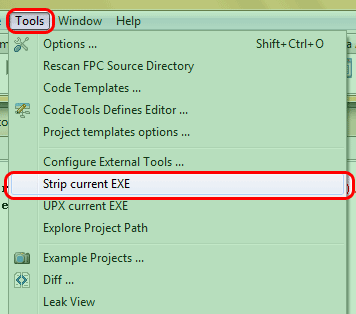
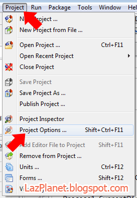
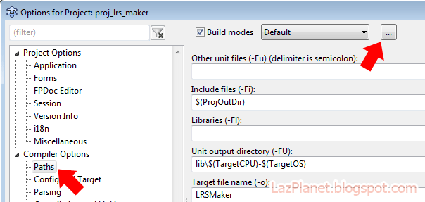
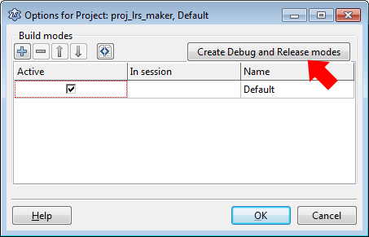
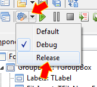
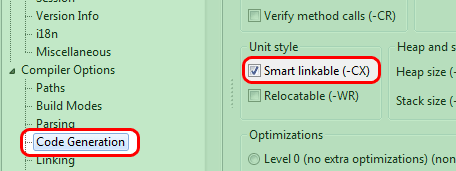
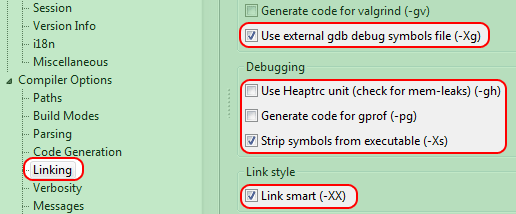

By default, Lazarus makes EXEs including debug information which makes them extremely big. You can strip out this debug information easily and make your EXEs smaller. Here's how to...
<!-- more -->
  
  
  
Lazarus produces executables that are big in size, almost 14 MB or more. This increased size is of no lame excuse. The big EXE contains debugging information. Expert programmers know that debugging is crucial for testing complex code to make sure they work correctly. And sometimes debugging becomes absolutely necessary when a bug (or an error in the code that fails the program) appears in the program. You don't want to use any faulty program do you? Debugging helps to better analyze what is going on in background, when the program is running.  
  
Don't worry, you can reduce the EXE file size to 1.3 MB or even below 700 KB. Here's how:  
  
a) Using Strip or Changing Project Settings (comes down to ~1.3MB)  
b) Using UPX (comes down to below 700KB, but with disadvantages)  
  
Strip is an utility that comes with FPC which is just an executable that can strip debugging information from an EXE. UPX further compresses the EXE to a minimum size.  
  
First of Strip-ing. There are two ways to how we can strip an EXE:  

### Option 1: Adding to Tools Menu

Option 2 requires changing Project settings. But programers are lazy. :- We don't have time to change all the settings of hundreds of projects, right? We could just use a menu to do our job. It is better for testing various source codes coming from different authors who did not alter the project settings to Option 2.

  

First take note of your FPC version. Go to **Help -> About**. You will see the current FPC version that you are using.

  

Go to **Tools -> Configure External Tools...**

Click **Add**. A dialog box for a new menu item under Tools menu. Enter the following info:

*   **Title:** Strip current EXE
*   **Program Filename:** C:lazarusfpc2.6.4bini386-win32strip.exe
*   _(Change "2.6.4" to your FPC version that you noted earlier. If you have installed Lazarus in another directory instead of C:lazarus , then change it accordingly.)_
*   **Parameters:** --strip-all "$TargetFile()"

  

Click **OK** and then **OK** again. Now you  will see a menu item in the Tools menu:

  

  

Test your program by pressing **F9** (or **Run -> Run**). Whenever you are ready to release your EXE, just click it, and within some time the file size will be reduced dramatically. (Details are at the end as a final instruction on how to apply this. Read on...)

### Option 2: Tweaking project settings

#### For Lazarus version 1.2 or later

Since Lazarus version 1.2 the settings can be automatically set through the [Build modes](http://wiki.lazarus.freepascal.org/IDE_Window:_Compiler_Options#Adding_a_release_and_debug_build_modes). So no messing around with tiny little settings.  
  
First, notice that there is no cog icon ([ icon")](how-to-reduce-exe-file-size-of-your/build-modes-3.gif)) beside the Run button on the toolbar. That means you have no build modes set for the project. Don't worry, we'll do that in a second.  
  
Go to **Project-> Project Options-> Compiler options**.  
  

  
  
Click the **\[...\]** button.  
  

  
Click the "**Create Release and Debug modes**" button. Then press OK and then OK again.  
  

  
Now you will see a cog icon beside the Run Button. This button lets us set the **build mode**.  
  

 icon having an arrow with options.")

  
Click the arrow beside it (not the button itself), and you will see 3 options: **Default**, **Release** and **Debug**. Default mode is the settings that you had set previously. Release mode is the settings that will get you smaller exe's, without the debug data. Debug mode is the mode to test your program for errors.  
  
In our case, we suppose that our debugging is over, now want to get a smaller exe. So set it to **Release mode**.  
  

  
 Then Click **Run** button (or click **Run -> Run** menu).  
  

#### For Lazarus version 1.0.14 or earlier

We can Strip debugging information through changing project settings (or compiler parameters) in the Project Settings of an appropriate project.

1.  Open a project. Go to **Project -> Project Options**
2.  Compiler OptionsCode GenerationSmart Linkable (-CX) -> Checked
3.  Compiler OptionsLinkingDebugging Uncheck all except Strip Symbols From Executable (-Xs)
4.  Compiler OptionsLinkingLink StyleLink Smart (-XX) -> Checked 
5.  Compiler OptionsLinkingDebugging Leave generating debugging info checked and check use External gdb debug symbols _(This will create a separate .dbg file and store the debugging information in it, leaving the EXE small. The file is not needed to run the EXE. It is just separate file with debug info.)_

  

If you can change these settings for every project you work on, you are good to go with this (Option 2). If not, choose "Option 1" above.

  

### UPX it!

Since FPC 2.6.2, upx is no more shipped with FPC. Previously, it was easy for us to just locate to upx.exe. But now we will have to download and use it separately. UPX or Ultimate Packer for eXecutables can reduce the EXE size below 700KB. But it has some [disadvantages](http://wiki.freepascal.org/Size_Matters#UPX). But people use it anyway.

  

1\. (If you use FPC 2.6.2 or later then...) download UPX from [here](http://upx.sourceforge.net/). Extract the upx.exe to any directory. But you can put it in the FPC directory to have UPX at a good place and not just sitting around other places. (It could generally be: **C:lazarusfpc2.6.2bini386-win32upx.exe** -- where 2.6.2 is your FPC version.)

  

2\. Go to **Tools -> Configure External Tools...**

  

3\. Click **Add** and Enter the following info:

*   **Title:** UPX current EXE
*   **Program Filename:** C:lazarusfpc2.6.2bini386-win32upx.exe
*   (Note that you will have to change 2.6.2 to your FPC version.)
*   **Parameters:** "$TargetFile()"

  

Click **OK** then **OK** again. Now you will see a menu in the **Tools -> UPX current EXE**.

  

### How to use:

**If you are using Option 1 for Strip-ing:**

Remember, first to Strip then do UPX, not the other way around. Hit **F9** and Run the program. You could also press **Shift+F9**. It will only create _or build_ the EXE and will not run it. After the creation of EXE, click **Tools -> Strip current EXE**. Wait for a while. Then click **Tools -> UPX current EXE**. Voila! You will get your small size marvel ready to shipped to your bearded friends!

  

**If you are using Option 2 for Strip-ing:**

The strip-ing is done automatically when you Run (**F9**) or Build (**Shift+F9**) the project. The EXE will be created. Now, click **Tools -> UPX current EXE**. Sweet! Neat! Awesome!

  

Reference:

[http://wiki.freepascal.org/Lazarus\_Faq#Why\_are\_the\_generated\_binaries\_so\_big.3F](http://wiki.freepascal.org/Lazarus_Faq#Why_are_the_generated_binaries_so_big.3F)

[http://www.pascalgamedevelopment.com/showthread.php?9113-How-to-reduce-Lazarus-0-9-30-project-exe-file-size](http://www.pascalgamedevelopment.com/showthread.php?9113-How-to-reduce-Lazarus-0-9-30-project-exe-file-size)

  

Further Reading:

[http://wiki.freepascal.org/File\_size\_and\_smartlinking](http://wiki.freepascal.org/File_size_and_smartlinking)

[http://wiki.freepascal.org/Size\_Matters](http://wiki.freepascal.org/Size_Matters)