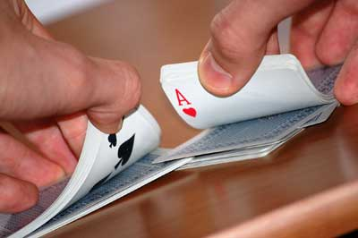
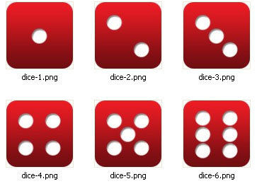
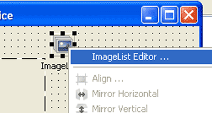
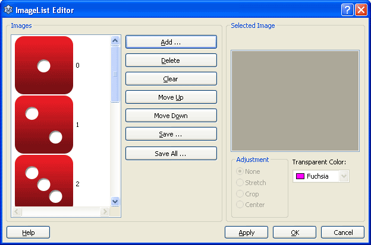
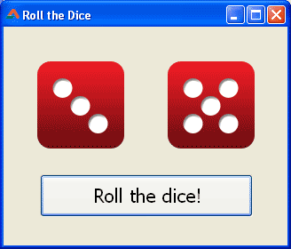

Learn how to Roll a Dice in your own program and stay ahead in the Game! We learn how to use an Image List to store the images (self-contained) in the program and show the images on a TImage. (Images are included in sample zip file. Easy-peasy!)
<!-- more -->


Are you familiar with a dice? If you are not a game person, a dice has 6 faces with dots of various numbers. We roll a dice and we see which face comes at the top so that we can move our position according to the number of dots on that face. There are many games that we play with dice.


### Basic Implementation of Dice rolling


Which persons did you meet today? Yesterday? Day before yesterday? You don't meet the same people everyday, right? So we can say that you meet random people everyday. Random means which is not in a specific order. When you are shuffling cards, you are not doing it to arrange the cards in a specific order. So you are setting the cards in a random order.





When you roll a dice you don't know which side is going to come up. So which side will be up is random. We have a function for randomizing in Free Pascal (or Lazarus). The function is named, well, Random(). But we have to run a Randomize function in order to "Initialize random number generator". We had another post about random numbers: .

Just try this little console program before the real deal. Create a Program Project (**Project -> New Project -> Program -> OK**) in [Lazarus](https://lazarus-ide.org). Now enter the following code replacing the existing code:

```pascal
program dice_roll_lazplanet;

{$mode objfpc}{$H+}

uses
  {$IFDEF UNIX}{$IFDEF UseCThreads}
  cthreads,
  {$ENDIF}{$ENDIF}
  Classes
  { you can add units after this };

var
  inp: string = '';

begin
  WriteLn('Dice rolling program');
  WriteLn('Please keep pressing ENTER if you want to roll the dice.');
  WriteLn('Please enter q to end this program.');

  Randomize;

  while (inp <> 'q') do begin
    ReadLn(inp);
    WriteLn();
    WriteLn('We have rolled the virtual dice in computer memory.');
    WriteLn('The result is: ', (Random(6)+1) );
  end;
end.
```

Now Run it (**F9** or **Run -> Run**).

Keep pressing enter to get a random dots result. Enter `q` to exit the program.

**Explanation**
The focus line in the above code is:

```pascal
    WriteLn('The result is: ', (Random(6)+1) );
```

`Random(6)` generates a random number from `0` to `(6 - 1) = 5`. We add 1 to create our virtual dice. So `0` becomes `1` and `5` becomes `6`, and all the numbers between increase to make sense.

If you are interested, you can see the reference for [`Random()`](http://lazarus-ccr.sourceforge.net/docs/rtl/system/random.html) and [`Randomize()`](http://lazarus-ccr.sourceforge.net/docs/rtl/system/randomize.html) routines.


### Quick Tutorial

Start [Lazarus](https://lazarus-ide.org).
Create a new Application Project (**Project -> New Project -> Application -> OK**).

Create 2 **TImage**, 1 **TButton** and a **TImageList**. We are going to show our random dice in the two **TImages**. Position them according to your desire and set `Caption` of the **TButton**.

Now download the sample code zip file mentioned below to get the dice images. The images are not necessary for the sample code to run (because they are in a `TImageList` and the images in a `TImageList` is embedded in the project automatically when you save the project). I have just included them for you, so that you can use them in this tutorial. But if you are good with Gimp or Photoshop, you can create 100 by 100 pixel images of the dice faces.





Once you have got them ready. Select the **TImageList** named **ImageList1** then set the `Width` & `Height` property to `100`. It is set in pixels, of course. If you have made the images with different size, you need to set it accordingly. If we do not set it accordingly, the images will be cropped to the `Value` given here.

Remember to set the `width` and `height` of the `TImage`s to `100` (or the dimension you like).

Now right click the **ImageList1** component in the Form designer and select **ImageList Editor**.





Now in the **ImageList Editor** dialog select the images one after another in an increasing order (from 1-dot image through 6-dot image).





Make sure the index is right. It should be 1 less than the dots of the image. Refer to the above image if you are in confusion. Click it to see a larger version of the screenshot.

When you are done, click OK.

Now double click the **TButton** and enter the following code:

```pascal
procedure TForm1.btnRollClick(Sender: TObject);
var
  bmp: TBitmap;
  rand1, rand2: Integer;
begin

  // get the random number for dice
  Randomize;
  rand1 := Random(6);

  bmp := TBitmap.Create;
  try
    ImageList1.GetBitmap(rand1, bmp);
    Image1.Picture.Assign(bmp);
  finally
    bmp.Free;
  end;

  // now to second dice
  rand2 := Random(6);

  bmp := TBitmap.Create;
  try
    ImageList1.GetBitmap(rand2, bmp);
    Image2.Picture.Assign(bmp);
  finally
    bmp.Free;
  end;

end;
```

Now run the Project (**F9** or **Run -> Run**).





Click the button to see the random dice face you have been waiting for.

**Explanation**

```pascal
  rand1 := Random(6);
```

The code returns a random number between `0` and `5`. We use this number to catch our dice image from the Imagelist.

```pascal
    ImageList1.GetBitmap(rand1, bmp);
```

We use the `TImageList`'s `GetBitmap()` with index value set as `rand1` and the bitmap being copied to `bmp` variable. `bmp` is our temporary variable to store the dice face image.

```pascal
    Image1.Picture.Assign(bmp);
......
    bmp.Free;
```

Finally we set the `bmp` as the `TImage`'s Picture. We free the image afterwards to prevent memory leak. That's so easy, right? Now the second image is similar

```pascal
  rand2 := Random(6);
```

We get a random number. We set the image with the random number as index.

```pascal
  bmp := TBitmap.Create;
  try
    ImageList1.GetBitmap(rand2, bmp);
    Image2.Picture.Assign(bmp);
  finally
    bmp.Free;
  end;
```

_Image: alegriphotos.com, [istockphoto.com](http://i.istockimg.com/file_thumbview_approve/15736915/2/stock-illustration-15736915-funny-dice-smiling.jpg)_
