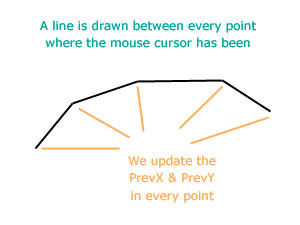

Drawing is fun. Learn how to create a drawing software that can let the user draw like a pencil in a virtual canvas in his computer screen. We are also going to use colors!
<!-- more -->


If you have a piece of paper and a pencil and loads of time to waste, what would you do? You will scribble. You will draw random shapes and lines in that piece of paper. That's what you are going to do today in your own program. Plus, you will find out the secrets how the computer draws what you draw!

It is much like using the Pencil tool in MS Paint.


### Quick Tutorial

Start [Lazarus](https://lazarus-ide.org).
Create a new Application project (**Project -> New Project -> Application -> OK**).

Create a `TColorButton` and a `TSpinEdit` (both from **Misc** tab) and a `TButton`. You can also use a `TBitBtn` instead of `TButton`, to use an icon for the button. It is a graphics application, you know. But it is upto you. Also, create a `TPaintbox`. Then select the `TButton` and set its `Name` property to `btnNew`. Add `TLabel`s and set `Caption`s as you desire. Your form layout may resemble the following:


Set the `MinValue` and `Value` of `SpinButton1` to `1`. You can set the `AkBottom` and `AkRight` of **PaintBox1 -> Anchors** property to `True` for sizing the `Paintbox` in resize event.

Switch to Code View (**F12**) and add these variables under the first `var` clause at the top:

```pascal
  paintbmp: TBitmap;
  MouseIsDown: Boolean;
  PrevX, PrevY: Integer;
```

Add the code below to `Paintbox1`'s `OnPaint` event. (Select `Paintbox1` then go to **Object Inspector -> Events -> OnMouseDown -> \[...\]** and enter:)

```pascal
procedure TForm1.PaintBox1MouseDown(Sender: TObject; Button: TMouseButton;
  Shift: TShiftState; X, Y: Integer);
begin
  MouseIsDown:=True;
  PrevX:=X;
  PrevY:=Y;
end;
```

Similarly, in the `OnMouseMove` event:

```pascal
procedure TForm1.PaintBox1MouseMove(Sender: TObject; Shift: TShiftState; X,
  Y: Integer);
begin
  if MouseIsDown then begin
    paintbmp.Canvas.Line(PrevX, PrevY, X, Y);
    PaintBox1.Canvas.Line(PrevX, PrevY, X, Y);

    PrevX:=X;
    PrevY:=Y;
  end;
end;
```

In the `OnMouseUp` event:

```pascal
procedure TForm1.PaintBox1MouseUp(Sender: TObject; Button: TMouseButton;
  Shift: TShiftState; X, Y: Integer);
begin
  MouseIsDown:=False;
end;
```

In the `OnPaint` event:

```pascal
procedure TForm1.PaintBox1Paint(Sender: TObject);
begin

  PaintBox1.Canvas.Draw(0,0,paintbmp);

end;
```

Select `ColorButton1` and add the code in the `OnColorChanged` event:

```pascal
procedure TForm1.ColorButton1ColorChanged(Sender: TObject);
begin

  paintbmp.Canvas.Pen.Color := ColorButton1.ButtonColor;
  PaintBox1.Canvas.Pen.Color := ColorButton1.ButtonColor;

end;
```

Select `SpinEdit1` and add code to the `OnChange` event:

```pascal
procedure TForm1.SpinEdit1Change(Sender: TObject);
begin

  paintbmp.Canvas.Pen.Width:=SpinEdit1.Value;
  PaintBox1.Canvas.Pen.Width:=SpinEdit1.Value;

end;
```

Double click `btnNew` and enter:

```pascal
procedure TForm1.btnNewClick(Sender: TObject);
begin

  paintbmp:=TBitmap.Create;

  // We create a canvas in the size of the screen
  // so that the user can resize and get space to
  // draw
  paintbmp.SetSize(Screen.Width, Screen.Height);

  // We make the canvas of White color
  paintbmp.Canvas.FillRect(0,0,paintbmp.Width,paintbmp.Height);

end;
```

Double click the form and enter:

```pascal
procedure TForm1.FormCreate(Sender: TObject);
begin

  // we create a new canvas to let the user draw
  btnNewClick(Sender);

end;
```

Add the code below on the Form's `OnClose` event:

```pascal
procedure TForm1.FormClose(Sender: TObject; var CloseAction: TCloseAction);
begin

  paintbmp.Free;

end;
```

We need to `Free` the `TBitmap` because it has been `Create`-ed. Remember to always `Free` anything in your code when you have used `Create()` function. If you fail to do that, you will face Memory Leak. So beware!

Now Run it (**F9** or **Run -> Run**).


### Explanations:


In the `btnNew`'s `OnClick` event:

```pascal
procedure TForm1.btnNewClick(Sender: TObject);
begin
  paintbmp:=TBitmap.Create;

  // We create a canvas in the size of the screen
  // so that the user can resize and get space to
  // draw
  paintbmp.SetSize(Screen.Width, Screen.Height);
  // We make the canvas of White color
  paintbmp.Canvas.FillRect(0, 0, paintbmp.Width, paintbmp.Height);
end;
```

We create a new canvas in the size of the screen. So that the user does not have to deal with a small canvas. The user gets extra space when he resizes.

After creation the canvas is all black. We don't want a dark canvas. So we draw a filled rectangular area with white color (`FillRect`). The default `Canvas.Brush.Color` is white, so we don't have to set the color.

**Why we draw on two canvases?**

There is a problem of drawing. If you draw something in a Canvas of a Component (such as we plan to draw in the `Paintbox1.Canvas`) then when it is repainted the drawn image gets erased. The component is repainted on the screen when it is resized or visually changed.

To eliminate the problem we have to draw the same image every time when the component is redrawn. That's why we have created a `TBitmap` (`paintbmp`) and drawn on it. All the drawings made on the `Paintbox1` is also being made on `paintbmp`. So whenever `Paintbox1` is repainted, we draw the `paintbmp` on the its Canvas. Look at the code below:

```pascal
var
  paintbmp: TBitmap;

...

procedure TForm1.PaintBox1Paint(Sender: TObject);
begin
  PaintBox1.Canvas.Draw(0,0,paintbmp);
end;
```

To create a virtual pencil work is a hardwork in computers. Do you think these drawings are made by dots? No! Well yes, technically. But from our perspective it is not drawn with dots. It is actually drawn with lines. Everytime the mouse is moved a line from the previous pixel / point is drawn, making it a series of lines to emulate a pencil stroke.

First, lets look at how a line tool works. When the user presses the mouse button (`OnMouseDown` event) 2 variables store the `X` and `Y` position where the mouse was down. (Assume they are `PrevX = X` and `PrevY = Y`.). When the mouse is up a line is drawn from the point `(PrevX, PrevY)` to point `(X, Y)`.


In the case of Pencil tool, we just have to update the `PrevX` and `PrevY` in the `OnMouseMove` event. So that we get a path of the mouse position where the cursor has been going.





We have to keep updating the `PrevX` & `PrevY` just after we have drawn a line.

```pascal
procedure TForm1.PaintBox1MouseMove(Sender: TObject; Shift: TShiftState; X,
  Y: Integer);
begin
  if MouseIsDown then begin
    paintbmp.Canvas.Line(PrevX, PrevY, X, Y);
    PaintBox1.Canvas.Line(PrevX, PrevY, X, Y);

    PrevX:=X;
    PrevY:=Y;
  end;
end;
```

In the case of Pencil tool a line has to be drawn in the MouseMove event. So we should also update the `PrevX` & `PrevY` values.

Take a look at [Developing with Graphics wiki article](http://wiki.freepascal.org/Developing_with_Graphics) for a better understanding of graphical magic tricks!
