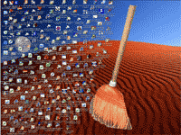
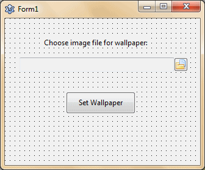
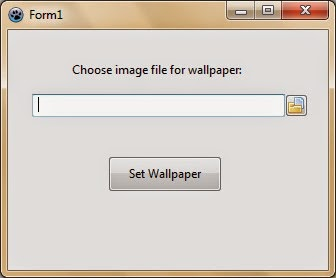
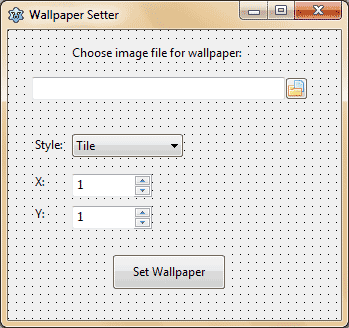
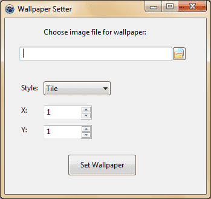

Do you know how to change a single image and change the whole feeling of how your computer looks? Get your seatbelt on!
<!-- more -->
  
  
The desktop wallpaper is a great part that makes our desktop. Although its just an image shown behind the desktop icons, even after that it can totally change the way our desktop looks. What if you want to make a Desktop Wallpaper manager? Then you will have to learn how to set the wallpaper. That's why I am writing this short article today.  
  
Changing Wallpaper is easier with Windows API call to SystemParametersInfo function. There is another [advanced method here](http://www.chami.com/tips/delphi/123096D.html). But for now, we'll just focus on a basic example.  
  
Okey, enough talk. Let's get to coding.  
  
Simple Example  
The simplest example for changing the desktop wallpaper would be:  

Procedure TForm1.Button1Click(Sender: TObject);  
var  
  PicPath : string;  
begin  
  PicPath := 'C:test.bmp';  
  SystemParametersInfo(SPI\_SETDESKWALLPAPER, 0, Pointer(PicPath), SPIF\_SENDWININICHANGE);  
end

  
Tutorial  
Start Lazarus.  
  
Create a new project (Project -> New Project -> Application -> OK).  
  
Draw a TFileNameEdit (from Misc tab) and a TButton (from Standard tab). Set the name of TButton as btnWallpaper and set its Caption as "Set Wallpaper". You can use any Tlabels if you like. In that case set its Caption to something appropriate. Here is a screenshot of mine:  
  

  
  
Now double click the TButton and enter:  

procedure TForm1.btnWallpaperClick(Sender: TObject);  
begin  
  SystemParametersInfo(SPI\_SETDESKWALLPAPER, 0, pchar(FileNameEdit1.FileName), SPIF\_SENDWININICHANGE);  
end;

  
Scroll to the top of the code and under the uses clause add "windows" unit:  
  
uses  
  ..., windows;  
  
As we are using the Windows API, the code is not cross platform. It will only work on Windows.  
  
Now Run the project (F9 or Run -> Run).  
  

  
Now open a JPG file and click the Set Wallpaper button. The wallpaper should change.  
  
This is the simplest working example for changing the wallpaper. But it has a problem. It only changes the wallpaper image. But it does not change the wallpaper style (such as tiled, stretched). So if the last wallpaper was set to tiled, then setting the wallpaper through this program would just change the image and keep it tiled.  
  
If you are satisfied with it then you can stop reading. But if you want to improve it then read on!  
  

### Enhancing it

In this segment we will add the Wallpaper Style option so that we can set the wallpaper as tiled, stretched etc.  
  
Draw a TComboBox to the form and set:  
Name = cboStyle  
Items =  
Tile  
Center  
Stretch  
Custom Position  
ItemIndex = 0  
Style = csDropDownList  
  
Notice the order of the text in the Items property. Such an order will help us to get the Wallpaper Style index for the registry. You will see later what I mean.  
  
Draw 2 "TSpinEdit"s (from Misc tab). Name one spinX and another spinY. Set both of their Value and MinValue property to 1. Don't worry about the MaxValue. We'll set their MaxValue on Form onCreate. So, double click on the form and enter:  
  

procedure TForm1.FormCreate(Sender: TObject);  
begin  
  spinX.MaxValue:=Screen.Width;  
  spinY.MaxValue:=Screen.Height;  
end;

  
Put some labels to help the user understand which component does what. Here's how my form looks like:  
  

  
Now to coding. We will use the [code from chami.com](http://www.chami.com/tips/delphi/123096D.html). Thanks goes to the author for his contribution. But first add the "registry" unit in the uses clause. Just remember we have added windows unit before, so we don't need to add it again.  
  

uses  
  ..., windows, registry;

  
Now add the const clause code below after the uses clause in the unit:  
  

const  
  // WallPaperStyles  
  WPS\_Tile      = 0;  
  WPS\_Center    = 1;  
  WPS\_SizeToFit = 2;  
  WPS\_XY        = 3;

  
Add a forward declaration for our Wallpaper setter procedure. Enter this code somewhere after the first var clause.  
  

procedure SetWallpaperExt(  
  sWallpaperBMPPath : string;  
  nStyle,  
  nX, nY : integer );

  
Now add the procedure before the last "end." line somewhere :  
  

//  
// sWallpaperBMPPath  
//   - path to a BMP file  
//  
// nStyle  
//   - any of the above WallPaperStyles  
//  
// nX, nY  
//   - if the nStyle is set to WPS\_XY,  
//     nX and nY can be used to set the  
//     exact position of the wall paper  
//  
procedure SetWallpaperExt(  
  sWallpaperBMPPath : string;  
  nStyle,  
  nX, nY : integer );  
var  
  reg    : TRegIniFile;  
  s1     : string;  
  X, Y   : integer;  
begin  
  //  
  // change registry  
  //  
  // HKEY\_CURRENT\_USER  
  //   Control PanelDesktop  
  //     TileWallpaper (REG\_SZ)  
  //     Wallpaper (REG\_SZ)  
  //     WallpaperStyle (REG\_SZ)  
  //     WallpaperOriginX (REG\_SZ)  
  //     WallpaperOriginY (REG\_SZ)  
  //  
  reg := TRegIniFile.Create(  
           'Control PanelDesktop' );  
  
  with reg do  
  begin  
    s1 := '0';  
    X  := 0;  
    Y  := 0;  
  
    case nStyle of  
      WPS\_Tile  : s1 := '1';  
      WPS\_Center: nStyle := WPS\_Tile;  
      WPS\_XY    :  
      begin  
        nStyle := WPS\_Tile;  
        X := nX;  
        Y := nY;  
      end;  
    end;  
  
    WriteString( '',  
      'Wallpaper',  
      sWallpaperBMPPath );  
  
    WriteString( '',  
      'TileWallpaper',  
      s1 );  
  
    WriteString( '',  
      'WallpaperStyle',  
      IntToStr( nStyle ) );  
  
    WriteString( '',  
      'WallpaperOriginX',  
      IntToStr( X ) );  
  
    WriteString( '',  
      'WallpaperOriginY',  
      IntToStr( Y ) );  
  end;  
  reg.Free;  
  
  //  
  // let everyone know that we  
  // changed a system parameter  
  //  
  SystemParametersInfo(  
    SPI\_SETDESKWALLPAPER,  
    0,  
    Nil,  
    SPIF\_SENDWININICHANGE );  
end;

  
Now double click the TButton and enter:  
  

procedure TForm1.btnWallpaperClick(Sender: TObject);  
begin  
  SetWallpaperExt(  
      FileNameEdit1.FileName,  
      cboStyle.ItemIndex,  
      spinX.Value, spinY.Value );  
end;

  
Now Run the Project (F9 or Run -> Run).  
  

  
  
  
  
  
  
Test the Program with as many images as you want. Change the options and apply them.  
  
Hope you had fun making this little Wallpaper setter. There is no limit of what you can do with this. You can create a Desktop Wallpaper Collection Manager or a program that can download a wallpaper everyday and set it as wallpaper. (There are also a bunch of wallpaper APIs to use: [1](https://www.desktoppr.co/api) [2](http://wall.alphacoders.com/api.php) ) Making such different variations of programs will make your coding skills improve.  
  

### Download Sample Code ZIP

You can download the above example tutorial project's source code from [here](https://www.dropbox.com/s/kn8oxl5z47tpow4/WallpaperSetter.zip?dl=1)  
Or here: [http://bit.ly/wallpaper-setter](http://bit.ly/wallpaper-setter)  
Size: 726 KB  
The package contains compiled executable EXE file.  
  
**Ref:**  
[http://stackoverflow.com/questions/1929721/how-to-change-desktop-wallpaper](http://stackoverflow.com/questions/1929721/how-to-change-desktop-wallpaper)  
[http://channel9.msdn.com/coding4fun/articles/Setting-Wallpaper](http://channel9.msdn.com/coding4fun/articles/Setting-Wallpaper)  
[http://www.chami.com/tips/delphi/123096D.html](http://www.chami.com/tips/delphi/123096D.html)