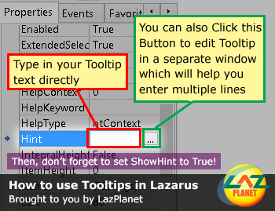

Tooltips are text that appears as a short help for a component when we keep our mouse over it for a while. We can add single line or multiline tooltips easily. Here's how...
<!-- more -->


### Why Tooltips / Hints?

[Tooltips](http://en.wikipedia.org/wiki/Tooltip) are a popular and common feature in the modern Operating Systems. Tooltips are also seen in HTML webpages (by using [`title`](https://html.com/attributes/a-title/) attribute to a tag). It is a great way to let the user understand what a button or a particular clickable object does. It is excellent for the users who are learning the operation of your software by himself, giving him a hint of the function of an object/component.


Tooltips also help the interface to be cleaner. If you have to put label texts all around the form to just explain the functions of the buttons (or components), then your design would be cluttered. Tooltip saves that valuable space in your User Interface design and makes your forms look neat.

We are also going to look at some other Help options which keep the form neat as well: Popup Notifier, Balloon Tooltip and status bar text help.


### How to use Tooltips for a component?

First, select the component for which you want Tool Tip for. Go to the **Object Inspector** window. Scroll a little and find an item titled **Hint**. You can write the Tooltip Text that you want in the text box next to it, or you can click the button at the right to enter a Tooltip/Hint of multiple lines.





Second, find out another property titled **ShowHint** and set it to **True**. If you don't set it to **True** then the Tooltip will not appear.

You can now Run your program (**F9** or **Run -> Run**). Hover your mouse over the component and you will see a Tooltip (or Hint) explaining what the button does!


### Variation 1: PopupNotifier

Another variation is the **TPopupNotifier** which can be used as a popup help which is better for long help.

You can use it like this:

Drop **TPopupNotifier** (from **Common Controls** tab). From its properties set an **Icon**, **Text** and **Title**. Create a help **TButton** (or **BitBtn**) somewhere and on its click event enter (we are assuming the button name is **Button2**):


```pascal
  PopupNotifier1.ShowAtPos(Left+Button2.Left, Top+Button2.Top+80);
```

Now Run the program (**F9** or **Run -> Run**) and click on the button. You will see a popup help.


### Variation 2: TrayIcon's Balloon Tooltip

Another modern variation is the Balloon Tooltip (or ScreenTip). For that we can drop a **TTrayIcon** (from **Additional** tab) and we need a **TButton** to run the `ShowBalloonHint` command for our Balloon Tooltip to appear. Set the **BalloonTitle** and **BalloonHint** of **TrayIcon1** as you wish and set **Visible** to **True**. You should also select an **Icon** for it to appear in the System Tray.


Double click the button and enter:

```pascal
  TrayIcon1.ShowBalloonHint;
```

Now Run the program (**F9** or **Run -> Run**) and click the button. You will notice a Balloon Tooltip in the System Tray Area.


### Variation 3: Help in Statusbar

Another variation is the one which is also used in websites, showing help text or hint in statusbar when the user points his mouse cursor over a component.

This can be done with a universal procedure like below to update the status bar text:

```pascal
var
  MyPoint : TPoint;
begin
  MyPoint := Button4.ScreenToClient(Mouse.CursorPos);
  if (PtInRect(Button4.ClientRect, MyPoint) then
  begin
    // Mouse is inside the control, do something here
  end;
end;
```

\[ Source: [StackOverflow.com](http://stackoverflow.com/questions/1721700/how-to-determine-if-the-mouse-cursor-is-inside-a-control) \]

Or it is also possible to change the statusbar text on hover event. It is an easier version to implement but it requires to write mouseover event procedures for every button we desire a statusbar help for. We could use the first one for better option and flexibility.

You can create a **TStatusBar** and set its **SimpleText** to something you desire.

Let's do this practically. Drop a **TStatusbar** (from **Common Controls** tab). Add a TButton. We assume its name is **Button4**. Now set its **Hint** property to something you desire. But don't set **ShowHint** to True (we do this because we don't want typical tooltips but we want to show the text in **Hint** property in **StatusBar**).

We will have to use [`PtInRect()`](http://lazarus-ccr.sourceforge.net/docs/rtl/types/ptinrect.html) function. For this add `types` in the `uses` clause:

```pascal
uses
..., types;
```

Drop a **TTimer** in the form (from **System** tab). Set its **Interval** to `500`. Double click it and enter:

```pascal
var
  MyPoint : TPoint;
begin
  MyPoint := Button4.ScreenToClient(Mouse.CursorPos);
  if (PtInRect(Button4.ClientRect, MyPoint)) then
  begin
    // Mouse is inside the control, do something here
    StatusBar1.SimpleText:=button4.Hint;
  end
  else
  begin

    // the default text
    StatusBar1.SimpleText:='Hello!';
  end;
end;
```

Now run the program and hover your mouse over the button. You will see the text in the **Hint** property of the **Button4**.


_Image: [http://jquerytools.org](http://jquerytools.org/media/img/hero/tooltips.jpg)_
