Some programs can minimize, but some very special programs can squeeze themselves to the system tray! Users can even use right click menu to do most of the stuff while minimized.
<!-- more -->


System tray is the area where various icons stay, to denote that they are running. The icons can be right clicked (sometimes left clicked) to get a menu to do further things. Some audio and video players use this feature to make them controllable even when they are minimized.

In this little article we will learn how to show your application icon in the system tray, show menu on right click and minimize to tray and some nifty tricks in between.


### Basics


The component we will use is **TTrayIcon** (from **Additional** tab).


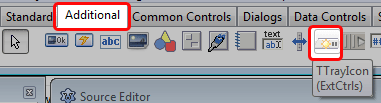


To try it, let's create a new project (**Project -> New Project -> Application -> OK**). Draw a **TTrayIcon** in the form anywhere. It will show up in the form. But don't worry, it will not be visible in runtime.

Now if you Run the program (**F9** or **Run -> Run**), it will not show anything on the system tray.


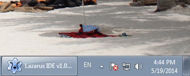


That's because the **Visible** property of the **TTrayIcon** is set to **False**. Set it to **True**.


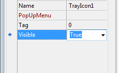


Now **Run** it again.


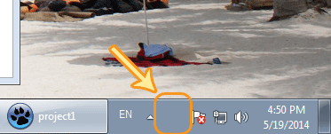


Now you will see that no icon appears! That's because we haven't set an icon for the component.


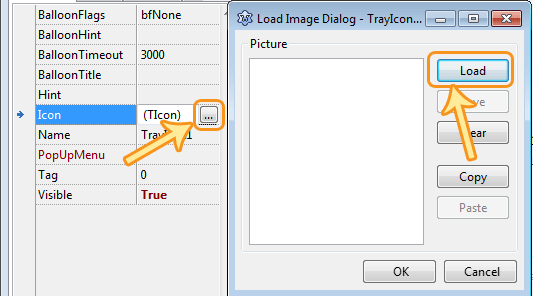


Set the **Icon** property, like the above screenshot. Choose an icon. If you don't have an icon in hand, you can save the project somewhere and then use the icon (projectname.ico) in the project directory. Then **Run** again.


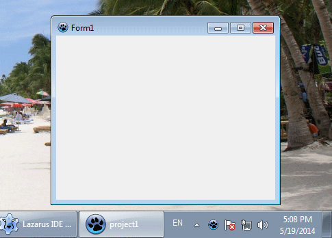


Now you will see an icon.

Sometimes you may not see the icon. That's becasue Windows automatically hides inactive icons to save screen space. If this is the case,
(1) you might have to click the arrow in the system tray to reveal it.
(2) Or you may click the arrow, then click "Customize...", then set you projects "Behavior" to "Show icon and notifications". This will always show your icon.

So, the basics of using the TTrayIcon is:
1. Draw the component
2. Set **Visible** to **True**, and
3. Set an appropriate **Icon**

This is the basic usage of showing your icon in system tray.


#### Setting tooltip for the icon


This is very easy:

1. Select the **TTrayIcon** component
2. Set its **Hint** property to something you wish

Now **Run** the program and hover over the icon to see your tooltip.


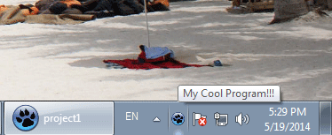


#### Showing a menu on the icon


If you have a wish to show a menu when the user right clicks on the tray icon, it is absolutely possible. Here's how to do it:

1. Draw a **TPopupMenu** (not TMainMenu) from **Standard** tab
2. Double click it and [create a menu like you wish](http://lazplanet.blogspot.com/2013/08/3-ways-to-use-popup-menus-in-lazarus.html). ([See how](http://lazplanet.blogspot.com/2013/08/3-ways-to-use-popup-menus-in-lazarus.html))
2. Select your **TTrayIcon** and set its **PopUpMenu** property to `PopupMenu1` (or whatever you named your TPopupMenu that you created earlier)


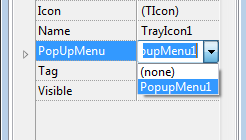


Now **Run** the project and you will see your menu on right clicking the icon in the system tray.


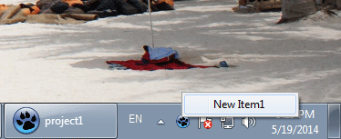


You can prepare the **TPopupMenu** anyway you like and it will automatically appear when you right click.


#### How to show Balloon Tooltip (Notification) on your icon


[Balloon tooltips](http://en.wikipedia.org/wiki/Balloon_help) are like callout type [tooltips](http://en.wikipedia.org/wiki/Tooltip), just like we see in cartoons. This has become very popular since Windows XP. It has been used in other OSs as well, but named differently. To use such a balloon tooltip follow these steps:

1. Select your **TTrayIcon**
2. Set **BalloonTitle** to something you desire. It will be the title or heading of the tooltip.
3. Set **BalloonHint** to something you desire. It will be the detailed message.
4. From code, run the code:
```pascal
TrayIcon1.ShowBalloonHint;
```
(Assuming the name of your **TTrayIcon** is **TrayIcon1**.)
You can draw a **TButton** on the form and double click it then enter the code.

Here is the result:

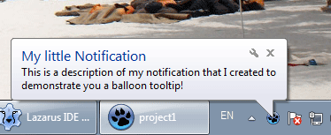


#### How to Minimize to Tray

Normally, when our program appears on screen, we can see its place in the taskbar. But sometimes we have to free the taskbar for other programs. That's why some developers have found a solution -- Minimize to Tray.

When user clicks a specific button, the program minimizes and the tray icon appears. So, instead of minimizing to taskbar, it minimizes to the tray icon. When the user clicks the icon, the program restores from the tray. Thus, restoring from the tray icon.

There may be two behaviors. One, the icon can only appear when minimized to tray and invisible in other times. Two, the icon can always stay visible. This is upto you. There are endless possibilities. You are the programmer, so design your code so that users feel more comfortable. But for demonstration, I will show a really simple one. But the basics are the same.

Basically, when **minimizing to tray**, we--
1. Minimize the form: Set the **WindowState** to **wsMinimized**. And then immediately...
2. Hide the form.

We don't hide the form first, because then the minimizing animation provided by the OS will not be seen. So, we minimize it first, it shows the animation, then we hide it. Make sure that you have the **TTrayIcon**'s **Visible** property set to **True** after doing this.

The code for doing this would be:

```pascal
  WindowState:=wsMinimized;
  Hide;
```

When **Restoring from Tray**, we--
- Show the form.
- Restore the form. Set **WindowState** to **wsNormal**.

The code to Restore from tray would be:

```pascal
   WindowState:=wsNormal;
   Show;
```

You can enter this code in the **TrayIcon**'s **OnClick** event. To do this, double click on your **TrayIcon** component, then enter:

```pascal
  if WindowState = wsMinimized then begin
    WindowState:=wsNormal;
    Show;
  end;
```


#### Using the Events of the TrayIcon

The **TTrayIcon** component has events to handle how the user interacts with the Tray icon. The events are:

*   **OnClick** : Triggered when user clicks on the icon at the tray
*   **OnDblClick** : Triggered when user double clicks on the icon
*   **OnMouseDown** : Triggers when user starts the click action
*   **OnMouseMove** : Triggers when user rolls mouse cursor over the icon
*   **OnMouseUp** : Triggers when user ends the click action
*   **OnPaint** : Self explanatory I guess. It triggers when the icon is _painted_ to the screen
*   **PopUpMenu** : If you expand it, you can set:
*   \-- **OnPopup**: Triggers when a menu is shown when right clicked on the icon
*   \-- **OnClose**: Triggers when the menu is closed (when the user clicks outside the menu)


Well, that's it! The basics of the **TrayIcon** component and how to use it. I have put together a little project for you to test these functions. The download link for the project is given below.


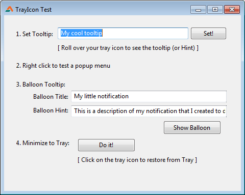


With the functionality already built in to the Lazarus/LCL, the possibilities are endless.
