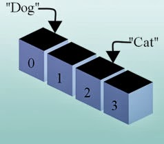

Come, discover the wonderful way to store and manage virtual lists on the computer memory.  
  
_It is a long time since you have seen a post from me. Well, to let you know, I have got a job. And luckily I got it even before my graduation result got published. That's great for my career but bad for this website. I have been busy with my work in my new job, organizing stuff to make it managable. Now its coming in a systematic manner, gradually. Now its time for this blog to occasionally get a post. Wish me good luck guys!_  
  

### The idea of Array

Arrays are a collection of similar values. You can think of it as a basket of values. This way, we can refer to the whole set of values with just the basket name. That makes our work easy. We can easily pass that basket name to a function and get all the values inside it processed. As if by magic! It is also easier to manage a whole bunch of values when it is grouped under a single name.  
  
In real life, we use folders. For what? For grouping SIMILAR documents. The TAX papers go on the "TAX file", rentals go on the "Rentals file". That makes our lives easy when we need to spot something quickly. In programing, arrays group similar values which in turn makes our lives easier too. Simple as that.  
  
For example, if you have 10 students on a class and you want to store their height (in centimeters/cm), what would you do? Would you do as following?  

var  
  StudentHeight1: Integer = 155;  
  StudentHeight2: Integer = 164;  
  StudentHeight3: Integer = 157;  
  ...  
  ...  
  StudentHeight10: Integer = 157;

  
  

The height of the leaders.... Just for humor! ;)

  
  
Let's see a figure below:  
Notice the usage a\[1\] vs a\[1,1\]. Single dimension has a total 3 items, while 2 dimensional array has 9 items. The dimensions are pointed out through blue arrows.  
  
For further reading about the multidimensional arrays [see this wiki](http://wiki.freepascal.org/Multidimensional_arrays).  
  

### A sample project

In this sample project we see a visual presentation of a dynamic array. We would create a dynamic array, add items to it and show the whole array.  
  
First, open up [Lazarus](http://www.lazarus.freepascal.org/).  
Click Project -> New Project -> Application -> OK.  
  
Switch to Form view (F12). Create a TMemo, 2 TLabels, and a TButton. Name one of the labels lblLength. Set the caption of the other as "Length:". Set the TButton's name to btnAdd. Switch to code view (F12) and under the first var clause add:  
  
MyArray : array of Integer;  
  
Switch to Form View (F12). Double click the TButton and enter the following code:  
  

procedure TForm1.btnAddClick(Sender: TObject);  
begin  
  
  // we just add another item to the array  
  SetLength(MyArray, Length(MyArray) + 1);  
  
  Randomize;  
  MyArray\[Length(MyArray) - 1\] := Random(9999);  
  
  UpdateStatus();  
  
end;

  
Add the following procedure below the above procedure:  
  

procedure TForm1.UpdateStatus();  
var  
  i: Integer;  
  
begin  
  lblLength.Caption:=inttostr(Length(MyArray));  
  
  Memo1.Lines.Clear;  
  for i := 0 to Length(MyArray) - 1 do begin  
    Memo1.Lines.Add(inttostr(MyArray\[i\]));  
  end;  
end;

  
Click on the procedure name to take the cursor on it. Then press Ctrl+Shift+C. This will add the declaration automatically at the top of the unit.  
  
Now run the project (F9).  
  
  
  
Now press the button a few times. You will see some random numbers being added to the TMemo. Actually the items shown in the memo are coming from an array. When you click the button, an item is added to the array. Then the items in the array is shown in the memo with a for loop.  
  
  
This way you can create virtual lists in the memory (RAM) and then render it on screen the way you want it. If you are interested in virtual lists then check out TStringList as well.  
  

### Download Sample Code ZIP

You can download the above example tutorial project source code from here: [https://db.tt/VPbShvQ1](https://db.tt/VPbShvQ1)  
Size: 515 KB  
The package contains compiled executable EXE.  
  
  
**Ref:**  
[http://wiki.freepascal.org/DYNAMIC\_ARRAY](http://wiki.freepascal.org/DYNAMIC_ARRAY)  
[http://wiki.freepascal.org/array](http://wiki.freepascal.org/array)  
[http://lazarus-ccr.sourceforge.net/docs/rtl/system/length.html](http://lazarus-ccr.sourceforge.net/docs/rtl/system/length.html)  
Photo: [Wikimedia](http://upload.wikimedia.org/wikipedia/commons/b/bf/CPT-programming-array.svg) [http://newsimg.bbc.co.uk](http://newsimg.bbc.co.uk/media/images/46343000/gif/_46343078_height_world_leaders_466.gif) [http://www.jumpthecurve.net](http://www.jumpthecurve.net/images/uploads/tic_tac_toe.gif)