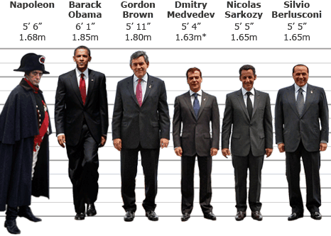
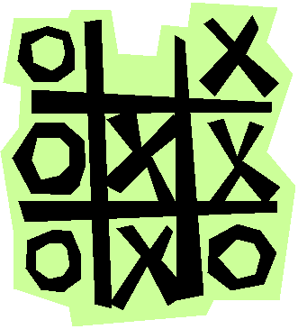
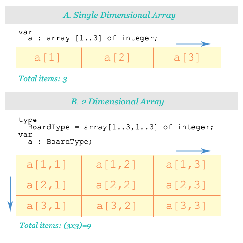
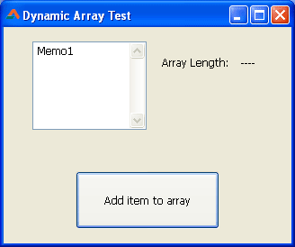
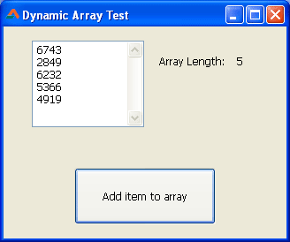

Come, discover the wonderful way to store and manage virtual lists on the computer memory.
<!-- more -->
  
_It is a long time since you have seen a post from me. Well, to let you know, I have got a job. And luckily I got it even before my graduation result got published. That's great for my career but bad for this website. I have been busy with my work in my new job, organizing stuff to make it managable. Now its coming in a systematic manner, gradually. Now its time for this blog to occasionally get a post. Wish me good luck guys!_  
  

### The idea of Array

Arrays are a collection of similar values. You can think of it as a basket of values. This way, we can refer to the whole set of values with just the basket name. That makes our work easy. We can easily pass that basket name to a function and get all the values inside it processed. As if by magic! It is also easier to manage a whole bunch of values when it is grouped under a single name.  
  
In real life, we use folders. For what? For grouping SIMILAR documents. The TAX papers go on the "TAX file", rentals go on the "Rentals file". That makes our lives easy when we need to spot something quickly. In programing, arrays group similar values which in turn makes our lives easier too. Simple as that.  
  
For example, if you have 10 students on a class and you want to store their height (in centimeters/cm), what would you do? Would you do as following?  

var  
  StudentHeight1: Integer = 155;  
  StudentHeight2: Integer = 164;  
  StudentHeight3: Integer = 157;  
  ...  
  ...  
  StudentHeight10: Integer = 157;

  
  

The height of the leaders.... Just for humor! ;)

  
Now if we wanted to make an average, we would have to type in all the variable names manually (StudentHeight1 + StudentHeight2 + StudentHeight3... ...). And for dividing, we need the count. So we would have to count all the students, then divide the total by the count. My question is, why work this hard? In this case we have update the count every time a new student is added. This is a burden to us programers. We buy super power processors for our computers, for what? For calculating the variables ourselves? Heck no!  
  
Let's use something automatic. Let's use arrays. It's logical and easily managable.  
  
If we had to store the student height data we could:  
  

var  
  height\_array = array \[1..10\] of integer;  
  
begin  
  
  height\_array\[1\] := 155;  
  height\_array\[2\] := 164;  
  height\_array\[3\] := 157;  
  
  ...  
  
  ...  
  
  height\_array\[10\] := 150;  
  
end;  
  

  
The range of height\_array starts from 1 and ends at 10. But generally, if we didn't set this range, array range starts from 0. Which makes it zero-based, of course.  
  
In the above example we can see that height\_array is an array, which is a variable. And it contains 10 values which are of Integer type. So we can say that arrays are a variable of variables.  
  
Okey. So we've implemented array for our problem. Then, for example, if we needed to make an average of all the heights then we could:  
  

var  
  height\_array : array \[1..10\] of integer;  
  
  i: integer;  
  sum: integer = 0;  
  count: integer;  
  
begin  
  
  height\_array\[1\] := 155;  
  height\_array\[2\] := 164;  
  height\_array\[3\] := 157;  
  
  ...  
  
  ...  
  
  height\_array\[10\] := 150;  
  
  
  
  // go through all the values and sum them up  
  for i := Low(height\_array) to High(height\_array) do  
    sum := sum + height\_array\[i\];  
  
  
  // how many items are there  
  count := Length(height\_array);  
  
  
  ShowMessage('The average is: ' + floattostr( sum div count ));  
  
end;  
  

  
Now that's a cool thing right? If we even had a function for average, even then, we could easily pass the heights data to the function by only passing the variable name:  
  

ShowMessage(floattostr( average(height\_array) ));

The function could be something like:  

function TForm1.average(var arr:array of Integer):Integer;  
var  
  i: integer;  
  sum: integer = 0;  
  count: integer;  
  
begin  
    for i := Low(arr) to High(arr) do  
      sum := sum + arr\[i\];  
  
    count := Length(arr);  
  
    Result:= sum div count;  
  
end;  
  

  
Array allows us to use functions for further processing. Using function for complex tasks is always a good idea. That keeps our main flow of the program simple. It also makes the program seem significantly easy to understand. It also makes the program flexible.  
  
**REMEMBER:** The main advantage of using arrays is we can iterate easily through all the values of an array through a simple for loop. So if we need to iterate through some data, it is logical to use arrays.  
  
  
If you can't understand the codes above, then relax. We will see how arrays work in a moment. After reading the examples below, hopefully everything will clear up in your head. But meanwhile let's recap what we've learned so far:  
\- Array is a collection of values, or collection of variables  
\- It can also store certain \*type\* of values that you have created yourself  
\- You can set the range for the items, thus start it from 1, but generally the element index starts from 0.  
\- Array makes it easier to go through all the values with a simple for loop. We don't have to type all the elements by hand.  
\- Array makes it easier to pass all the data in an array to a function (by only refering to the name of the array variable).  
  
  

### Implementation of Arrays in FreePascal/Lazarus

#### 1\. How to create a simple array:

my\_array : array \[1..5\] of integer;

  
  
The above array named my\_array, now has 5 elements / members / items, 1 through 5. They are of default values now, because we didn't set their values yet. Those elements can be of Integer type. We can also change the type to keep other types of data, such as instead of Integer we have made an array of strings:  
  

string\_array : array \[1..5\] of string;

  
  
Now the string\_array contains 5 elements, which can hold 5 strings.  
  
We can also customize the code to define other kind of range:  
  

string\_array2 : array \[5..10\] of string;

  
  

#### 2\. How input values to arrays:

  

my\_array\[1\] := 100;

  
  
The above code will set the 1st value of the array to 100. 1 is the index number for the array item. We could use similarly:  
  

my\_array\[2\] := 200;  
  
my\_array\[3\] := 350;  
  
my\_array\[4\] := 3000;  
  
...  
  
...

  
  
To store strings to our string\_array, we obviously have to:  
  

string\_array\[1\] := 'String 1';  
  
string\_array\[2\] := 'Another String';  
  
string\_array\[3\] := 'ANother String I own';  
  
...  
  
...

  
  

#### 3\. How to retrieve a value from an array:

Form1.Caption := string\_array\[2\];

  
  
This would make our form caption say 'Another String' (given that you have set its value through `string_array[2] := 'Another String';`).  
  

#### 4\. How to know the range of an array

Low(array\_name)

\-> To know the lower range  

High(array\_name)

\-> To know the higher range  
  
If we have an array that we declared like this:  

string\_array2 : array \[5..10\] of string;

  
  
...Then,  

Low(string\_array2)

will return 5 and High(string\_array2) will return 10.  
  

#### 5\. How many items are in the array:

`Length(array_name)` will simply return the count of the array elements.  
  
Length() is also used to get the length of a string. But when an array is passed on to it, it returns the array items count. [Read the docs](http://lazarus-ccr.sourceforge.net/docs/rtl/system/length.html) for details.  

#### 6\. Dynamic Array -- Array without ranges (Super Important!!!)

I am mainly a PHP programer. And in PHP I use barely use array with ranges. I just create an array, add items to it and do what I do; without ever declaring the range. I love this style of coding. It makes me feel flexible, rather than feel confined in a range.  
  
Free Pascal also has this feature. Up to now, we have seen array code example with ranges (i.e. \[5..10\]). Now we would see arrays without this range:  
  

var  
  MyArray : array of string;  
    
begin  
  
  // By default the array has 0 items.  
  // This is because we did not set any range.  
  // So we add 2 items to it.  
  SetLength(MyArray, 2);  
    
  // By default the array index number starts  
  // from 0 (zero).  
  // It starts from zero because we did not  
  // declare any start range.  
  MyArray\[0\] := 'A string';  
  // Then 1 comes after that, of course.  
  MyArray\[1\] := 'Another string';  
  
end;  

  
  
We don't have a specific "additem" function for adding items to the array. We have a SetLength function. We just have to say how many total items we need.  
  
But what if you just want to "add" 1 item to the array, by not knowing the total item count? We have a solution:  
  

SetLength(MyArray, Length(MyArray) + 1);

  
  
Length(MyArray) tells us how many items exist in the array. We just add 1 to it and reset the length of the array. Now we have an extra item for our use.  
  
  

#### 7\. Multidimensional Arrays:

I don't know much about multidimensional arrays. But as far I understand it can have 2 index numbers to define an array item. For example, we have used MyArray\[xyz\]. In multidimensional arrays we could use something like `MyArray[xyz, abc]`.  
  
The following code is for a tic tac toe board. I got this from [this wiki page](http://wiki.freepascal.org/Multidimensional_arrays)\-  
  

type  
  StatusType = (X, O, Blank);  
  BoardType = array\[1..3,1..3\] of StatusType;  
  
var  
  Board : BoardType;

  
  
Notice how the array is declared. In the BoardType declaration there are 2 ranges seperated by a comma. So it is a 2 dimensional array. The array can hold information about a tic tac toe board.  
  

  
  
Let's see a figure below:  

Notice the usage a\[1\] vs a\[1,1\]. Single dimension has a total 3 items, while 2 dimensional array has 9 items. The dimensions are pointed out through blue arrows.  
  
For further reading about the multidimensional arrays [see this wiki](http://wiki.freepascal.org/Multidimensional_arrays).  
  

### A sample project

In this sample project we see a visual presentation of a dynamic array. We would create a dynamic array, add items to it and show the whole array.  
  
First, open up [Lazarus](http://www.lazarus.freepascal.org/).  
Click Project -> New Project -> Application -> OK.  
  
Switch to Form view (F12). Create a TMemo, 2 TLabels, and a TButton. Name one of the labels lblLength. Set the caption of the other as "Length:". Set the TButton's name to btnAdd. Switch to code view (F12) and under the first var clause add:  
  
MyArray : array of Integer;  
  
Switch to Form View (F12). Double click the TButton and enter the following code:  
  

procedure TForm1.btnAddClick(Sender: TObject);  
begin  
  
  // we just add another item to the array  
  SetLength(MyArray, Length(MyArray) + 1);  
  
  Randomize;  
  MyArray\[Length(MyArray) - 1\] := Random(9999);  
  
  UpdateStatus();  
  
end;

  
Add the following procedure below the above procedure:  
  

procedure TForm1.UpdateStatus();  
var  
  i: Integer;  
  
begin  
  lblLength.Caption:=inttostr(Length(MyArray));  
  
  Memo1.Lines.Clear;  
  for i := 0 to Length(MyArray) - 1 do begin  
    Memo1.Lines.Add(inttostr(MyArray\[i\]));  
  end;  
end;

  
Click on the procedure name to take the cursor on it. Then press Ctrl+Shift+C. This will add the declaration automatically at the top of the unit.  
  
Now run the project (F9).  
  

  
  
Now press the button a few times. You will see some random numbers being added to the TMemo. Actually the items shown in the memo are coming from an array. When you click the button, an item is added to the array. Then the items in the array is shown in the memo with a for loop.  
  

  
This way you can create virtual lists in the memory (RAM) and then render it on screen the way you want it. If you are interested in virtual lists then check out TStringList as well.  

**Ref:**  
[http://wiki.freepascal.org/DYNAMIC\_ARRAY](http://wiki.freepascal.org/DYNAMIC_ARRAY)  
[http://wiki.freepascal.org/array](http://wiki.freepascal.org/array)  
[http://lazarus-ccr.sourceforge.net/docs/rtl/system/length.html](http://lazarus-ccr.sourceforge.net/docs/rtl/system/length.html)  
Photo: [Wikimedia](http://upload.wikimedia.org/wikipedia/commons/b/bf/CPT-programming-array.svg) [http://newsimg.bbc.co.uk](http://newsimg.bbc.co.uk/media/images/46343000/gif/_46343078_height_world_leaders_466.gif) [http://www.jumpthecurve.net](http://www.jumpthecurve.net/images/uploads/tic_tac_toe.gif)
