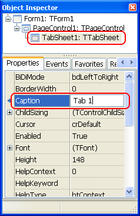

Tabs are a good way to tidy up your form and give a perfect look to a hundred checkboxes. Today we learn how to use this inevitable UI element in our forms.
<!-- more -->
  
  
  
Tabs help us to categorize hundreds of options into smaller parts. The user can easily navigate to his expected tab and access some option. There are countless software which use tabs for making it easier to access the right option from numerous options presented in one form. One example is the [Firefox](http://www.mozilla.org/en-US/firefox/new/) Options dialog. If you go to the Advanced section then you will see some tabs, such as, General, Data Choices, Network, Update, Encryption.  
  

  

(Click the screenshot to view original size.)

  
There are many options in each tab. If there were no tabs, how could we put such a long list of options in one form? So, tabs are necessary. Use tabs when there are many options that you cannot easily fit them in a view. But don't overuse tabs. That will only make the interface look messy.  
  

### Tabs in Lazarus

Using tabs in Lazarus is easy. But at first it might feel a little weird. Well, to get you into a little confusion, Lazarus has 2 components for Tabs! TPageControl and TTabControl. You can use both of them from the Common Controls tab in the Lazarus toolbar.  
  

  
So what's the difference between them?  
  
According to [this topic](http://forum.lazarus.freepascal.org/index.php?topic=18853.0) in the Lazarus Forums, Blaazen explains:  
  

> Simply, TPageControl contains other components on each tab.  
> TTabControl has the same components on each tab.  
>   
> TTabControl is for multi-tab interface, like web-browser or file-manager.  
>   
> TPageControl can be used where you need other content on each tab, like some Options... dialogs or whatever.

  
So, TPageControl is where we need different components in each tab. Such as an options dialog. TTabControl on the other hand is where you need same components in each tab. For example, a browser has the same components for each tab, the browser component, of course. It never changes between tabs.  
  
In this little article we will see how to use TPageControl, which we generally use for options dialog. But using TTabControl is similar. We will have a tiny little part for that too, at the end. So first we get to TPageControl.  
  

### Tutorial

Start [Lazarus](http://www.lazarus.freepascal.org/).  
  
Create a new Application Project (Project-> New Project-> Application-> OK).  
  
Now go to Common Controls tab of the Lazarus toolbar and draw a TPageControl in the form.  
  

  
  
Hey, wait! No tabs! Yeah, its perfectly natural. We will have to add tabs in order to show it. Before that, it is just an plain old rectangle!  
  
Now right click it and select Add Page  
  

  
Now you will see a tab. in your TPageControl component.  
  

  
You will also notice there is a new TTabSheet created in the Object Inspector, right inside of your TPageControl. TTabSheet are sort of like a container which can hold components inside it. You will the TTabSheet (or Tabsheet1) to be selected. That means now the Object Inspector is showing properties for the Tabsheet, not the TPageControl. So now you can change the Caption property to change the Caption of the tab.  
  

  
Now, we would create another tab. Right click the TPageControl in the form and select Add Page.  
  

  
That will add another tab in our TPageControl. Change its caption to Tab 2 from the Object Inspector.  
  

  

  
You can see that the Tab 2 is selected. If you draw components inside it, it will stay in Tab 2. Now if you click Tab 1, you will see the first tab and inside it you can add components for Tab 1. If you click on Tab headings in such way, the TPageControl is selected automatically. If you click on the content area of the tab, the TTabSheet is selected. (You can play with selecting them both and notice the change in the Object Inspector.)  
  

  
  
Now add 2 TRadioButtons in Tab 2 and 3 TCheckBoxes. Change the name of the last Checkbox's name as ChkOK. Change its caption to something like: Show message when I click OK. Create a TButton at the bottom of the form, outside the TPagecontrol. Set its caption as OK.  
  
Now if you look at the Object Inspector it will feel quite a mess of components having a pretty impressive hierarchy structure!  
  

  
Don't be afraid looking at it. You can call components without mentioning their hierarchy. To prove that we will add a simple code to the TButton. Double click the OK button. Now enter the following code:  
  

procedure TForm1.Button1Click(Sender: TObject);  
begin  
  if ChkOK.Checked = true then  
    ShowMessage('This is a dummy button!');  
end;

  
As you can see in the above code, we have referred to our TCheckBox the way we refer it without having a TPageControl.  
  
Now run the project (F9 or Run-> Run).  
  

  
Now test the "tabbiness" yourself. Navigate between tabs. Now check and uncheck the Checkboxes and click the button.  
  
You can also arrange the tabs' order. For example, if you want to bring Tab 2 before Tab 1 then simply go to Tab 2, then right click it and select **Move Page Left**. Similarly, there is another menu item named **Move Page Right**. If you want to delete a Tab, go to that tab and then right click it, select **Delete Page**. You can also use **Insert Page** from the menu as well, if you want to add the tab before the selected tab, instead of adding it at the end when you click **Add Page**.  
  

### About TTabControl

Using TTabControl is similar to using TPageControl, as I have mentioned earlier. The only major difference is that you need only one set of components for the TTabControl. Those will be changed/updated as you wish on selecting each tab. You can create a TTabControl in the form and right click it, select Add Tab. You can create components in the content area. You can change their properties or whatever in its OnChange event.  
  
You can use Add Tab, Insert Tab, Delete Tab, Move Tab Left, Move Tab Right as you can for TPageControl.  
  
  

### Download Sample Code ZIP

You can download the above example tutorial project source code from [here](https://www.dropbox.com/s/pk701y03xg08gvn/TabTest.zip?dl=1)  
Size: 521 KB  
The package contains compiled executable EXE.