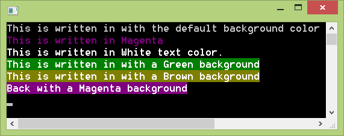

Console applications are not of entertaining type. They have that whitish dull color in a black background. But who says you cannot change it! Here is a tip to change the text color of console programs.
<!-- more -->
  
  
Console programs written by any language uses the default color to show text. Which is white on black background. It is the usual color for any program written in Free Pascal as well. But what if you need to change it? What if you want to highlight the results of your program with a different color to separate it from other text? We have an option.  
  

### How...?

With the [crt](http://www.freepascal.org/docs-html/rtl/crt/) unit you can do many cool tricks to your dull boring good old console programs. You can [look here for many tricks](http://www.math.uni-leipzig.de/pool/tuts/FreePascal/units/node2.html). We don't need all of these for now. We will only focus on changing Text Color and yes, background color as well.  
  
We have 2 procedures to change text and background colors of Free Pascal console programs, TextColor and TextBackground.  
  
  

### How to change Text Color in Free Pascal

We have a procedure for changing text color in Free Pascal, which is [TextColor](http://www.freepascal.org/docs-html/rtl/crt/textcolor.html). Check out the syntax below:  

procedure TextColor(  
  Color: Byte  
);

  
You can use something like TextColor(Red); before a Write or WriteLn function to print text with the Red color. Like this:  
  

TextColor(Red);  
WriteLn('This text will be Red in color');

  
  
But this procedure is in the crt unit. So you will have to add it in the uses clause:  
  

uses  
  ... , crt;

  
[Color constants](http://www.math.uni-leipzig.de/pool/tuts/FreePascal/units/node2.html) are as follows:  
  

  Black = 0;  
  Blue = 1;  
  Green = 2;  
  Cyan = 3;  
  Red = 4;  
  Magenta = 5;  
  Brown = 6;  
  LightGray = 7;  
  DarkGray = 8;  
  LightBlue = 9;  
  LightGreen = 10;  
  LightCyan = 11;  
  LightRed = 12;  
  LightMagenta = 13;  
  Yellow = 14;  
  White = 15;

  
A simple program [example](http://www.freepascal.org/docs-html/rtl/crt/textcolor.html) can be given below:  
  

Program ExampleTextColor;  
uses Crt;  
  
{ Program to demonstrate the TextColor function. }  
  
begin  
  WriteLn('This is written in the default color');  
  TextColor(Red);  
  WriteLn('This is written in Red');  
  TextColor(White);  
  WriteLn('This is written in White');  
  TextColor(LightBlue);  
  WriteLn('This is written in Light Blue');  
  ReadLn;  
  
end.

  
You can try this code with [Lazarus](http://www.lazarus.freepascal.org/) by Creating a new Program Project (Project-> New Project-> Program-> OK) then selecting all text and pasting (replacing) the code. You can then Run the code (F9 or Run-> Run).  
  

### How to change the background color in Free Pascal

We can also change the background color of text in Free Pascal console programs. We can use the [TextBackground](http://www.freepascal.org/docs-html/rtl/crt/textbackground.html) procedure to do this job, which is also from crt unit. Look at the syntax:  

procedure TextBackground(  
  Color: Byte  
);

  
The color constants are same as mentioned above.  
  
You can easily change the background of printed text on the console screen. You will have to use TextBackground before any Write or WriteLn code. Like this:  
  

TextBackground(Green);  
WriteLn('This text will have a green background');

  
A sample program code [example](http://www.freepascal.org/docs-html/rtl/crt/textbackground.html) can be like this:  
  

Program ExampleBgColor;  
  
uses Crt;  
  
{ Program to demonstrate the TextBackground function. }  
  
begin  
  
  TextColor(White);  
  WriteLn('This is written in with the default background color');  
  TextBackground(Green);  
  WriteLn('This is written in with a Green background');  
  TextBackground(Brown);  
  WriteLn('This is written in with a Brown background');  
  TextBackground(Black);  
  WriteLn('Back with a black background');  
  ReadLn;  
  
end.

  
You can try the above code with a New Program Project in Lazarus, like stated above.  
  

Ref:  
[http://www.math.uni-leipzig.de/pool/tuts/FreePascal/units/node2.html](http://www.math.uni-leipzig.de/pool/tuts/FreePascal/units/node2.html)  
[http://www.freepascal.org/docs-html/rtl/crt/textcolor.html](http://www.freepascal.org/docs-html/rtl/crt/textcolor.html)  
[http://www.freepascal.org/docs-html/rtl/crt/textbackground.html](http://www.freepascal.org/docs-html/rtl/crt/textbackground.html)
