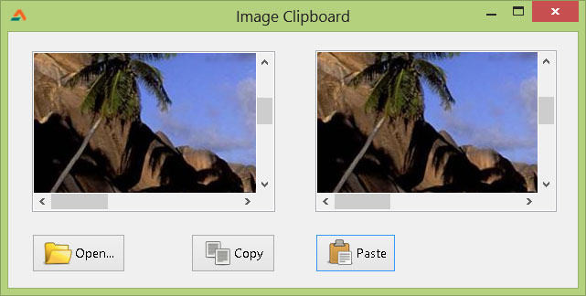

In paint programs, we see a function to copy an image to clipboard and paste it from there. Paste an image from anywhere, Photoshop, Firefox in your own program! Here's how...
<!-- more -->
  
  
Clipboard is a virtual space where content is stored when we cut or copy anything. I suppose you use cut, copy, paste menu items almost everyday, from browsers or word processors and even image editors like photoshop. When we copy (or cut) something, the content is stored in the clipboard which is a virtual space for such stuff. It can hold text, images, html and what not.  
  
Today we learn how to use clipboard for images. We learn how to copy an image to clipboard and paste an image from clipboard.  
  

### Copying an image to clipboard

var  
  bmp1: TBitmap;  
begin  
  
  bmp1 := TBitmap.Create;  
  
  bmp1.Width := Image1.Width;  
  bmp1.Height := Image1.Height;  
  bmp1.Canvas.Draw(0,0,Image1.Picture.Graphic);  
  
  //Clipboard.Clear;  
  Clipboard.Assign(bmp1);  
  
  bmp1.Free;  
  
end;

  
We prepare the bmp1 for copying to the clipboard. The contents of the bmp1 will be sent to the clipboard. In the above example we have a TImage named Image1. It has an image loaded into it. ([You can also let the user load an image in it through using a TOpenDialog.](http://lazplanet.blogspot.com/2013/05/a-simple-image-viewer-from-start-to.html) But that's not necessary for a basic trial.)  
  
var  
  bmp1: TBitmap;  
...  
  bmp1 := TBitmap.Create;  
  
We declare the TBitmap and initiate it through the Create function.  
  
  bmp1.Width := Image1.Width;  
  bmp1.Height := Image1.Height;  
  
We set the dimension of the image to be copied on the clipboard .  
  
  bmp1.Canvas.Draw(0,0,Image1.Picture.Graphic);  
  
We draw the Image1's Picture on bmp1.  
  
  Clipboard.Assign(bmp1);  
  
This is the main attraction of the show! We set/assign bmp1 as the clipboard.  
  
  bmp1.Free;  
  
We free bmp1 from memory.  
  

### Pasting the image from the clipboard

We will now proceed to the Paste image that is on Clipboard. We will paste the image on a TImage named Image2.  
  

var  
  tempBitmap: TBitmap;  
  PictureAvailable: boolean = False;  
  
begin  
  
  
  // we determine if any image is on clipboard  
  if (Clipboard.HasFormat(PredefinedClipboardFormat(pcfDelphiBitmap))) or  
    (Clipboard.HasFormat(PredefinedClipboardFormat(pcfBitmap))) then  
    PictureAvailable := True;  
  
  
  if PictureAvailable then  
  begin  
  
  
    tempBitmap := TBitmap.Create;  
  
  
    if Clipboard.HasFormat(PredefinedClipboardFormat(pcfDelphiBitmap)) then  
      tempBitmap.LoadFromClipboardFormat(PredefinedClipboardFormat(pcfDelphiBitmap));  
  
    if Clipboard.HasFormat(PredefinedClipboardFormat(pcfBitmap)) then  
      tempBitmap.LoadFromClipboardFormat(PredefinedClipboardFormat(pcfBitmap));  
  
  
    Image2.Width := tempBitmap.Width;  
    Image2.Height := tempBitmap.Height;  
  
  
    // this line does not resize the canvas  
    // accordingly...  
    //Image2.Canvas.Draw(0, 0, tempBitmap);  
  
  
    // so we use assign, it works perfectly  
    image2.Picture.Bitmap.Assign(tempBitmap);  
  
  
    tempBitmap.Free;  
  
  
  end  
  else  
  begin  
  
    ShowMessage('No image is found on clipboard');  
  
  end;  
end;

  
Now the explanation:  
  
  if (Clipboard.HasFormat(PredefinedClipboardFormat(pcfDelphiBitmap))) or  
    (Clipboard.HasFormat(PredefinedClipboardFormat(pcfBitmap))) then  
    PictureAvailable := True;  
  
First we determine that an image exists on on the clipboard or not. If there is an image format on the clipboard then we proceed to pasting the image.  
  
    if Clipboard.HasFormat(PredefinedClipboardFormat(pcfDelphiBitmap)) then  
      tempBitmap.LoadFromClipboardFormat(PredefinedClipboardFormat(pcfDelphiBitmap));  
    if Clipboard.HasFormat(PredefinedClipboardFormat(pcfBitmap)) then  
      tempBitmap.LoadFromClipboardFormat(PredefinedClipboardFormat(pcfBitmap));  
  
The clipboard may have images of many formats. So we load the appropriate format which is available.  
  
    // this line does not resize the canvas  
    // accordingly...  
    //Image2.Canvas.Draw(0, 0, tempBitmap);  
  
The above code is not used. You can use this code. But if you use this code the image2 TImage will not show the full clipboard image. The image will be shown in an area which is of the width and height of Image2 that is set in the form designer at design time (no matter how many times you change width and height of the TImage). The reason is that canvas (in this case TImage.canvas) cannot be resized once it has been created. (Or you may [refer to](http://lazarus.freepascal.org/index.php/topic,20709.0.html) TImage.picture.bitmap.SetSize).  
  
    image2.Picture.Bitmap.Assign(tempBitmap);  
  
This code is much better. It automatically adjusts the width and height of canvas.  
  

### Ending...

You can also look [in this Lazarus wiki](http://wiki.lazarus.freepascal.org/Clipboard) for details on using clipboard functions. You can extend this example in many ways. Don't forget to post comments on improvements or suggestions in the comments below.  
  
You can download a sample program from below which illustrates the above article practically.  
  

  
You can open an image and use Copy-Paste buttons to test the program. You can also test it by Pressing Print Screen button on your keyboard then using the Paste button paste the screenshot. You can also copy image from MS Paint or Photoshop or GIMP to this program to test if the program works.  

_(Image: http://cityofcorinthms.com/business/permits-inspections/)_
