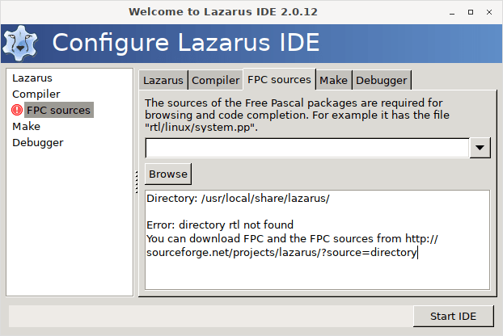
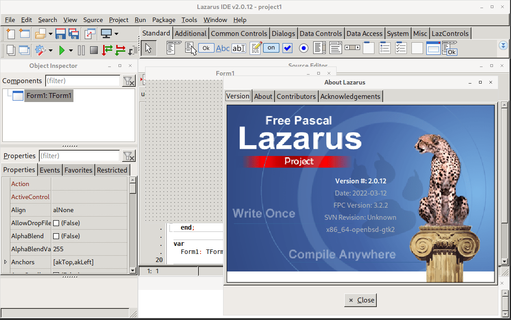
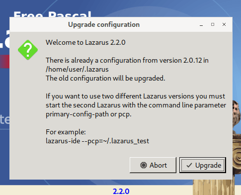
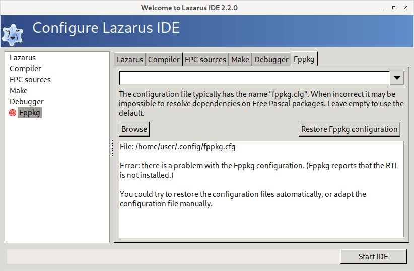
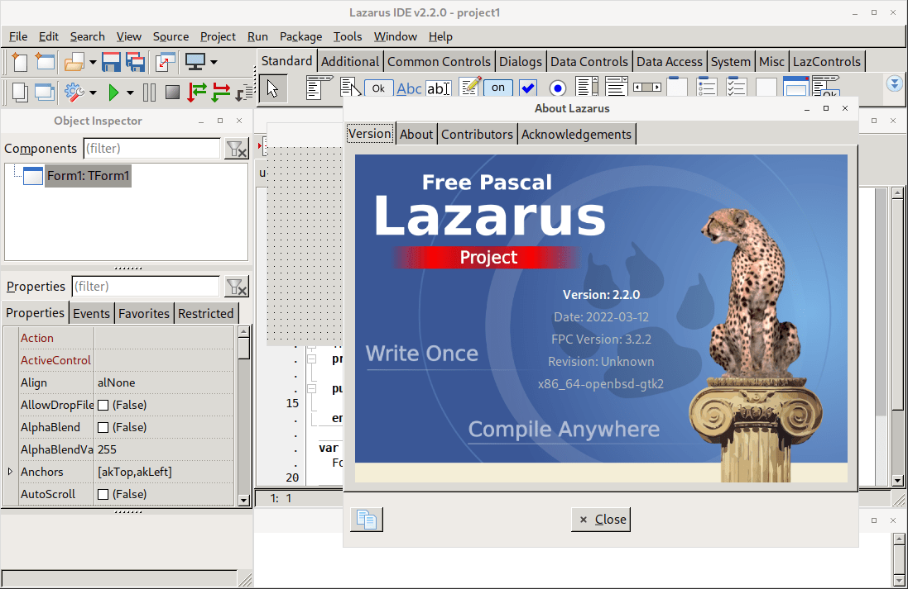

Are you using OpenBSD? Why not install Lazarus there? This article has you covered on how to do just that.
<!-- more -->

Recently have been [using OpenBSD](https://notabug.org/adnan360/code-backups/src/master/bsd/openbsd/install-openbsd.md). Did you know it's one of the most secure operating systems ever built by humans? They [fix security holes](https://www.openbsd.org/security.html) before they're even discovered and used in the wild. They had just 2 remote vulnerabilities in the default system in a long time, which is really low compared to other systems, even Linux.

OpenBSD is a cool operating system. So if you haven't tried it and have some spare time, try it. It will change your thinking about operating systems. It's a UNIX-like system, meaning most of the commands like `cd`, `ls`, `cat` are similar to Linux, so you'll feel right at home if you ever used it before.

So lately I was looking for ways on how to use Lazarus on OpenBSD. And eventually, I found a way. I was successfully able to run Lazarus on OpenBSD 7.0 release and 7.1 snapshot. So hop on if you're interested.


## Where do packages come from?

We will be building a package for Lazarus. Don't worry, it's easy. But first let's learn a bit about packages.

Packages contain binary files for a program we wish to run and the information about which dependencies are needed to run it etc., so that a package manager knows how to install it. So a package is a packaged program wrapped in a package file. :)

When we install packages to use a program or what not, the packages have to come from somewhere, right? They have to be made. Usually Linux and BSD operating systems have their own build systems for this. These build systems, well, build the package files for us.

When we run `pkg_add`, `apt install`, `pacman -S` or any other package manager "install" commands, they just download these nicely built package files and installs them on our computer. Convenient, right?

A build system not only just builds the packages, it optionally applies changes to the source code as well so that they run better on the platform. So they're a very important part of the platform's ecosystem. Build systems usually have "recipes" for every package we use and it does the build process based on those recipes.

OpenBSD has such a system which is called "ports". In the OpenBSD world, a single recipe from that ports collection is called, you guessed it, a "port". If running `ls /usr/ports` on your OpenBSD system doesn't return directories like `audio`, `fonts`, `games` etc., then you probably don't have OpenBSD ports installed.


## Is Lazarus package already there on repos?

I don't have a "lazarus" package on my OpenBSD 7.0 release version's repository, so I used the following process to install it. But don't worry, it's easy if you follow the steps here. But it's always a better idea to backup the system before trying this.

**NOTE:** The package for Lazarus is not included in the main repo yet, at least at the time of writing this. In case you want to check, try running `pkg_info -Q lazarus`. If it shows "lazarus", you can install Lazarus with `doas pkg_add lazarus` and you won't have to go through the rest of the port building process.


## Step 1: Setup ports

**NOTE:** You will need a system which has X11 installed in order to build a port. That means you will need to have [file sets](https://www.openbsd.org/faq/faq4.html#FilesNeeded) having `x` at the beginning installed on your system. If you have a graphical system with mouse pointer and such, chances are you're already covered. If not, you can [install file sets on an already installed OpenBSD system](https://www.cyberciti.biz/faq/openbsd-install-sets-after-install/). Another thing to remember that instructions below are for OpenBSD release version and not meant for current or snapshot. For those, please check the end of the article.

So, run these on a terminal program to install ports on your system:

```sh
$ cd /tmp
$ ftp https://cdn.openbsd.org/pub/OpenBSD/$(uname -r)/{ports.tar.gz,SHA256.sig}
$ signify -Cp /etc/signify/openbsd-$(uname -r | cut -c 1,3)-base.pub -x SHA256.sig ports.tar.gz
$ doas -s
# cd /usr
# tar xvzf /tmp/ports.tar.gz
```

It may take a long time depending on your system.

We're basically downloading the ports collection, verifying that it's a legitimate copy, then extracting it in `/usr/ports`.

If you are new to command line:
- You can open any terminal program installed on your system, such as, xterm, lxterminal, sakura etc. to use these commands.
- You can just type or paste a command and press enter to "run" it.
- With `doas -s` we are logging in as root. This will let us do advanced stuff on the system.
- With systems where sudo is installed, `sudo -s` also does the same thing. You may need to enter the user password after running either of these.
- You can also use `su` to do the same thing. If you use `su` it would need root user password instead.
- Running `exit` will get you out of that mode.
- The commands needed to be run as root are indicated with a `#` at the beginning of the line.
- Lines beginning with `$` can be run as normal user.
- When you are copying and pasting commands in the terminal, you don't need to copy these `$` or `#` at the beginning of the line.
- When you are in doubt, try running `whoami`. It will tell you which user you are currently logged in as.
- You will find this style around almost everywhere, for example, on blog posts and articles. This style is common for Linux/Unix operating systems.

Now if you check with `ls /usr/ports`, you will see many directories. Go ahead and browse to `/usr/ports` with a file manager. These directories contain, as we talked about earlier, the "recipes" for packages. The directories you see under `/usr/ports` are just categories for those recipes. For example, recipe for building the Firefox package is under `www/mozilla-firefox`, recipe for building FPC package is under `lang/fpc` etc.

Do not run `exit` yet. With still logged in as root, continue to next step.


## Step 2: Preparing Lazarus port

Now, we'll get the [third party repo](https://github.com/ibara/openbsd-ports-wip) that contains a Lazarus IDE port. Thanks to [Dr. Brian Callahan](https://bsd.network/@bcallah) for maintaining the port. In future, when Lazarus package gets included in the official repos, you will not have to use this repo at all. But for now:

```sh
# git clone --depth 1 https://github.com/ibara/openbsd-ports-wip /tmp/obsd-wip
# cp -r /tmp/obsd-wip/devel/lazarus /usr/ports/devel
# cd /usr/ports/devel/lazarus
# pkg_add fpc gmake libiconv gtk+2
# pkg_delete lazarus
# make install
```

We need to install `fpc`, `gmake`, `libiconv`, `gtk+2` because they are required by Lazarus build process. Depending on your setup, some of them might be already installed. The `pkg delete` command uninstalls any existing lazarus packages. If it says `Can't find lazarus`, feel free to ignore it.

`make install` should start with something like:

```
===> lazarus-2.0.12 depends on: ...
...
===>  Checking files for lazarus-2.0.12
>> Fetch https://downloads.sourceforge.net/sourceforge/lazarus/lazarus-2.0.12.tar.gz
...
```

At the time of writing this, the port is at `2.0.12` (run `grep ^V /usr/ports/devel/lazarus/Makefile` to check). It may be updated later, so don't worry about the version number for now.

**UPDATE:** The port [has been updated](https://github.com/ibara/openbsd-ports-wip/pull/3) for 2.2.0-0, so you'll get the latest version without any effort.

Let it do it's thing. Gradually it will download the source code of Lazarus, build it and install it.

After it's finished it should say something like:

```
...
lazarus-2.0.12: ok
Running tags: ok
```

Type `exit` and enter to logout from root prompt and use the terminal normally.


## Step 3: Running Lazarus

Now you should be able to run Lazarus from applications menu or [if it doesn't work](https://github.com/ibara/openbsd-ports-wip/issues/1) run `lazarus-ide` from terminal.

If you see a [red icon beside FPC sources on the welcome dialog](https://github.com/ibara/openbsd-ports-wip/issues/2#issuecomment-949302216), you would need the FPC sources installed.



To do this:

**NOTE:** If you require a different version of FPC other than "3.2.2" (run `fpc -v` to know which one you need), please change it everywhere in the following instructions.

```sh
$ cd ~/Downloads
$ ftp ftp://ftp.hu.freepascal.org/pub/fpc/dist/3.2.2/source/fpc-3.2.2.source.tar.gz
$ cd /usr/local/share/lazarus
$ doas mkdir fpc
$ cd fpc
$ doas tar xvzf ~/Downloads/fpc-3.2.2.source.tar.gz
```

If it extracted completely, you can delete the source file with: `rm ~/Downloads/fpc-3.2.2.source.tar.gz`

Then enter the path `/usr/local/share/lazarus/fpc/fpc-3.2.2` in the Lazarus dialog box and continue.

When you have it running it should show up something like this:




## Step 4: Going a step further

For most, the journey ends here. But for the curious ones, it starts. You are free to skip this step.

### Building latest version

The version on the port was `2.0.12` when I tried it. If any newer version is out by the time you read this article, go to [this SourceForge page](http://sourceforge.net/projects/lazarus/files/Lazarus%20Zip%20_%20GZip/) and look for the latest version number in the directory names listed there. It is currently showing `2.2.0-0` for me.

**UPDATE:** The port [has been updated](https://github.com/ibara/openbsd-ports-wip/pull/3) for 2.2.0-0, so you'll get the latest version without doing anything further.

While this may not work for all the versions, you can change the version to `2.2.0-0` on the `Makefile` inside `/usr/ports/devel/lazarus`, then run `make makesum` from that directory, then run `make install` to see if that builds and installs the new 2.2.0-0 version of Lazarus. Depending on the development changes to the new versions, this strategy might not work.

So basically:

(Remember to change the version 2.2.0 and 0 to the latest version)

```sh
$ cd /usr/ports/devel/lazarus
$ doas -s
# cp Makefile Makefile_backup
# awk '/^V =/{sub(/^V =.*/,"V = 2.2.0\nV_APPEND = 0")} 1' Makefile | tee Makefile
# awk '/^DISTNAME =/{sub(/^DISTNAME =.*/,"DISTNAME = lazarus-\${V}-\${V_APPEND}\nPKGNAME = lazarus-\${V}_\${V_APPEND}")} 1' Makefile | tee Makefile
# make makesum
# pkg_add fpc gmake libiconv gtk+2
# make
```

While the build process is going on let me explain what we did above. You can skip this if you want. First we copy `Makefile` into `Makefile_backup` because we're going to modify the file. It is a better idea to have a copy in case we mess up.

Usually, version number is in a format `<major version>.<minor version>.<revision/patch version>`. For example, `1.2.3`. But Lazarus seems to have this uncommon convention when it comes to version numbering. For example, the latest version `2.2.0-0` has an extra `-0`.

In OpenBSD ports system, the version `2.2.0-0` cannot be put as version as is, due to a `bad FLAVOR 0 (admissible flavors   )` error. This is probably due to having a `-` in the version causes it to think that `0` is a flavor (a variation of the package), which we don't want.

So we use `2.2.0-0` as before for downloading source (`DISTNAME`), but show the ports system `2.2.0_0` as version number (with `PKGNAME`) to fix this. `V = 2.2.0` is for main version number and `V_APPEND = 0` is for appending the extra number. We use `awk` to add these semi-automatically into the `Makefile` file. It is a lot easier this way by just copy-pasting these commands.

So what we basically do is, we replace this:

```make
V =			2.0.12
DISTNAME =		lazarus-${V}
```

with this:

```make
V = 2.2.0
V_APPEND = 0
DISTNAME = lazarus-${V}-${V_APPEND}
PKGNAME = lazarus-${V}_${V_APPEND}
```

But we let `awk` figure out where to put which text. Think of it as an intelligent replace command.

If the `make` command stops with errors, it will probably not work as is. Feel free to post a comment if you have an error. If the command is successful, it should end with something like this:

```
...
system.pp:(.text.n_system_$$_strcopy$pchar$pchar$$pchar+0x6): warning: strcpy() is almost always misused, please use strlcpy()
(1008) 748 lines compiled, 180.1 sec
(1022) 3 hint(s) issued
gmake[2]: Leaving directory '/usr/obj/ports/lazarus-2.2.0-0/lazarus/ide'
gmake[1]: Leaving directory '/usr/obj/ports/lazarus-2.2.0-0/lazarus/ide'
```

Don't be alarmed by the warning messages. It will still work.

When successful, continue to install like this:

```sh
# make plist
# pkg_delete lazarus
# make install
```

If the `make install` command ends with something like below, then install is successful:

```
lazarus-2.2.0_0: ok
Running tags: ok
```

You can now launch Lazarus from application menu.

### Getting rid of startup issues

When you launch Lazarus, if you had previous installs on the machine, you may see an option to upgrade configuration, which you can do by just clicking **Upgrade**.



In the next dialog, you may also see a red icon beside Fppkg.



Don't worry about it. Leave it as is and it will default to `~/.config/fppkg.cfg`. If you get red icon beside FPC Sources entry, just follow the instructions above and put the sources path in the input.

When you're done, just click **Start IDE**.



Another note. It shows an `Illegal character in format string` error when you try to build or run an unsaved project (initial project when you start it). You'll have to save the project somewhere, preferably in a fresh new directory and then run it.


### Some tips

If `make install` doesn't do anything, it probably means there are files from a previous build already existing in the system. In this case `make clean=dist` and `make clean=flavors` is probably what you need. If that doesn't work, you may have to run:

```sh
$ cd /usr/ports/devel/lazarus
$ doas make clean; doas rm /usr/packages/$(uname -m)/*/$(basename $PWD)*.tgz; doas rm -rf /usr/obj/ports/$(basename $PWD)*; doas rm /usr/distfiles/$(basename $PWD)*.tar.gz; doas rm /usr/ports/plist/$(uname -m)/$(basename $PWD)*
```

Be careful with the command though. Make sure to `cd` into the `devel/lazarus` port directory before running and only run it if everything else fails. It cleans build files leftover from the previous builds and lets you do a clean build if you choose to. This is also useful if you are done building and installing the port and just want to clean leftover build files. It doesn't affect existing installs.

If you just want to build the package and not install, then run `make` instead of `make install`. After the package is built, it should be available in `/usr/packages/amd64/all` (you may have to change `amd64` depending on your cpu architecture).

If you want to build the package under OpenBSD snapshot or current version, which is totally possible, you can follow instructions on [this page](https://www.openbsd.org/anoncvs.html) for ports setup then follow the same instructions in this article (starting from the `git clone` command) to build it.


## Last words

So there you go, Lazarus running on OpenBSD systems. If you want to stay out of security holes and still use Lazarus, you now have a way!

If you got stuck somewhere, feel free to post it in the comments below, or use the contact page.
