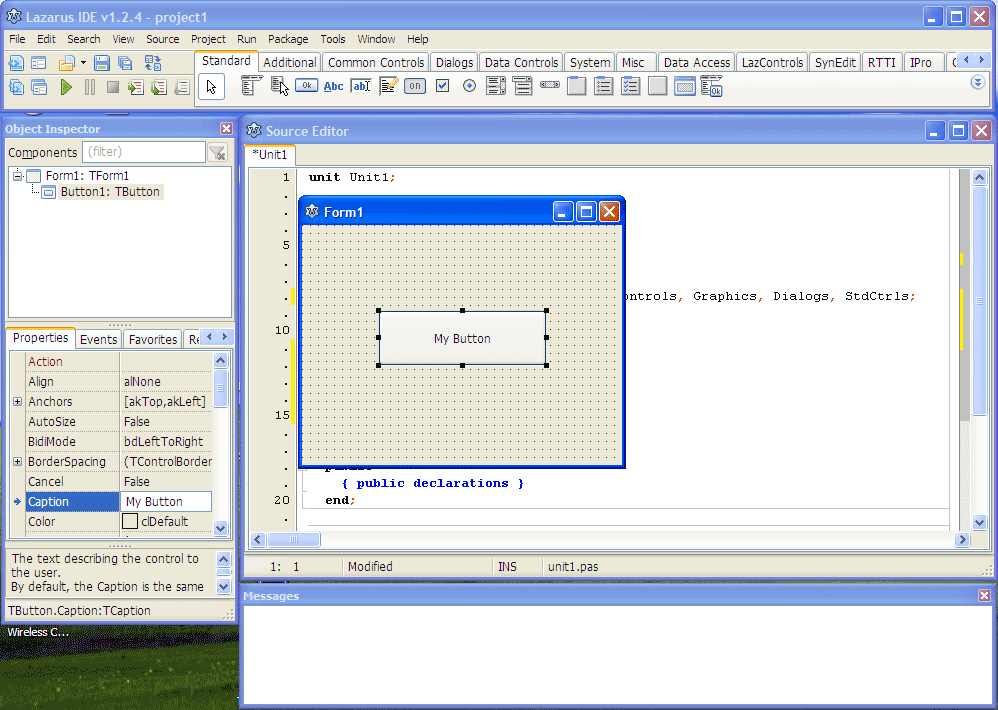

Lazarus 1.2.4 has been released. It is the second version with FPC 2.6.4. It is basically a bug fix release but worth upgrading.
<!-- more -->

Lazarus is getting bug-free everyday. Here is another stable release of Lazarus - version 1.2.4. It has FPC 2.6.4. The previous version 1.2.2 also had this version of FPC. This version has many new bug fixes. You can look at the [changes here](http://wiki.lazarus.freepascal.org/Lazarus_1.2_fixes_branch#Fixes_for_1.2.4_.28Merged.29).

1.2.2 version seems to be having some issues while I was using it. Some features worked slow. I hope this version would be problem free. It is better to upgrade to the latest stable to get a stable environment. If you can, you should upgrade.

The look is similar to Lazarus version 1.2. No huge change there...

Thanks to the Lazarus Developers for their hard work in this valuable project.

### What's New

The changes are [listed here](http://wiki.lazarus.freepascal.org/Lazarus_1.2_fixes_branch#Fixes_for_1.2.4_.28Merged.29).

### Download

The release is available for download at SourceForge:
[http://sourceforge.net/projects/lazarus/files/](http://sourceforge.net/projects/lazarus/files/)

Or from the homepage: [http://lazarus.freepascal.org/index.php?page=downloads](http://lazarus.freepascal.org/index.php?page=downloads)

Choose your CPU, OS, distro and then the "Lazarus 1.2.4" directory.

**Minimum requirements:**
Windows:       98
FreeBSD/Linux: gtk 2.8 or qt4.5, 32 or 64bit
Mac OS X:      10.5 for Intel cpus, 10.4 for PowerPC, LCL only 32bit, non LCL apps can be 64bit

### Alternate Download

For people who are blocked by SF, the Lazarus releases from SourceForge are mirrored at:
[ftp://freepascal.dfmk.hu/pub/lazarus/releases/](ftp://freepascal.dfmk.hu/pub/lazarus/releases/)
and later at (after some time for synchronization)
[http://michael-ep3.physik.uni-halle.de/Lazarus/releases/](http://michael-ep3.physik.uni-halle.de/Lazarus/releases/)
and
[http://mirrors.iwi.me/lazarus/](http://mirrors.iwi.me/lazarus/)

### How-to-Install Guide

You can  for all Operating Systems.
If you are an Ubuntu user then also see  (you can follow the same guide to install in previous or latest versions of Ubuntu, such as 12.04 LTS, 12.10, 13.10, 14.04 LTS etc. or any other debian based OS).

### Source

[Lazarus Forum Announcement Post](http://forum.lazarus.freepascal.org/index.php/topic,24890.0.html)
