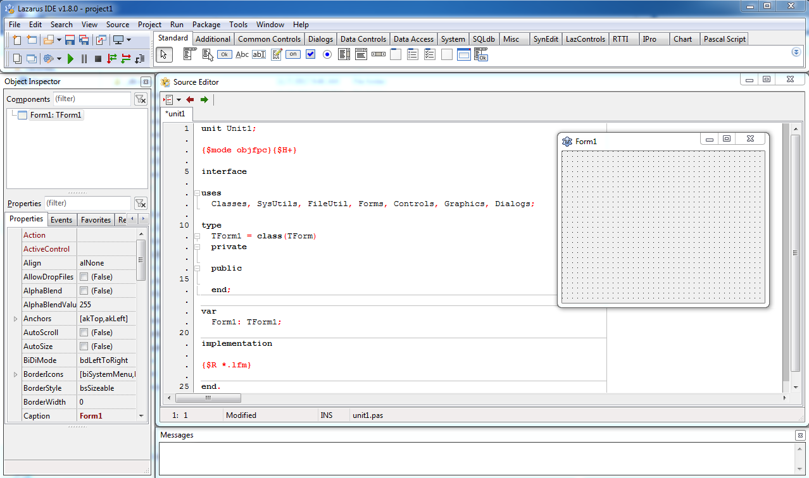
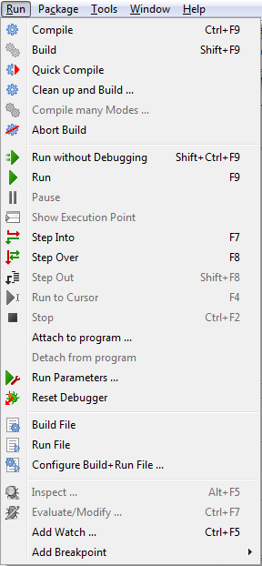

Lazarus 1.8 has been released. It is the first version with FPC 3.0.4. It has many visible and under the hood changes.
<!-- more -->
  
As a fan it seems this version took the longest to release! Another stable version of the Lazarus of version 1.8, with FPC 3.0.4 has been announced on 7 December 2017. Some major changes include:  
  

*   Qt5 based new widgetset
*   High DPI option for LCL components
*   TToolButton to use arrows beside buttons
*   Some Clipboard and Menu improvements
*   [and many more...](http://wiki.lazarus.freepascal.org/Lazarus_1.8.0_release_notes)

  
The look has been changed slightly. The toolbar button icons have changed.  
  

  
Menu icons as well. It certainly looks more professional than before...  
  

  
Also, I notice that the previous { public declarations } and { private declarations } are no more. That's a serious change for beginners, but I think professionals will like it.  
  
I'm sure there are many more changes out there. Feel free to explore!  
  
At the end, a thousand thanks to the Lazarus Developers for their hard work in this valuable project.  
  

### What's New

The changes are [listed here](http://wiki.lazarus.freepascal.org/Lazarus_1.8.0_release_notes) and [here](http://wiki.freepascal.org/Lazarus_1.8_fixes_branch#Fixes_for_1.8.0_.28merged.29).  
  

### Download

The release is available for download at SourceForge:  
[https://sourceforge.net/projects/lazarus/files/](https://sourceforge.net/projects/lazarus/files/)  
  
Choose your CPU, OS, distro and then the "Lazarus 1.8" directory.  
  
Or from the homepage: [http://www.lazarus-ide.org/index.php?page=downloads](http://www.lazarus-ide.org/index.php?page=downloads)  
  
  
**Minimum requirements:**  
Windows:  
2k, XP, Vista, 7, 8, 8.1 and 10, 32 or 64bit.  
optional qt 4.5 or 5.6 for qt apps  
  
FreeBSD/Linux:  
gtk 2.8 for gtk2, qt4.5 for qt, qt5.6 for qt5, 32 or 64bit.  
  
Mac OS X:  
10.5 to 10.12; Carbon (32bit), Cocoa (64bit, not stable), qt and qt5 (32 or 64bit).  
  

### Alternate Download

For people who are blocked by SF, the Lazarus releases from SourceForge are mirrored at:  
[ftp://ftp.freepascal.org/pub/lazarus/releases/](ftp://ftp.freepascal.org/pub/lazarus/releases/)  
and later at (after some time for synchronization)  
[http://mirrors.iwi.me/lazarus/](http://mirrors.iwi.me/lazarus/)  
  

### How-to-Install Guide

  
You can  for all Operating Systems.  
If you are an Ubuntu user then also see  (you can follow the same guide to install in previous or latest versions of Ubuntu, such as 12.04 LTS, 12.10, 13.10, 14.04 LTS, 16.04 LTS etc. or any other debian based OS).  
  

### Source

[Lazarus Forum Announcement Post](http://forum.lazarus.freepascal.org/index.php/topic,39210.0.html)
