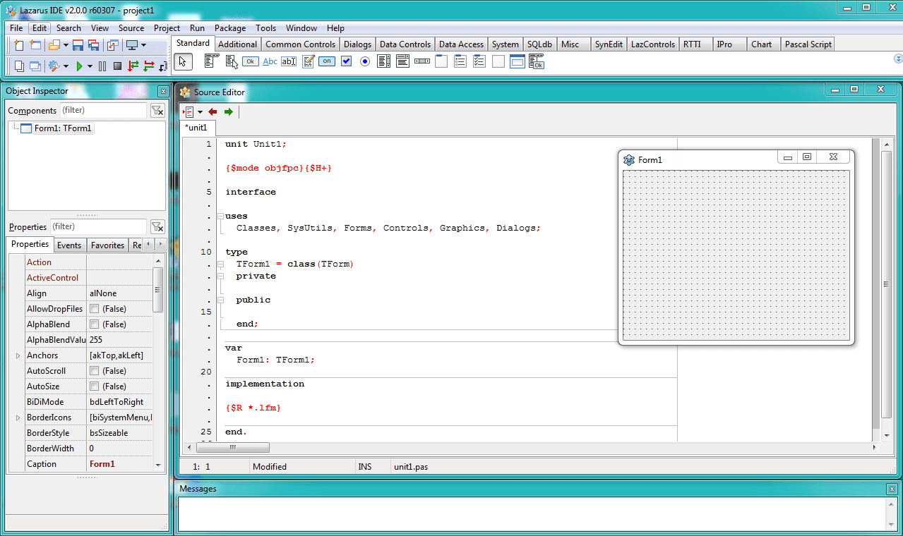
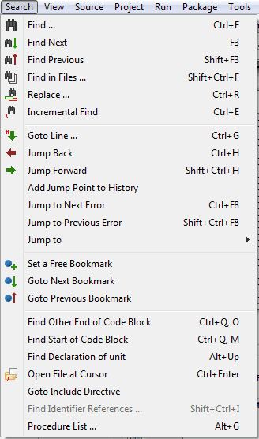

Lazarus 2.0 has been released. It is the second major release with FPC 3.0.4. It has many new minor changes to look for.
<!-- more -->
  
I think you'll agree it is always a pleasure to see a new version of Lazarus. The stable version of the Lazarus of version 2.0, with FPC 3.0.4 has been announced on 5 February 2019. Some major changes include:  
  

*   Horizontal mouse scroll events (for special mice with horizontal scrolling capabilities)
*   High DPI improvements
*   [pas2js](http://wiki.lazarus.freepascal.org/lazarus_pas2js_integration) support - to create a browser or nodejs application
*   Code navigation improvements
*   [and many more...](http://wiki.lazarus.freepascal.org/Lazarus_2.0.0_release_notes)

  
Here is how it looks on a typical Windows install:  
  

  

I am not quite sure, but it seems menu icons had some minor changes, which makes it look even more professional than before. It brings out contrast between different features better, which was missing on the previous icons.  
  

  
  

There are many other changes which are yours to explore! Go ahead, download Lazarus and try for yourself.

  
As a sidenote, the fpc package for Free Pascal on Debian (Linux) has been changed to fpc-laz. You will have to adopt with the new name from now on.  
  
As usual, many thanks to the tireless effort that Lazarus Team has put to this release. We wouldn't have this wonderful product without them.  
  

### What's New

The changes are [listed here](http://wiki.lazarus.freepascal.org/Lazarus_2.0.0_release_notes) and [here](http://wiki.freepascal.org/Lazarus_1.8_fixes_branch#Fixes_for_1.8.0_.28merged.29).  
  

### Download

The release is available for download at SourceForge:  
[https://sourceforge.net/projects/lazarus/files/](https://sourceforge.net/projects/lazarus/files/)  
  
Choose your CPU, OS, distro and then the "Lazarus 2.0" directory.  
  
Or from the homepage: [http://www.lazarus-ide.org/index.php?page=downloads](http://www.lazarus-ide.org/index.php?page=downloads)  
  
  
**Minimum requirements:**  
Windows:  
  2k, XP, Vista, 7, 8, 8.1 and 10, 32 or 64bit.  
  
FreeBSD/Linux:  
  gtk 2.8 for gtk2, qt4.5 for qt, qt5.6 for qt5, 32 or 64bit.  
  
Mac OS X:  
  10.5 to 10.12; Carbon (32bit), Cocoa (64bit, beta), qt and  
  qt5 (32 or 64bit).  

### Alternate Download

For people who are blocked by SF, the Lazarus releases from SourceForge are mirrored at:  
[ftp://ftp.freepascal.org/pub/lazarus/releases/](ftp://ftp.freepascal.org/pub/lazarus/releases/)  
and later at (after some time for synchronization)  
[http://mirrors.iwi.me/lazarus/](http://mirrors.iwi.me/lazarus/)  
  

### How-to-Install Guide

  
You can [click here for an installation guide](http://localhost/wp-lazplanet/2013/03/20/how-to-install-lazarus/) for all Operating Systems.  
If you are an Ubuntu user then also see [this post for an exclusive guide for installing Lazarus 2.0.0 in Ubuntu](http://localhost/wp-lazplanet/2013/05/08/how-to-install-lazarus-1-0-8-on-ubuntu-13-04-raring/) (you can follow the same guide to install in previous or latest versions of Ubuntu, such as 16.04 LTS, 18.04 LTS, 18.10 etc. or any other debian based OS).  
  

### Source

[Lazarus Forum Announcement Post](http://forum.lazarus-ide.org/index.php/topic,44161.0.html)