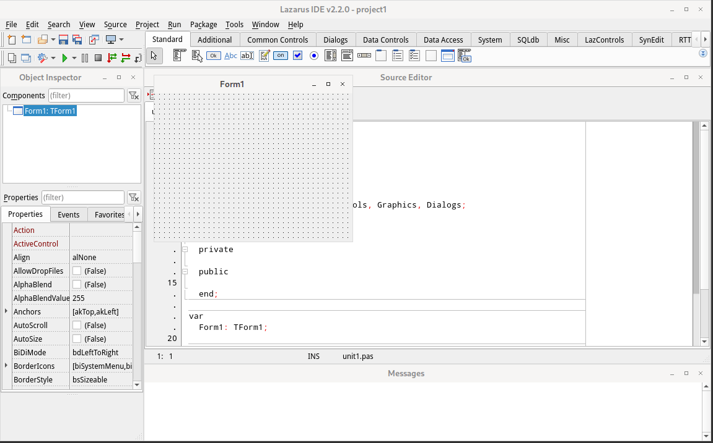

New year brings in a new Lazarus release. Version 2.2.0 with FPC 3.2.2. It has many new minor changes to look for.
<!-- more -->

Just as we started the new year with as many new year resolutions as we can think of, Lazarus devs aren't sitting idle. On January 5, 2022, they released Lazarus 2.2.0 with FPC 3.2.2.

If you are looking for any groundbreaking changes in this version, you'd probably be disappointed. But no worries, it still has plenty of minor changes and fixes to make our lives easier. So it is recommended to upgrade anyway.

Some changes include:

- Simplified `FileExists` behavior
- Freetype font rendering units were moved to a package of its own
- The PasWStr unit has been removed
- Minor changes in TLazIntfImage.Create, TValueListEditor, TShellTreeView, TShellListView, TMaskEdit, TGroupBox, TRadioGroup, TCheckGroup, TFrame, T(Float)SpinEdit, TListBox
- Now allows temporary cursor changes instead of setting the Screen.Cursor property directly. They ensure that valid cursor values are restored.
- IDE changes:
  - Added IDE macro $(OutputFile) for the outputfile of the project
  - Codetools support for anonymous functions
  - "Close tabs to the right" in Source-Notebook
  - Buttons for closing pages on the left, right and others in Search Results window
  - An options page "Environment > IDE Startup" in the IDE Options dialog. Allows selecting a project type to be created when the IDE starts.
  - Added keyboard shortcut for Swap line/selection up/down, Duplicate line/selection, Copy/Cut append to clipboard, Copy/Cut (append) line/selection to clipboard
- Debugger:
  - LazDebugger-FP (FpDebug) v1.0 is now the default for new installations on Windows and Linux. Users with existing config should change their settings.
  - GDB(mi): comes now with gdb version 9.2 modified for use with unicode. (for 32 and 64 bit)
  - "Run to Cursor" in addition to the existing "Step over to Cursor", the debugger (gdbmi/fpdebug) now provide "Run to Cursor".
- Components:
  - AnchorDocking now supports multiline tabs, button to minimize a docked site, can load layouts HighDPI aware.
  - New IDE addon named Spotter, showing a search list of all IDE commands.
  - Lots of TAChart changes
  - TSpinEditEx has a new property "ThousandSeparator"
  - Scientific notation and precision improvements in TFloatSpinEditEx
  - New package DockedFormEditor added. For more info see DockedFormEditor.
- Changes affecting compatibilty:
  - TCanvas.PolyBezier default behavior changed
  - TImageList stores compressed images in LFM
  - TRadioGroup's OnEnter and OnExit event changes
- and [many more](https://wiki.lazarus.freepascal.org/Lazarus_2.2.0_release_notes)

Here is how it looks on a typical Linux install:

Credit is where credits due, many thanks to the tireless effort that Lazarus Team has put to this release. We wouldn't have this wonderful product without them.

### What's New

Full list of changes are [listed here](https://wiki.lazarus.freepascal.org/Lazarus_2.2.0_release_notes) and [here](https://wiki.lazarus.freepascal.org/User_Changes_3.2.2).

### Download

The release is available for download at SourceForge:
<https://sourceforge.net/projects/lazarus/files/>

Choose your CPU, OS, distro and then the "Lazarus 2.2.0" directory.

Or from the homepage: <https://www.lazarus-ide.org/index.php?page=downloads>

According to [previous announcement](https://forum.lazarus.freepascal.org/index.php/topic,55122.0.html) and [this announcement](https://forum.lazarus.freepascal.org/index.php/topic,55551.0.html), Lazarus and FPC source codes are now hosted on gitlab.com:
- <https://gitlab.com/freepascal.org/fpc/source>
- <https://gitlab.com/freepascal.org/lazarus/lazarus>

If you have a GitLab.com account, go ahead and give them a star.

### Minimum requirements

Windows:
   2k, XP, Vista, 7, 8, 8.1 and 10, 32 or 64bit.

FreeBSD/Linux:
   gtk 2.8 for gtk2, qt4.5 for qt, qt5.6 for qt5, 32 or 64bit.

Mac OS X:
   Cocoa (64bit) 10.12 to 11.4, Carbon (32bit) 10.5 to 10.14, qt and
   qt5 (32 or 64bit).

### How-to-Install Guide

You can  for all Operating Systems.
If you are an Ubuntu user then also see  (you can follow the same guide to install in previous or latest versions of Ubuntu, such as 18.04 LTS, 20.10 etc. or any other debian based OS).

### Source

[Lazarus Forum Announcement Post](https://forum.lazarus.freepascal.org/index.php/topic,57752.0.html)
