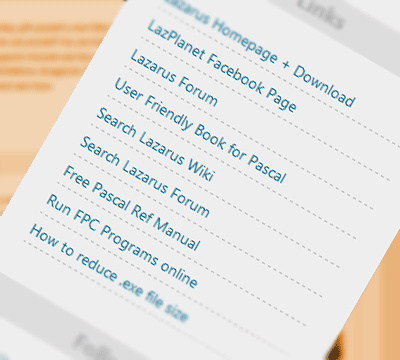

As a Lazarus user we know how often some links we visit. And typing them again and again is a daunting task for lazy programmers like us! ;-) So LazPlanet introduced a new Links section in the sidebar so that necessary links stay always on the homepage and you can click them and enjoy the ride.
<!-- more -->

There are links to the usual sites, such as Lazarus Homepage, Forum, Wiki etc. ...And the answer to probably the most asked question, "How to reduce the exe file size that I have compiled?"

There are also some handy features that can **speed up your coding**! For example, you can search inside the Lazarus Forum or Lazarus Wiki. They both are content-rich websites and the links in the widget lets you search those sites without typing in "site:wiki.lazarus.freepascal.org" and ultimately saves you a lot of time.

To use those searches, click on the link and then fill up your query in the input under the "For:" text. Then click search or press enter.

(It now uses a third party website which has ads in it. But I'll try to find an alternative way to use Google directly. Moreover, may be I can put an input box in the sidebar making it even easier to search in those sites and with one less click.)

You can now just Bookmark [http://lazplanet.blogspot.com](http://lazplanet.blogspot.com/) and just click on the links to go with the flow!

It also includes a link to a user friendly Pascal book, [**"Essential Pascal"** written by Marco Cantù](http://www.marcocantu.com/epascal/). It is Freely available to read in the website. It is a great book for both beginners and intermediate users. It is written for Delphi and Pascal but can be easily used for Lazarus and Free Pascal. The beginners will find this book delightful. It is written with such good care and contains such matters which gave me a bit more insight then other books/materials I have read.

So here you go. Such a nifty feature for you guys. If you have any suggestions to add other links or modify them, it is greatly appreciated.

Plus, don't forget to Like to subscribe to [LazPlanet Facebook page](https://www.facebook.com/pages/LazPlanet/394517107328349) to get tiny tiny tips for Lazarus more often. (It happens very often when I don't have time to write a full post. So I post some small text in the Facebook page.) So it would be a waste not to utilize that great resource.

Good luck coding!
\-Adnan Shameem