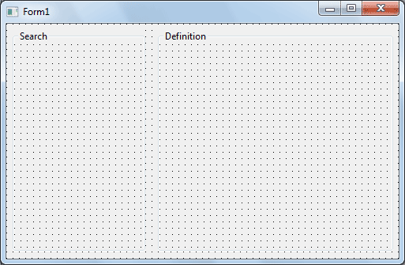
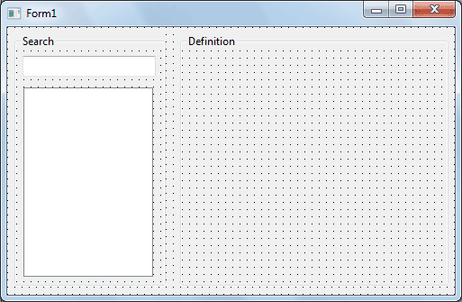
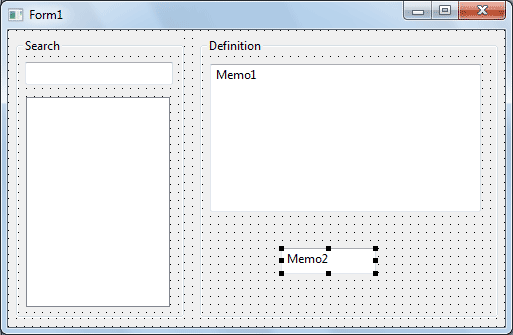
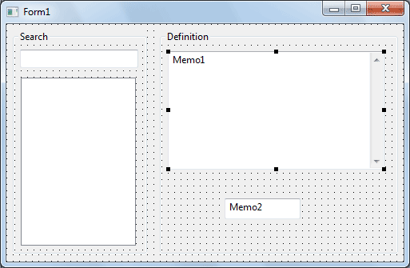
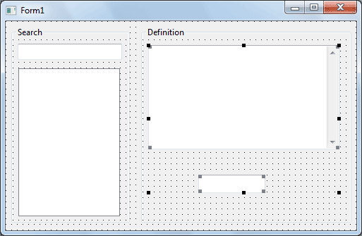
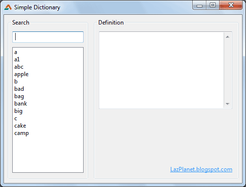
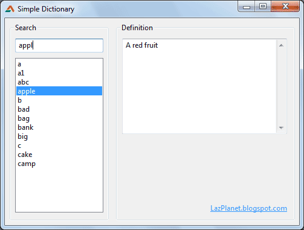

Dictionary is one of the fun challenges of programming. Learn how to make a dictionary in this quick tutorial.
<!-- more -->
  
Dictionary programmes are fun all by itself. The storage, retrieval and searching etc. are very exciting. And what about creating a dictionary in your own mother tongue? While you're at it, how about using the code to reprogramme the software to show what basic Pascal procedures do! Once you understand the code, you can shape it whatever you want. I hope you're salivating!  
  

We, now a days... We don't like to  
look-up words in bulky old books  
called dictionary... we search it!

  
So we are going to use a simple tab-delimited dictionary file for our simple dictionary. The syntax of the data would be:  
  

word1<tab>meaning1  
word2<tab>meaning2  
word3<tab>meaning3  
word4<tab>meaning4  
...  
...

  
We would use TStringList.LoadFromFile() to load the file data into our program. Then using TStringList's DelimitedText we would separate the words and definitions and show it.  
  
So everything is there in Lazarus already. So it would be a walk in the park for us, trust me!  
  
  

### Create the Data

First, let's create the data file that would hold all the words and the meanings.  
  
Create a folder/directory for the Simple Dictionary project. On that directory save a file named "Dictionary.txt". On that file put the text below using notepad (or any other plain text editor like Notepad++, gedit etc.):  
  
EDIT: Click [this link](http://pastebin.com/2Km5XyiM), then copy the code under the "Raw Paste Data" heading. The following code does not have tab characters. (Blogger strips them.)  
  
a First letter of English alphabet a1 Very good abc Basics apple A red fruit b Second letter of English alphabet bad Not good bag Holder of things bank Keeper of money big Large in size c Third letter of English alphabet cake Baked food camp Mobile home!  
  
Make sure you save the file.  
  

### Editing the data file

The above is a data code given just as a sample to get you started. You can edit the code to add your words and definitions.  
  
You can edit the data file in Excel or any other spreadsheet program (like LibreOffice, OpenOffice, gnumeric etc.) Or any of the plain text editors would suffice.  
  

#### On Notepad++:

Open the file. If you want to use UTF8 characters, click Encoding->Convert to UTF-8 Without BOM. Edit the file. Save it as usual.  
  

#### On other plain text editors

You can use any other plain text editor for editing the dictionary file. Just open it, ensure that UTF-8 encoding is selected, then edit, save, done!  
  

#### On Excel:

If you want to work with words/definitions in other language except English, Excel may dissapoint you. Excel does not support UTF8 characters in Tab delimited Plain text files. If you still wish to use a spreadsheet program, use OpenOffice/LibreOffice (explained below).  
  
Open the file with Ctrl+O and use "Text files" in the filter. Click Next. Make sure "Tab" checkbox is selected. And also, select "{none}" in the Text qualifier. Click Finish.  
  
For saving, just use Ctrl+S like any normal file. Just click Yes if a message appears for saving in text delimited format.  
  

#### On OpenOffice/LibreOffice:

Summon the Open dialog, Ctrl+O.  
Select the "Text CSV" filter (not the other "Text" option, otherwise it will open it in Writer). After opening the file a dialog box will appear.  
  
Make sure that "Tab" is selected as separator. Delete the value in the "Text Delimiter" field. If you are using any language other than English, try changing the Character Set to "Unicode (UTF-8)". (Failing to do so may corrupt your file.)  
  
When saving, click "Keep current format", if a dialog box appears.  
  

### Project

Start [Lazarus](http://lazarus.freepascal.org/).  
  
Create a new Application Project (**Project->New Project->Application->OK**).  
  
Draw **2 GroupBoxes**. One to the left, other to the right. Change the **Caption** of the left one to "**Search**" and the right one to "**Definition**".  
  

  
Draw a **TEdit** and a **TListBox** on the **Groupbox to the left**. The TEdit is going to be our search box and the ListBox is going to hold our words. **Empty** the **Text** property of **Tedit**.  
  

  
Draw 2 **TMemo** inside the groupbox to the right.  
  

  
**Memo2** will be a hidden TMemo that will store our definitions. So Select Memo2 and set Visible to False.  
  
Select Memo1 and set the Scrollbars property to ssAutoVertical.  
  

  
Empty the Lines property of both the Memo1 and Memo2.  
  

  
Double click on Form1 and enter the code below:  
  

procedure TForm1.FormCreate(Sender: TObject);  
var  
  myLine: String;  
  Lines, Parts: TStringList;  
begin  
  
  if FileExistsUTF8('Dictionary.txt') then begin  
  
      try  
          Parts := TStringList.Create;  
          Lines := TStringList.Create;  
          Lines.LoadFromFile('Dictionary.txt');  
          // in case the word lines are in bad order  
          Lines.Sort;  
  
          for myLine in Lines do begin  
              if Trim(myLine) <> '' then begin // we ignore empty lines  
                  Split(#9, myLine, Parts); // #9 means tab  
                  ListBox1.Items.Add(Parts.Strings\[0\]);  
                  Memo2.Lines.Add(Parts.Strings\[1\]);  
              end;  
          end;  
  
      finally  
          if Parts <> nil then FreeAndNil(Parts);  
          if Lines <> nil then FreeAndNil(Lines);  
      end;  
  
  
  end else begin  
      ShowMessage('Dictionary file not found!');  
      Close;  
  end;  
  
end;

  
**Explanation:**  
This procedure is undoubtedly the most important procedure of this project. We get the lines in the dictionary data file into our TStringList, which is obviously named "Lines".  
  
Now, we have all the tab seperated word and its meaning. E.g. Word1<tab>Meaning. Now we need to seperate the word from the meaning, So that we can show all the words in the ListBox and store the definitions in our TMemo named Memo2. So how can we seperate the two? We will use the "Split" procedure that we'll enter next.  
  
So, the Word and Meaning will be returned in our another TStringList, "Parts". Parts\[0\] will have the word and Parts\[1\] will have the meaning. We can then easily store them where needed so we can access them when searched for.  
  
  
Now that you are in Code view, paste the following procedure code before the "end." line (before the last line):  
  

procedure TForm1.Split(Delimiter: Char; Str: string; ListOfStrings: TStrings);  
begin  
  
   ListOfStrings.Clear;  
   ListOfStrings.Delimiter       := Delimiter;  
   ListOfStrings.StrictDelimiter := True;  
   ListOfStrings.DelimitedText   := Str;  
  
end;

  
**Explanation:**  
This procedure will help us to get the word and definition from the data lines.  
  
This procedure just utilizes the TStringList's power of Delimiting text. But for this we have to set the delimiter (in our case its "tab"). If you don't get it, don't worry, it's not important. It just works "under the hood".  
  
Now take your cursor to the definition name and press Ctrl+Shift+C. This will create a declaration of the procedure where needed in order to make it usable in our code.  
  
Now switch to Form view (F12) and double click the TEdit. Now enter the following code:  
  

procedure TForm1.Edit1Change(Sender: TObject);  
var  
  i: Integer;  
  query, searchitem: string;  
begin  
  // We would search case insensitive to make  
  // it easy for the user. That's why uppercase.  
  query := UpperCase(Edit1.Text);  
  
  for i := 0 to ListBox1.Count-1 do begin  
  
    // Same. Uppercase because we are searching  
    // Case insensitive.  
    searchitem := UpperCase(ListBox1.Items\[i\]);  
  
  
    if LeftStr(searchitem, Length(query)) = query then begin  
  
      ListBox1.ItemIndex := i;  
      ListBox1Click(Sender);  
      // We selected the first found item, so we don't need  
      // to search more... so we quit searching  
      Exit;  
  
    end;  
  
  end;  
  
end;

  
  
This will enable us to search from the word list. I have used the partial list search technique.  
  
Now switch to Form view (F12). Then double click on the ListBox and enter:  
  

procedure TForm1.ListBox1Click(Sender: TObject);  
begin  
  
  if ListBox1.ItemIndex >= 0 then  
    Memo1.Text:=Memo2.Lines\[ListBox1.ItemIndex\];  
  
end;

  
  

#### Explanation:

First, we check if the index 0 or more. When no item is selected, the ItemIndex is -1. If that time, somehow this click event is triggered, it would raise an error because "Memo2.Lines\[ListBox1.ItemIndex\]" part would not work. Lines\[-1\] would return nothing. So we make sure we don't get that error.  
  
After that we retrieve the definition. Remember what Memo2 is for? It holds all the definitions of our data file. And we've stored all these definitions exactly in the index position of the ListBox1. So, we just get the definition with the selected index number of the ListBox.  
  

#### Saving it

Now save the project using File->Save all. Choose to save in the project folder that you created at the beginning of the article (and where "Dictionary.txt" file is).  
  
Now that you've saved the project we are ready to Run the project. Press F9 (or Run->Run) to run the project.  
  

  
Write something to search in our new dictionary...  
  

  
There you go! A simple dictionary for your enjoyment.  
