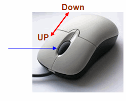

Zooming is kind of fun! Here is a 5 minute image zoom tutorial with mouse scroll fun!
<!-- more -->
  
We have 2 nifty events named **OnMouseWheelUp** and **OnMouseWheelDown** to tell when the user scrolled his mouse wheel.  
  
  
  

  
Zooming is basically stretching the image to place it in a bigger area than the original. then the image looks bigger. We can use **StretchDraw** for this.  
  
We can combine these 2 and you will be seeing a result before you know it!  
  

  
  

### Tutorial

  
Start [Lazarus](http://www.lazarus-ide.org/).  
  
Create a new Application Project (Project->New Project->Application->OK).  
  
Draw a TImage (from Additional tab). Set a picture of your choice as its Picture property.  
  
Draw a TScrollBar. Set its HorzScrollbar->Tracking and VertScrollbar->Tracking property to True.  
  
  
  
  
Draw a TPaintbox inside the TScrollbox (start drawing from inside the TScrollbox to achieve this). Place it in the most top left position (or set Top to 0, Left to 0).  
  
  
  
  
Now switch to F12 to go to Code View. Add the following line just under the line TForm1 = class(TForm).  
procedure DrawImage;  
  
Put your cursor on the line and press Ctrl+Shift+C. This should elaborate the procedure automatically for you to write something in it. Write something like this:  
  
procedure TForm1.DrawImage;  
var  
  ImageRect: TRect;  
begin  
  ImageRect := Rect(0,0,(Image1.Picture.Width \* ScaleFactor), (Image1.Picture.Height \* ScaleFactor) );  
  PaintBox1.Width := ImageRect.Right;  
  PaintBox1.Height := ImageRect.Bottom;  
  PaintBox1.Canvas.StretchDraw(ImageRect, image1.Picture.Bitmap);  
end;  
  
Just under the **Form1: TForm1;** line, insert this code:  
  
  ScaleFactor:integer;  
  
Now switch to Form View (F12). Double click the form and enter:  
  
procedure TForm1.FormCreate(Sender: TObject);  
begin  
  ScaleFactor:=1;  
end;  
  
We will set the default ScaleFactor to 1 to show the image as is at first when it loads. Then we manipulate the value to enlarge the image.  
  
Now go to Form View (F12). Select the TPaintBox. Go to Events and click the \[...\] button next to ScrollWheelDown and enter:  
  
procedure TForm1.ScrollBox1MouseWheelDown(Sender: TObject; Shift: TShiftState;  
  MousePos: TPoint; var Handled: Boolean);  
begin  
  // we don't want it to be less than 1  
  if ScaleFactor > 1 then begin  
     ScaleFactor:=ScaleFactor-1;  
     DrawImage;  
  end;  
end;  
  
Now again Go to Events and click the \[...\] button next to ScrollWheelUp and enter:  
  
procedure TForm1.ScrollBox1MouseWheelUp(Sender: TObject; Shift: TShiftState;  
  MousePos: TPoint; var Handled: Boolean);  
begin  
  // we allow 50 times zoom!  
  if ScaleFactor < 50 then begin  
     ScaleFactor:=ScaleFactor+1;  
     DrawImage;  
  end;  
end;  
  
These two above will control the mouse wheel scroll events. When the Wheel will scroll up it will zoom in and zoom out when scrolling down.  
  
Lastly, select PaintBox1, go to Events once again. Click the \[...\] button next to OnPaint. Now enter:  
  
procedure TForm1.PaintBox1Paint(Sender: TObject);  
begin  
  DrawImage;  
end;  
  
This simple code will update the image when it is needed. Especially when it needs redraw (resize the window, minimize/restore, hide/show the window etc.)  
  
  
  
  
  
  
  
  

#### Run it!

Now run the project (F9 or Run->Run).  
  
This would show your shiny new form on your screen ready to be played with.  
  

  
This is just a quick example of how to use mouse scroll and image stretching in simple code. You can enhance it if you like.  
  
Thanks to Achmad Davit for requesting this.  

Ref:  
[http://docs.embarcadero.com/products/rad\_studio/delphiAndcpp2009/HelpUpdate2/EN/html/delphivclwin32/Graphics\_TCanvas\_StretchDraw.html](http://docs.embarcadero.com/products/rad_studio/delphiAndcpp2009/HelpUpdate2/EN/html/delphivclwin32/Graphics_TCanvas_StretchDraw.html)  
[http://wiki.lazarus.freepascal.org/Developing\_with\_Graphics#Using\_the\_non-native\_StretchDraw\_from\_LazCanvas](http://wiki.lazarus.freepascal.org/Developing_with_Graphics#Using_the_non-native_StretchDraw_from_LazCanvas)
