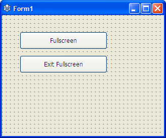
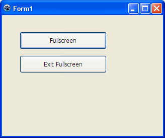

Fullscreen is a common option in many of the popular programs we use. Today we learn the simple trick of making our program fullscreen.
<!-- more -->
  
  

### Introduction

Fullscreen is an excellent option for programers. Because often you will need to eliminate all the other windows and just focus on the content that is on your form.  
  
When a software goes Fullscreen it sizes itself up to the screen size and removes even its titlebar, Close-Minimize buttons. Even the Taskbars and other panels of the OS hides and let only the content to show. It is very handy when you for example, want to create an image slideshow and want the users to see the images in a fullscreen view with a dark background.  
  
Making a form fullscreen is not hard. In fact its so simple that after I uncover its mysteries, you will be frustrated on the simplicity of it! ;-)  
  

### How does it work

Okey, let me explain. If we want to make a form fullscreen, (1) we have to hide the border around the window, and the Close, Minimize and Maximize buttons as well. That would leave us with a rectangular area on the screen. Now we have to make it take all the screen space for itself. So, (2) we would have to Maximize the form. That's it! It will make the form fullscreen and automatically hide Taskbar or other windows. The OS takes care of hiding all the bars and panels.  
  
But to be extra sure, you can set the form to [Always on Top](http://lazplanet.blogspot.com/2014/01/always-on-top-lazarus-form.html) and [Hide the taskbar](http://lazplanet.blogspot.com/2014/02/show-hide-windows-taskbar-lazarus.html) as well.  
  

#### To make your Form Fullscreen

So basically we:  
1\. Set the Form's **BorderStyle** property to **bsNone**.  
2\. Set **WindowState** property to **wsMinimized**.  
  
3\. Optionally, you can set **FormStyle** to **fsSystemStayOnTop** (to make it [always on top](http://lazplanet.blogspot.com/2014/01/always-on-top-lazarus-form.html).)  
4\. Optionally, you can **Hide the taskbar** with the help of [this post](http://lazplanet.blogspot.com/2014/02/show-hide-windows-taskbar-lazarus.html). (But remember to show the taskbar again on program exit. If you don't show it, the user will be left with no taskbar!)  
  

#### To Restore the Fullscreen mode

Here, we do the opposite:  
1\. Set **WindowState** property to **wsNormal**  
2\. Set the form's **BorderStyle** property to **bsSizeable** (or your previous style that you have set).  
 3. If you changed the FormStyle, you can set **FormStyle** to **fsNormal** (or what you previous have set)  
4\. If you have hidden the taskbar, show it again with the help of [this post](http://lazplanet.blogspot.com/2014/02/show-hide-windows-taskbar-lazarus.html).  
  
You will notice that when doing fullscreen we have first modified the the BorderStyle. But when restoring from fullscreen we first modified WindowState. We switched this order because setting the BorderStyle First loses the dimension (width-height) of the form while restored.  
  

### Tutorial

We will now see the above thing in action.  
  
Start [Lazarus](http://www.lazarus.freepascal.org/).  
  
Create a new Application Project (Project -> New Project -> Application -> OK).  
  
Draw 2 TButtons in the form. They will be named as Button1 and Button2. Set Button1's Caption to "Fullscreen" and Button2's "Exit Fullscreen".  
  

  
We'll code the Fullscreen button. Double click **Button1** and enter:  
  

procedure TForm1.Button1Click(Sender: TObject);  
begin  
  //\*\* 1. We remove the Form's border  
  BorderStyle:=bsNone;  
  
  //\*\* 2. We maximize the form  
  WindowState:=wsMaximized;  
  
  //\*\* 3. Set to always on top (Optional)  
  FormStyle:=fsSystemStayOnTop;  
  
  //\*\* 4. Hide the taskbar (Optional)  
  // Code available here:  
  // http://lazplanet.blogspot.com/2014/02/show-hide-windows-taskbar-lazarus.html  
end;

  
  
Now, we get to the Restore Fullscreen option. Double click **Button2** and enter :  
(If you can't switch between Code View and Form View try F12 or View->Toggle Form/Unit View)  
  

procedure TForm1.Button2Click(Sender: TObject);  
begin  
  //\*\* 1. Restore the BorderStyle  
  BorderStyle:=bsSizeable;  
  
  //\*\* 2. Restore the form  
  WindowState:=wsNormal;  
  
  //\*\* 3. Restore the Always on Top (Optional)  
  FormStyle:=fsNormal;  
  
  //\*\* 4. Show the taskbar  
  // Code available here:  
  // http://lazplanet.blogspot.com/2014/02/show-hide-windows-taskbar-lazarus.html  
end;

  
I have not added the Windows API code to Hide the Taskbar. So it remains a pure [cross platform](http://wiki.freepascal.org/Multiplatform_Programming_Guide) solution. But if you wish to include it, you are welcome. You can also use [compiler directive](http://www.math.uni-leipzig.de/pool/tuts/FreePascal/prog/node3.html) to include the code only when compiled from windows. For example:  
  

uses  
  Classes, SysUtils, ..., ...  
  {$IFDEF MSWINDOWS}  
  ,windows  
  {$ENDIF}  
  ;

  
The above code only includes windows unit if it is being compiled from windows. You can use compiler directive for other codes as well.  
  
If by chance you got stuck in the fullscreen mode and can't close the form, use Alt+F4.  
  
Now Run the project (F9 or Run->Run).  
  

  
  
Click the buttons to test if it goes fullscreen and back.  
  
You can use this in an Image viewer, a web browser or a media player. May be even for a kiosk!  
  
**EDIT (22 FEB 14):**  
This is a basic example code for making your form fullscreen. It has some limitations that it doesn't remember the last state and it always restores to wsNormal.  
  
If you want more advanced version with keyboard shortcut and form size & state remembering and linux troubleshooting, see [this wiki for code](http://wiki.lazarus.freepascal.org/Application_full_screen_mode).  
