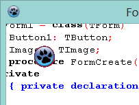

Forms are boring solid objects. But you can make it fun in many ways. One of them is transparency. Here's how...
<!-- more -->
  
  

### Quick Tutorial

  
Create a new Application project (Project->New Project->Application->OK).  
  
Set the color of the form to red ($000002EE). Create buttons and stuff that you want to test with.  
  
Add windows in the uses clause:  

uses  
... , windows;

  
Below the uses clause enter these lines:  
  

  const  
  LWA\_COLORKEY = 1;  
  LWA\_ALPHA = 2;  
  LWA\_BOTH = 3;  
  WS\_EX\_LAYERED = $80000;  
  GWL\_EXSTYLE = -20;  
  
  
 {Function SetLayeredWindowAttributes Lib "user32" (ByVal hWnd As Long, ByVal Color As Long, ByVal X As Byte, ByVal alpha As Long) As Boolean }  
 function SetLayeredWindowAttributes (hWnd:Longint; Color:Longint; X:Byte; alpha:Longint):bool stdcall; external 'USER32';  
  
 {not sure how to alias these functions here ????   alias setwindowlonga!!}  
 {Function SetWindowLong Lib "user32" Alias "SetWindowLongA" (ByVal hWnd As Long, ByVal nIndex As Long, ByVal dwNewLong As Long) As Long }  
 Function SetWindowLongA (hWnd:Longint; nIndex:longint; dwNewLong:longint):longint stdcall; external 'USER32';  
  
  
 {Function GetWindowLong Lib "user32" Alias "GetWindowLongA" (ByVal hWnd As Long, ByVal nIndex As Long) As Long }  
 Function GetWindowLongA ( hWnd:Longint; nIndex:longint):longint stdcall; external 'user32';

  
Below the line implementation add these procedures:  
  

procedure SetTranslucent(ThehWnd: Longint; Color: Longint; nTrans: Integer);  
var  
attrib:longint;  
  
  
begin  
  
    {SetWindowLong and SetLayeredWindowAttributes are API functions, see MSDN for details }  
  
    attrib := GetWindowLongA(ThehWnd, GWL\_EXSTYLE);  
  
    SetWindowLongA (ThehWnd, GWL\_EXSTYLE, attrib Or WS\_EX\_LAYERED);  
  
    {anything with color value color will completely disappear if flag = 1 or flag = 3  }  
  
    SetLayeredWindowAttributes (ThehWnd, Color, nTrans,1);  
  
end;  

Double click the form and enter the following code. (Note: You will have to change the value of transparency value to the form's color, or the color that you want to be transparent.)  

procedure TForm1.FormCreate(Sender: TObject);  
var  
  
   transparency:longint;  
  
begin  
  
     {the color were going to make transparent the red that the form backgroud is set to}  
     transparency:=  $000002EE;  
  
     {call the function to do it}  
     SetTranslucent (form1.Handle, transparency, 0);  
  
end;

  

### Run it

Did you entered them correctly? Let's test it out. Press F9 (Run->Run).  
  

  
Are you satisfied? Your form is look-through.  
  
The above code uses windows unit and Windows API so it is not cross platform.  
  

### Concept

The procedures let the Windows' window manager say that "Where you find x color make it transparent." Remember, what color you use as the transparency variable value will be transparent, no matter in which component the color is. (If you change the red color then set it like: transparency:=  $000002EE; in the form's on create event) It could be even images We have used red. So if red is on an image, that will be transparent too. That's a disadvantage, but it is a cool effect.  
  
If you want better options, then use form regions. You can define in a better way the shape of the form.  
  
You can also have translucency effect, which is widely used in splash screens.  
  

### Download Sample code zip

You can [download the sample source code here](https://dl.dropboxusercontent.com/u/6459514/LazPlanet/Form-Controls/formtrans_color.zip)  
Size: 0.98 MB  
  
**Ref:**  
[http://www.lazarus.freepascal.org/index.php/topic,8488.0.html](http://www.lazarus.freepascal.org/index.php/topic,8488.0.html)