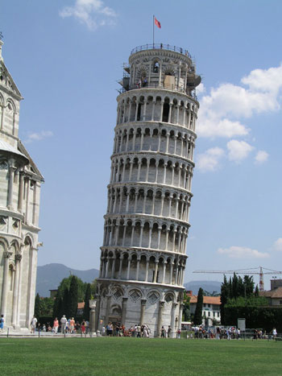
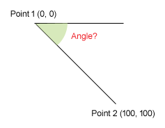
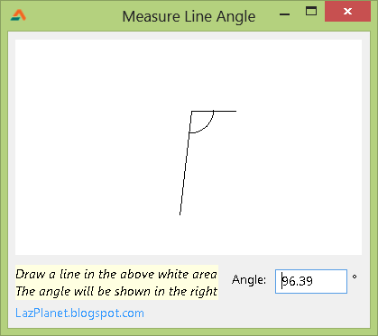

When you draw a line, does that come to you that how many degrees is that line? How much is it steep or flat? Learn through your own program.
<!-- more -->


A line can be of any angle. It can be parallel to earth, or steep like a pole, or angular, like it is leaning towards something. We all know the name of Tower of Pisa. It is famous for its leaning nature. It is not perpendicular/staright/vertcal like all the other usual buildings of the world. It is not standing 90 degrees upright, but its leaning by 5.5 degrees.





So if we get a imaginary line at the at the right side of the tower, then can we calculate the angle of pisa? Yes. But we need math. Specifically Geometry and more specifically Trigonometry.


### Quick Tutorial

I am weak at math. So I borrowed a function from [here](http://stackoverflow.com/questions/15596217/angle-between-two-coordinats-arctan2) by a user named [NLGN](http://stackoverflow.com/users/757830/ngln):

```pascal
function TForm1.AngleOfLine(const P1, P2: TPoint): Double;
begin
  Result := RadToDeg(ArcTan2((P2.Y - P1.Y),(P2.X - P1.X)));
  if Result < 0 then
    Result := Result + 360;
end;
```

Create a new Application Project (**Project -> New Project -> Application -> OK**).

Paste the above function below the `{$R *.lfm}` line. Take the cursor over the name of the function and press **Ctrl+Shift+C**.

Add `math` unit to the `uses` clause:

```pascal
uses
  ..., math;
```





Suppose that we want to calculate the angle of the diagonal line. The line starts at `(0, 0)` position \[where it is `(x, y)`\] and ends at `(100, 100)` position. From the image above, it is obvious that the angle is 45 degrees. But let our program find the angle.

Switch to Form Designer (**F12**). Now Double click the form and enter:

```pascal
Caption := FloatToStr(AngleOfLine(point(0, 0), point(100, 100)));
```

Our two points lies in `point(0, 0)` and `point(100, 100)`.

Now run the project (**F9** or **Run -> Run**).

You will see 45 in the Title bar of the form. It will be able to detect the angle from the two points given.

You can utilize this function to show your creativity to implement this function in many ways. We have a sample code zip file downloadable below. It is a graphical implementation of the function.





We have a `TImage` named **Image1**. In the mouse move event of it we have such code:

```pascal
procedure TForm1.Image1MouseMove(Sender: TObject; Shift: TShiftState; X,
  Y: Integer);
var
  angle: ValReal;
begin
  if Clicked = true then begin // mouse is pressed
    Image1.Canvas.FillRect(0,0,Image1.Width,Image1.Height);

    Image1.Canvas.Line(Start_x, Start_y, X, Y);
    Image1.Canvas.Line(Start_x, Start_y, Start_x+50, Start_y);

    // Angle related drawings...
    angle:=AngleOfLine(Point(Start_x,Start_y), Point(X,Y));
    Image1.Canvas.Arc(Start_x-25,Start_y-25,Start_x+25,Start_y+25,
                       0,-round(angle*16));

    Edit1.Text:=FormatFloat('0.00',angle);
  end;
end;
```

`Start_x` and `Start_y` contains the `X` and `Y` position of mouse cursor when the mouse was pressed down.

We use `Arc()` function to draw an arc to indicate the angle's length.


**Ref:**
[http://lazarus-ccr.sourceforge.net/docs/lcl/graphics/tcanvas.arc.html](http://lazarus-ccr.sourceforge.net/docs/lcl/graphics/tcanvas.arc.html)
[http://stackoverflow.com/questions/15596217/angle-between-two-coordinats-arctan2](http://stackoverflow.com/questions/15596217/angle-between-two-coordinats-arctan2)
[http://lazarus-ccr.sourceforge.net/docs/rtl/math/radtodeg.html](http://lazarus-ccr.sourceforge.net/docs/rtl/math/radtodeg.html)

Credits:
[http://stackoverflow.com/users/757830/ngln](http://stackoverflow.com/users/757830/ngln)

_Photo: [http://panfilocastaldi.wordpress.com](http://panfilocastaldi.files.wordpress.com/2011/05/20110506-leaning-tower-of-pisa.jpg)_
