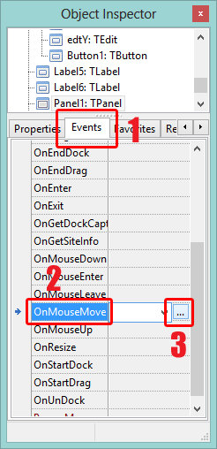

Find out if your user is pointing to left or right, top or down of the screen. If you are keen for a shock, then yes! You can also position the cursor wherever you want! Without having the user moving their mouse! Here's how
<!-- more -->
Mouse cursor is an indicator in the screen/monitor that where you are interested to do anything. When you move your mouse, your cursor moves. Now, how to get the position of the cursor on the screen?  
  

### A bit of concept

It is so short..  
  
First let's have a look at how the mouse position data works. Mouse cursor position can be identified by two variables, one saying the horizontal position and the other saying vertical position. Horizontal value is called X and vertical value is called Y.  
  

  
X is written before than the Y, just like the alphabet. If your mouse is at the left top then X=0 and Y=0 or (0, 0). If the user moves 100px (pixels) right then X=100 and Y=0 or (100, 0). If the user moves 200px downward then X=100 and Y=200 or (100, 200). Moving the cursor rightward increases the value of X. Moving the cursor downward increases the Y.  
  
You have read about graphs on Economics or Mathematics. So this shouldn't be hard to understand.  
  

### Position on a component

If you want to get the position of the mouse cursor on a component, then you will have to use the component's OnMouseMove event.  
  

  
You can drop a TPanel and a TLabel. Then select the panel, go to Events tab in the Object Inspector. Click the \[...\] button besides it. And write:  
  

procedure TForm1.Panel1MouseMove(Sender: TObject; Shift: TShiftState; X,  
  Y: Integer);  
begin  
  Label1.Caption:='Position: '+IntToStr(X)+', '+IntToStr(Y);  
end;

  
Remember, the X, Y values are relative to the component's area. That means x and y will be 0 (zero) when the cursor is at the left-top corner of the component, not the screen.  
  
It is especially useful if you are creating a drawing software. You can draw lines, circles, rectangles where the user moves mouse.  
  

### Getting cursor position on screen

Its simpler than you think.  

Mouse.CursorPos.x //would return the horizontal cursor position as Integer  
Mouse.CursorPos.y //would return the vertical cursor position as Integer  

  
You will have to use IntToStr to put the value on a Label's caption (or whichever caption you want). But mouse is always moving. The above command will give you the position for that moment when the command is executed. You will have to update the caption according the latest position, right? So you will need a Timer control to update it after certain periods of time.  

You can set the interval of the TTimer to 50 milliseconds. _(Note: 1 second = 1000 milliseconds.)_  

  
Create two labels. Name them lblX and lblY. Double click the Timer and write:  
  

  lblX.Caption := IntToStr(Mouse.CursorPos.x);  
  lblY.Caption := IntToStr(Mouse.CursorPos.y);

Now the above command will be run after every 50 milliseconds (very quick) to update the mouse cursor position.  
  
Now Run it (F9). And you will see the mouse cursor position with just two lines of code. (You have no idea how much is going under those codes.)  
  
If you move mouse...  
  

  
You will see it change!  
  

  
Interesting, right?  

  

### Setting the cursor position on screen

Drop two TEdits and a TButton. Name the TEdits as edtX and edtY. Set their Text property as 0 (zero). Double click the button and write:  

Mouse.CursorPos := Point(StrToInt(edtX.Text), StrToInt(edtY.Text));

  
Check out the codes mentioned here in action!  
  
  
  

_Photo: 123rf.com, graphics99.com_
