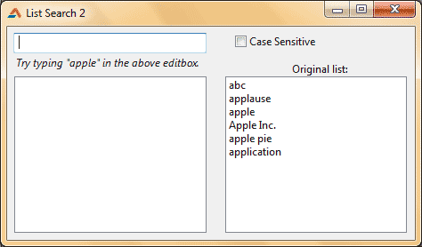

Lists are interesting to do programing tricks. In this session we learn how to search partial inputs with only the first part of the list items.
<!-- more -->


### Introduction

In the previous post we have learned a . Today we have another better example. It searches for the first letters of the list items and shows all the items that matches the first characters of the query.

It does not need the whole list item text to find list items. It can search with partial inputs. These partial inputs only have to match the first part of the list item. For example, entering "appl" can bring up "apple", "application". It can search both case sensitively and insensitively.

This kind of code is better for dictionary-type lists. It only matches the first part of the list items. So you can also search huge alphabetically sorted lists with this code.

One disadvantage of this code is that it cannot search from the middle of the list items. For example, writing "pple" will not find "apple".


### Algorithm

Algorithm is a game-plan for doing a certain thing. It can be like a sketch for what is to be done. It is usually informal as the programmer creates it for himself.

Before starting to write code, it is good idea to sketch up an algorithm. Below is the partial list search algorithm with the case sensitive option.

1. Clear the result list
2. Iterate through the list items
3. Check if the list item's first n letters are same as search query's first n letters.
3a. If match is found then add it to result list.
4. Go to step 2

We can easily convert it to Case Insensitive code by Uppercasing the both comparison strings in step 3. Now read the algorithm again and see if uppercasing the comparison strings would work.

Well... it should.

Now implementing both Case Sensitive and Case Insensitive. The complexity may haunt your mind when implementing case sensitive option. But the basics is that you uppercase the query and comparison string when you search Case Insensitively. This way we destroy case information from the strings. So "AbC", "abc", "ABC", all these becomes "ABC". So if we search the list with "ABC" and we find and item "abc" and we convert it to "ABC" then we will get a match.

1. Store the search query string in a variable query
1a. If searching with case sensitive option then we store the exact query to variable query
1b. If searching without case sensitive option then we uppercase version of the query to variable query

2. Clear the result list

3. Iterate through the original list

4a. If searching case sensitive, store the exact list item in a variable searchitem
4b. If searching case insensitively, we would store list item with uppercasing

5. Compare both the strings query

6. If found a match then add it to result list


### Quick Tutorial

Create an Application Project (**Project -> New Project -> Application -> OK**).

Drop a `TEdit`, `TCheckbox` and 2 `TListbox`es. Name the `TCheckbox` to `chkCase`. `Listbox1` is our original list where we can add many items to it for testing the search function. So add items to `Listbox1`. `Listbox2` on the other hand is our result list.

Your layout  may resemble this:





Select the `TEdit`, then go to **Object Inspector -> Events** tab. Then click the **[...]** button in front of `OnChange` event. Now enter the following:

```pascal
var
  i: Integer;
  query, searchitem: string;
begin
  if chkCase.Checked = true then
    query := Edit1.Text
  else
    query := UpperCase(Edit1.Text);

  ListBox2.Clear;

  for i := 0 to ListBox1.Count-1 do begin
    if chkCase.Checked = true then
      searchitem := ListBox1.Items[i]
    else
      searchitem := UpperCase(ListBox1.Items[i]);

    if LeftStr(searchitem, Length(query)) = query then
      ListBox2.Items.Add(ListBox1.Items[i]);

  end;
end;
```

Now run the project (**F9** or **Run -> Run**).


Now type in "app". You will see matching items in the result list. Now type in "App" and click on the checkbox. You will not see the result change. It is a bug. To fix it, we will have to add a code.

Double click on the TCheckbox and enter:

```pascal
begin
  Edit1Change(Sender);
end;
```

Now run the program again and test yourself.

You can also  to enhance the program, such as Add, Delete, Clear item.
