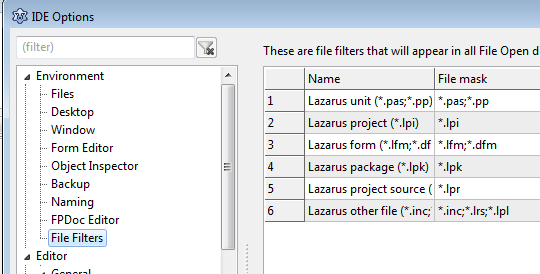
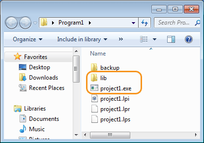
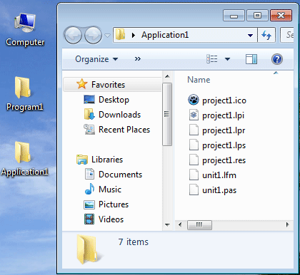
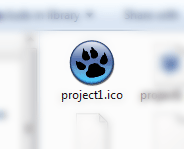
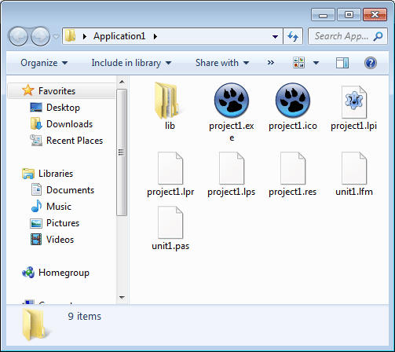

How do Lazarus projects work? Each Project file have their own purpose. Today, we do an autopsy or a post-mortem to learn about their function!
<!-- more -->
  
  
  
When we save a project in Lazarus, we don't care about the files that get created, right? We don't need to, because Lazarus handles them in Background. But learning about these files would make you more comfortable about managing multiple projects. And you can also meddle with the project files yourself when you need to do some trick to get things done (as you have to in the [GeckoPort projects](http://lazplanet.blogspot.com/2013/11/browser-in-lazarus-with-gecko-pt2.html)).  
  
A project has many files. They are not at all garbage. They have their own purpose. For example, you have files for storing Forms, their codes, icons and pictures that are used in the components etc. Although it may seem unnecessary to learn about those files and their function but every Lazarus programmer should know about these files as this idea can help you understand how [FPC](http://wiki.freepascal.org/FPC_Applications/Projects_Gallery)/[Lazarus](http://wiki.freepascal.org/Lazarus_Application_Gallery) project file structure work with [Lazarus IDE](http://en.wikipedia.org/wiki/Lazarus_%28IDE%29).  
  

### What is a post-mortem?

  
Post mortem in simplest sense is when a dead human body or remains is cut into pieces in order to find out the information they need. Post-mortem is very common in TV Serials like "CSI:Ny" or "Bones". They run tests and analyze those body parts/portions to reach to a conclusion about something.  
  

### What we are gonna do...

  
Rest assured! We are not going to cut a human body. We will just save a Lazarus project and take its files one by one and try to analyze them and get a better idea of what they do and why they are created. Instead of opening them in Lazarus, we will open them in notepad (or other text editor) to see what's inside them. We will learn what Lazarus stores in those files and what those files do.  
  

### Save it Superman!

  
Superheroes have to save the people from danger. We will save Lazarus project from losing its bits and bytes from the memory! (i.e. by saving it to hard disk.)  
  
First, start [Lazarus](http://www.lazarus.freepascal.org/). Click **Project -> New Project**. Select Program. Then click OK. Now a Free Pascal console program is created. This kind of project does not have a GUI so they have simple file structure. Now write some code, such as the famous Hello World code:  
  

...  
begin  
  writeln('Hello World!');  
  readln();  
end.  

  
Now don't run it yet. Just save it by clicking **File -> Save All**. Create a "**Program1**" folder in desktop and save the files inside it. Keep the default filenames as is and save them.  
  
Great! Now close Lazarus and open the "**Program1**" folder in File explorer.  
  
You will see 3 files: **project1.lpi**, **project1.lpr**, **project1.lps**. Now we will open these files one by one in a plain text editor and see what's in them.  
  

  
  

#### project1.lpi

  
The extension .lpi means "Lazarus Project Information" file. And the name basically explains it. The file stores the settings that we set in the project properties dialog, including project name, target filename, compiler options etc.  
  
If this file wasn't created, the project information would have had no place to be stored and we had to manually set them everytime we use the project. Especially if we had special compiler options for  the code, we had to enter it everytime we compile the project. And it would've been a daunting task to remember these. So it is a good thing that Lazarus saves the project settings in this file.  
  
You can double click this file to open the project in Lazarus. But we are not interested to open it on Lazarus right now, so moving on...  
  

#### project1.lpr

  
The extension .lpr is a confusing abbreviation. Because according to _Tools-> Options-> Environment-> File Filters_, .lpr means "Lazarus project source" file. It should have been .lps, but it is not.  
  

  
Well, from the name "Lazarus project source", you can guess that this file contains the source code for our project.  
  
This .lpr file should contain the following:  
  

program project1;  
  
{$mode objfpc}{$H+}  
  
uses  
  {$IFDEF UNIX}{$IFDEF UseCThreads}  
  cthreads,  
  {$ENDIF}{$ENDIF}  
  Classes  
  { you can add units after this };  
  
begin  
  writeln('Hello World!');  
  readln();  
end.  

  
When we run a Free Pascal code in the command line we simply save the code as something.pas and compile it. This lpr file is the same but with a different extension. It contains the source code just like .pas file would do.  
  
If you double click this .lpr file, it will open the project in Lazarus. But, we'll not right now. Moving on...  
  

#### project1.lps

  
The extension .lps probably means "Lazarus Project Session". This is a very interesting file because at first glance, it looks similar to the .lpi file. But it has different purpose. It contains the session data. That means it stores what you did in the last time you opened the project. For example, if you opened the Classes file in a tab, Lazarus remembers the next time you open the project and shows the Classes tab from your previous session. It even remembers where your cursor was in those files. Pretty amazing! And this is possible because Lazarus stores all these data in this lps session file.  
  

#### "backup" folder

  
This folder contains backups that Lazarus keeps of the project files in case you lose one. This behavior can be changed from **Tools-> Options-> Environment-> Backup**.  
  

#### When we build or run it

  
Now open the project in Lazarus (by double clicking the lpi or lpr or using **File-> Open**). Click **Run -> Compile**. (You can also try **Run-> Run**.) When the compiling finishes you will see a "**lib**" folder to be created in the project folder. It has a .compiled and .o file. They are the result of compiling.  
  

  
You should also see a **project1.exe** in the project folder which is our executable. This executable is not ready to be published. It has debugging data. To strip off this data check out Build modes.  
  

### Now to GUI project

  
Start Lazarus. Now click Project-> New Project-> Application-> OK.  
  
Now draw a TButton on the form, set its Caption property to "Click me!", double click and enter:  
  

procedure TForm1.Button1Click(Sender: TObject);  
begin  
  ShowMessage('Hello World!');  
end;  

  
Don't run or build it yet.  
  
Create a folder in the desktop named "Application1". In Lazarus, click File-> Save all. Keep the default file names while saving.  
  
Close Lazarus.  
  
Go the folder "Application1" folder you just created.  
  

  
Now there are 7 files! (Compared to only 3 files in the console project.) This is because GUI application need more data than a console project. It has to have the source code, of course, plus the component properties, resource file and an icon and so on.  
  
So let's see what these files do...  
  
The lpi and lps files are basically the same as the console project. So we can skip them.  
  

#### project1.ico

  
As your common sense may indicate, .ico means "Icon" file. Unlike console programs, the GUI project has to have an icon for the exe (or dmg or any other binary format). This is currently a Lazarus "paw" icon. When you set an icon for the project, this will be replaced by that icon.  
  

  

#### project1.lpr

  
This file is quite different than what we saw in the console project. The extension is same, but it contains different code in a GUI project.  
  
This file is very important for a project as the project is basically run through this file. When we run the program, it starts from this very lpr file. (Just like we use "Sub Main" in VB and "int main(){}" in C/C++.) It has the begin...end block which is run before any other code. It is the program's starting point. This is similar to the console project. In our console project the begin...end block in the lpr is run at first too.  
  
In a GUI project, it typically has this code:  
  

program project1;  
  
{$mode objfpc}{$H+}  
  
uses  
  {$IFDEF UNIX}{$IFDEF UseCThreads}  
  cthreads,  
  {$ENDIF}{$ENDIF}  
  Interfaces, // this includes the LCL widgetset  
  Forms, Unit1  
  { you can add units after this };  
  
{$R \*.res}  
  
begin  
  RequireDerivedFormResource := True;  
  Application.Initialize;  
  Application.CreateForm(TForm1, Form1);  
  Application.Run;  
end.  

  
So, you can understand that the code inside the begin...end block basically initializes the application, creates an instance of TForm1, and finally runs our application.  
  
This file is automatically created and maintained by Lazarus. So you will rarely have to edit this file.  
  

#### project1.res

  
This is a resource file. It is generated everytime you compile or build the project.  
  
It contains all the images that you set in the properties of the components. For example, when you set the Picture property of a TImage, the image has to be stored somewhere. So it is kept in this file. The contents of the file set in the properties, is recorded in this file.  
  
The picture data is is kept in lfm as well. So what is this? This is a res files generated for the whole project. This res file is then included/embedded in the exe. Remember the "{$R \*.res}" line in the project1.lpr? This line tells the compiler to include all the .res files in the project directory to be included.  
  

#### unit1.lfm

  
This file contains the form information. Besides the form information, it contains all the properties for the components that you placed in the form, including their Left, Top, Width, Height, Caption etc. properties. When you pick a Picture for a TImage, it actually stays in this file (at least its contents).  
  
In our project we should see:  
  

...  
  object Button1: TButton  
    Left = 67  
    Height = 65  
    Top = 77  
    Width = 191  
    Caption = 'Click me!'  
    OnClick = Button1Click  
    TabOrder = 0  
  end  
...  

  
The caption that we set and even the dimensions are saved in this file. (Obviously, the dimensions shown here would not be the same in your project.)  
  

#### Finally, unit1.pas

  
From the extension and the clear name, you can easily guess that it contains the code for Form1 and its components. **It is basically a pascal unit. The main program stays in the .lpr file and .pas files are included from it.**  
  
So, in both cases of Console and GUI projects, .lpr file always stores the program and units contain the additional code to aid the main program.  
  
Now, Running it...  
  
Click **Run-> Compile**.  
  

  
Similar to the console program, a "lib" folder is created and the result of the compilation are kept there as files. Also, the project1.exe is created which is around 14mb. This is huge. Because it contains debugging data. You can strip off this data and make it weigh around 700kb. Read more about Build modes.  
  
So, that's it. I wish I had this article when I first started using Lazarus. It would've made my understanding of Pascal way better as I didn't know a clear difference between a Pascal unit and a main Program. You are very lucky to have this article in your hands.  
  
Basically, Lazarus invents nothing. Every piece of data about a Lazarus project is stored in files. There are separate files for separate things. The forms are saved in LFMs, their code is saved in PASes, when compiling you need compiler options and it is saved in the LPI file and so on... Now that you have the knowledge, you can have a better life with coding your programs.