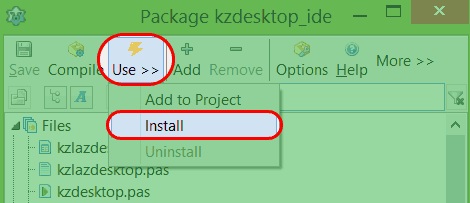
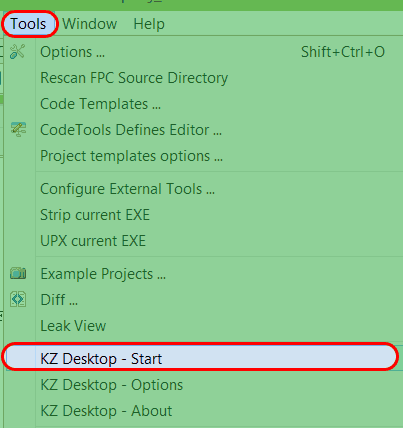

This tutorial shows you how to make lazarus run with just one window. It is a good docking solution which will be integrated in Lazarus in future, when it becomes stable.
<!-- more -->
  
Lazarus is a good piece of software. It can create cross platform applications, no sweat! It can also convert Delphi projects and help them run on Mac and Linux machines. But let's face it, it has windows running on over the screen. It is sometimes difficult to manage all the cluttered windows and do the actual coding. In this scenerio, you might choose to use single window interface. And the good news is, there is a way to turn those messy windows into a disciplined interface.  
  
Take a look at how Lazarus looks normally:  
  
  
  
A development environment, or a random collection of windows?!  
  
We will use **KZDesktop** package to make lazarus run in a single window. Please keep in mind that it is in a beta state. It may work properly as expected. So if you want to keep it safe, do not use it. (But I am using it and have not yet faced any crash.)  
  
If you want a stable solution, then choose **Anchor Docking**. It is available with the default installation of Lazarus. ( EDIT: When I wrote this article I didn't know much about Anchor Docking. Now that know I have added instructions on how to use it...) **We'll see the Anchor Docking solution too, at the end.**   
  
I heard that when it is going to become stable, it would be added to Lazarus as a feature. Here's how you can enjoy Lazarus in a single window:  

### 1.Download KZDesktop

Go here to download the package:  
[http://sourceforge.net/projects/kzdesktop/files/](http://sourceforge.net/projects/kzdesktop/files/)  
or here for a direct link: [http://sourceforge.net/projects/kzdesktop/files/?source=navbar](http://sourceforge.net/projects/kzdesktop/files/?source=navbar)  
  

Extract the downloaded package in C:lazaruscomponents (Assuming that you have [installed](http://lazplanet.blogspot.com/2013/03/how-to-install-lazarus.html) Lazarus in C:lazarus directory)  

### 2.Prepare Lazarus

Start Lazarus.  
  
Then go to Package -> Open package file (.lpk)  
  

Then Open the C:lazaruscomponentskzdesktop\_beta01kzdesktop\_ide.lpk  

  
  
Click compile. It will take some time to compile.  

  
  
Click Use -> Install. Press yes on a messagebox that appears. It will rebuild the whole Lazarus IDE. It is very interesting as Lazarus will re-create Lazarus itself! After rebuilding, Lazarus will restart.  

  

### 3.Use KZDesktop

  
Click **Tools -> KZ Desktop-Start**. Press OK.  

  
  
Then Click **File -> Restart** and voila! It is in single window!  
  
Now look at your Lazarus with proud as it puts the windows, where they belong! ... In a single window!!  
  

  
  

### Disabling KZDesktop

If you have any problem with KZDesktop or just don't like it, then you can disable it.

  

Click Tools -> KZDesktop - Stop.

Press OK.

Click File -> Restart.  
  

### Anchor Docking Way...

Anchor docking is available in your lazarus installation directory by default. So it is a more stable solution than kzDesktop. Simple instruction to install it:  
1\. Double click c:lazaruscomponentsanchordockingdesignanchordockingdsgn.lpk  
2\. It will start lazarus with an extra package window. Click Compile on it. After the compilation, click Use->Install.  
3\. You will be prompted anchordocking package will be installed as well, click OK. Another message would ask would you like to rebuild Lazarus, click Yes.  
  
Lazarus will be restarted after the installation and you will see the windows docked. If you see any window undocked, then drag its titlebar and drop over the docked windows to dock it. Then Click Tools -> Save layout to save the layout. (Otherwise the layout will not be saved for the next time.)  
  
Here is a screenshot of the single window Lazarus made possible with Anchor Docking:  
  

Not bad, right? To some extent, I like it better than kzDesktop. Especially it doesn't mess up the Alt+Tab behavior. And the form designer is not docked in such a way that I have to use arrows to scroll it. Somehow it feels more natural to me. ( It's just my opinion. )  

  
To uninstall Anchor Docking then click Package -> Install/Uninstall Package. Then select anchordockingdsgn and click Uninstall Selected.  
  

### Conclusion

In this article we learned about 2 solutions for making Lazarus as single window. kzDesktop is in beta, so it makes it less reliable. But if you are strictly looking for a single window solution, even with the form designer, then kzDesktop is your solution. Beta 2 of kzDesktop has a better scrolling of the form by dragging a rectangle view area and not with some arrow buttons.  
  
If you are looking for a stable, reliable option, go for Anchor Docking.  
  
If you are still unsure, then try both of them then choose the best one that suits your needs.