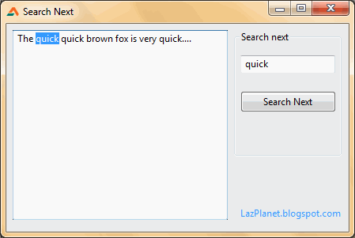
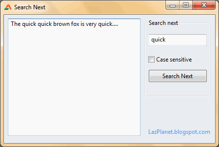

Another example of simple text search which implements a Search Next button, which continuously searches for the given text. Its very easy. Heres how...
<!-- more -->


We had a . The example searches for only the first occurrence of the word. Today we will update our knowledge. We will create a continuous text search which will search for every instance of the word that are in the text.

Basically the idea is to use [`PosEx`](http://www.freepascal.org/docs-html/rtl/strutils/posex.html) to search the first instance of the word. We will get the position of the first instance. Then we will substract the searched text from the original text and search again in the rest of the text. We will repeat until there is no more instances of the word.

A quick tutorial will clear your confusions, if any:


### Quick Tutorial

Create a new Application Project (**Project -> New Project -> Application -> OK**).

Drop a **TMemo**, **TEdit** and a **TButton** on the form. Set the `Caption` of **TButton** as "`Search next`". Double click on the **TButton** and enter:

```pascal
var
  s: string;
  i, searchstart: Integer;

begin
  //searchstart:=Memo1.SelStart+Memo1.SelLength+1;
  searchstart:=SearchAfterPos+1;
  s := Copy(Memo1.Text, searchstart, length(Memo1.Text)-(searchstart));

  i := PosEx(Edit1.Text, s);
  if (i <> 0) then begin
    Memo1.SelStart := (i-2)+(searchstart);
    Memo1.SelLength := length(edit1.Text);
    memo1.SetFocus;
    // we want to search from this point afterwards
    SearchAfterPos:=SearchAfterPos+i+Length(Edit1.Text)-1;

  end else begin
    // we have finished searching to the end
    ShowMessage('The word is found no further.');
    // we will search from the beginning next time
    SearchAfterPos:=0;

  end;

end;
```

Double click the **TEdit** then enter:

```pascal
begin
  // we reset...
  // we would search from the beginning next time
  SearchAfterPos:=0;
end;
```

Add the declaration at the top under the first `var` (before the `implementation` line):

```pascal
  // It indicates from where we will search next time
  SearchAfterPos: Integer=0;
```


### Run it

Run the program (**F9** or **Run -> Run**). Fill up the memo with some text. To search for a text type the word in the **TEdit**. (You can pick up a word from your text for testing.) Press the button. It will search for the text. If the text is found then it will be selected. If not found, it will show a message.





Here you go, your own text search utility!


### Explanation

It is a very simple text search program. So the explanation is very simple  as well. What do we do, ourselves, to find a word in a paragraph. We look for the word from the first sentence to last. If we find the word then may be we highlight the word, then continue from there to find the next occurrence. The last part is very important, "then continue from there..." We will learn about it from our first line of code:

```pascal
  searchstart:=SearchAfterPos+1;
```

As a value of `SearchAfterPos` we have got `0` (zero) for the first time. It means we will start our searching from `0+1=1` position. `PosEx` is `1` based (position starts from `1`), `SelStart` is `0` based (position starts from `0`). That's why we have to add the `+1`, because we will use it in `PosEx`.

Next, we get the text to search:

```pascal
  s := Copy(Memo1.Text, searchstart, length(Memo1.Text)-(searchstart));
```

So, why not show the whole `Memo1.Text`? Why use `Copy`? Because, we will subtract the text we have already searched the word for. We will search the text that remains afterwards. It will be clear in a second.

We have got the string to be searched for `PosEx`. Now our work is simple. We run the `PosEx` as usual:

```pascal
  i := PosEx(Edit1.Text, s);
```

We search for the text of `Edit1.Text` in the string `s`. `s` is a trimmed-down version of the `Memo1.Text` which only includes the text that we have not yet searched.

```pascal
  if (i <> 0) then begin
```

`PosEx` returns zero (`0`) when it cannot find the word. If the word is found, then it returns the position where the word is found. If the word is found then we...

```pascal
    Memo1.SelStart := (i-2)+(searchstart);
```

`SelStart` value starts form zero. But the position that `PosEx` returns starts from `1`. So when we set the `SelStart`, we `-1` and convert it to zero-based position. And we have also added `+1` at the start of our program, remember? In the value of `searchstart` to be precise. We will have `-1` again. Which makes us `(i-2)` in the above code.

```pascal
    Memo1.SelLength := length(edit1.Text);
```

We specify how much text will be selected in the `Memo`. We will set the `length` of the word to be selected.

```pascal
    memo1.SetFocus;
```

If we do not set focus to the memo, then the text will be selected in memo, but it will not be visible until you press Tab and set focus to the memo. We will set focus by this command. Alternatively you can set Memo's `HideSelection` to False.

```pascal
    // we want to search from this point afterwards
    SearchAfterPos:=SearchAfterPos+i+Length(Edit1.Text)-1;
```

We want to save the position where we found the word, plus, the word's `length`. When the search next button is pressed next time, we will search from after this position. Remember to keep it as zero-based (so the `-1`). Because we will add `+1` when we set value for `searchstart`.

```pascal
  end else begin
    // we have finished searching to the end
    ShowMessage('The word is found no further.');
    // we will search from the beginning next time
    SearchAfterPos:=0;
```

When the word is not found we show the message and set our search position to zero.

When the text is changed our previous search after position can be inaccurate. So we will reset the previous search position:

```pascal
  // we reset...
  // we would search from the beginning next time
  SearchAfterPos:=0;
```

You can also add the "Case Sensitive" feature to the code. Just use `UpperCase` code to do that. Drop a checkbox in the form and add a condition that when the checkbox will be checked we will uppercase the string:

```pascal
  if (CheckBox1.Checked = false) then begin
    s := UpperCase(s);
    target_s := UpperCase(Edit1.Text);
  end else begin
    //s:=s;  // we keep it as it is
    target_s := Edit1.Text;
  end;
```

Add the above lines of code just after the `s := Copy(...` line. Replace with `target_s` where `Edit1.Text` is used in the rest of the code. Don't forget to declare `target_s:string;` in the procedure's `var` clause.





This is it! You've now learned to run a text search!
