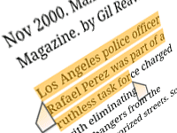
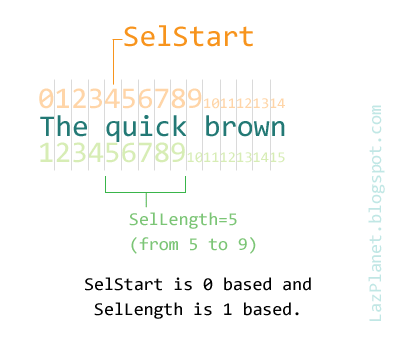
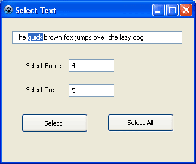

Sometimes highlighting or selecting some part, not all, becomes necessary. We look into the method of how we can do it.
<!-- more -->
  
  
How can you highlight or select a part of Text in a TEdit? Well, you can select all text using the TEdit.SelectAll procedure. But what if we want to select a portion of the input that is in a TEdit?  
  
Well, we look into a solution that can be applied in any component that supports SelStart and SelLength.  
  
If we want to select all text in the input, simply we can do this:  
  
Edit1.SetFocus;  
Edit1.SelectAll;  
  
If you don't set focus to it, then the selection will not be visible and the SelectAll procedure will not work its magic.  
  
Similarly if you want to select a portion of the input, then try this code:  
  
  Edit1.SetFocus;  
  Edit1.SelStart:=4;  
  Edit1.SelLength:=5;  
  
Suppose we have "The quick brown fox jumps over the lazy dog." text in the TEdit named Edit1. Then the above will select the word "quick". Notice that "quick" starts from the position 5, but we have to enter a zero-based value as a SelStart input. (Zero-based means it starts from zero.) So:  
  
0 = T  
1 = h  
2 = e  
3 = (Space)  
4 = q  
  
But the length is 1-based (it starts from 1). So we set the length 5 to select "quick".  
  

  
  
We have a sample Application to test how both SelectAll and SelStart & SelLength works. You can either try the Quick Tutorial or download the sample from below.  
  

### Quick Tutorial

  
Start Lazarus. Create a new Application Project (Project-> New Project-> Application-> OK).  
  
Create 3 TEdits and 2 Tbuttons (and Labels for instructions as you want).  
  
Name them in the following manner:  
**TEdits:**  
edtText - which will have the text to select,  
edtStart - which will have the value for SelStart,  
edtLength - which will have the value for SelLength.  
  
You can keep the 2 Tbuttons as they are.  
  
Double click the first Tbutton (which will select a part of text) and enter:  
  
procedure TForm1.Button1Click(Sender: TObject);  
begin  
  edtText.SetFocus;  
  edtText.SelStart:=StrToInt(edtStart.Text);  
  edtText.SelLength:=StrToInt(edtLength.Text);  
end;  
  
Double click the other button and enter:  
  
procedure TForm1.Button2Click(Sender: TObject);  
begin  
  edtText.SetFocus;  
  edtText.SelectAll;  
end;  
  
Now Run the Project (F9 or Run-> Run).  
  

  
And test the program!  
  

### Download Sample Code ZIP

You can download an example source code ZIP file from here: [http://db.tt/PF34MqPe](http://db.tt/PF34MqPe)  
Or here: [http://bit.ly/137AOcc](http://bit.ly/137AOcc)  
Size: 518 KB  
There is a compiled executable EXE file inside the package.  
  
_Image: [www.completeguides.net](http://www.completeguides.net/@api/deki/files/200/gb_browser_text_select.png?revision=1)_  
  
Ref:  
[http://www.delphipages.com/forum/showthread.php?t=144498](http://www.delphipages.com/forum/showthread.php?t=144498)