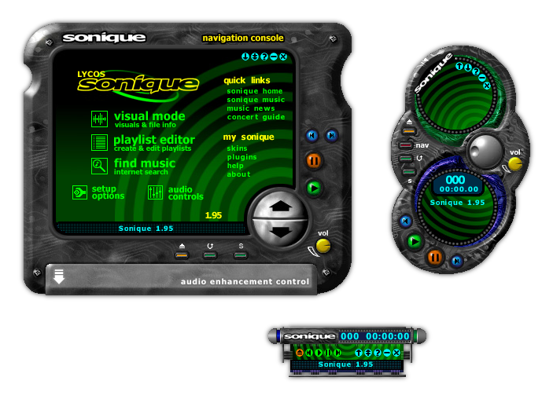
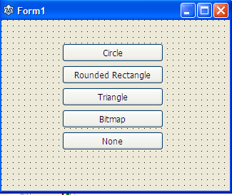
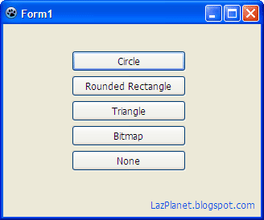
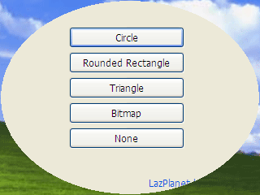
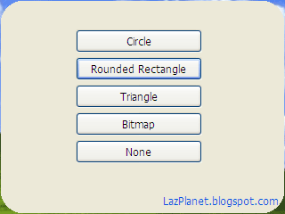
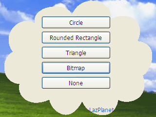

Forms are rectangular, right? In this article we prove it wrong. We will turn our form into circle, triangle and what not!
<!-- more -->
  
Happy [_Pahela Baishakh_](http://lazplanet.blogspot.com/2013/04/shuvo-noboborsho-and-here-is-new-mascot.html) to all _Bangalees_. Have a good year 1421 (Bengali Year).  
  
Forms are pretty dull, boring rectangular shape. But who says we can't change the shape of the forms? We can and we will. Basically, you can turn your form into any shape you desire. Many of the Lazarus programmers don't know that. But it's possible. The simplicity of it is also amazing. Anything you can store on a Black and White (monochrome) TBitmap can be used to shape your form. That includes rectangles, circles, triangles, rounded rectangles and many more.  
  

### Background

First time I saw a shaped form was the Sonique Player. It was back in 2001 or '02. I used to use it on Windows 98. I had no internet so I got it from a magazine CD. Its development stopped in 2002. [Wikipedia](http://www.wikipedia.org/) has a [great article about Sonique Player](http://en.wikipedia.org/wiki/Sonique_%28media_player%29). It was a good player with a cool interface. It had a intuitively shaped form. look at the screenshot below (click it to zoom):  
  

  
The interface is cool even in this day at 2014! As the above screenshot suggests it had 3 modes or views. A player that takes shape and changes shapes too! Since then I was obsessed with shaped forms. I tried [Multimedia Builder](http://www.mediachance.com/mmb/). It was a premature software but I learned the very basics of programming with it. It had an option to set form mask / region / shape or whatever. And with it I made an MP3 Player with shaped form successfully. After some years, my hard-disk crashed. So I neither have a copy of it nor a screenshot.  
  
Then the very famous [Windows Media Player 9](http://en.wikipedia.org/wiki/Windows_Media_Player) came out from Microsoft. And it had a shaped look too. And not only that. You can also resize the form and the shape changes with it! How amazing! Well, may be not today but it was very amazing back when it was released.  
  
So my obsession driven me to try resizing a shaped form like WMP9. Meanwhile, I shifted to Visual Basic 6. And the algorithm for shaping form was dead slow. A normal shape would take almost 4 seconds. I did not have any inspiration to modify the algorithm. So seeing the form being resized slowly the project was dropped.  
  
But enough talk! Let's see what we have to do in Lazarus. Lazarus has a pretty fast algorithm for shaping forms. So that's a relief. We basically:  
  
**1\. Hide the titlebar.** We hide the titlebar so that the titlebar doesn't take space from our form. There's no use of a titlebar in a shaped form anyway. This is also optional. You can skip it according to your needs.  
**2\. Create a TBitmap, set it to Monochrome and draw the shape on it**. Monochrome means strictly having black or white pixels. No color in between. We set it by TBitmap.Monochrome:=True. Only pixels with white color will form the shape. Black will remain transparent.  
**3\. Set the bitmap as the form's shape** (with SetShape)  
  
It's that easy! Oh, and you can use it on any component as well. For example, a button. Such an example project already exists in your Lazarus installation. Check out C:lazarusexamplesshapedcontrols (assuming that you have Lazarus installed in C:lazarus).  
  
For example, to shape the form into a circle shape, use the code below (we have created a new Application project, then placed a TButton on it, double clicked it then entered the following):  
  

procedure TForm1.Button1Click(Sender: TObject);  
var  
  ABitmap: TBitmap;  
begin  
  // Hide the titlebar  
  BorderStyle:=bsNone;  
  ABitmap := TBitmap.Create;  
  ABitmap.Monochrome := True;  
  ABitmap.Width := Width; // or Form1.Width  
  ABitmap.Height := Height; // or Form1.Height  
  
  // We set the background as black (which will be transparent)  
  ABitmap.Canvas.Brush.Color:=clBlack;  
  ABitmap.Canvas.FillRect(0, 0, Width, Height);  
  
  // Now we draw our shape in White  
  ABitmap.Canvas.Brush.Color:=clWhite;  
  ABitmap.Canvas.Ellipse(0, 0, Width, Height);  
  //Canvas.Draw(0,0,ABitmap);  
  SetShape(ABitmap);  
  
  ABitmap.Free;  
end;

  
Writing SetShape is equal to writing Form1.SetShape (as is Width, Height and BorderStyle).  
  
(1) First, we hide the titlebar with:  

  BorderStyle := bsNone;

  
(2) Then we create a TBitmap  

  ABitmap := TBitmap.Create;

...set it as monochrome  

  ABitmap.Monochrome := True;

... and set it equal to the form's width and height. You know, the usual stuff!  
  
We paint the whole canvas of the TBitmap with black. It will make room for our drawing.  

  ABitmap.Canvas.Brush.Color:=clBlack;  
  ABitmap.Canvas.FillRect(0, 0, Width, Height);

  
Then we draw in color White to form the shape or shape the form!  

  ABitmap.Canvas.Brush.Color:=clWhite;  
  ABitmap.Canvas.Ellipse(0, 0, Width, Height);

  
The reality is that no matter whatever you draw in this Canvas it will shape the form. You can draw a triangle, rounded rectangle or anything.  
  
If you load a Monochrome bitmap file with a complex drawing in this Canvas you could even make complex of shapes of the form, such as the shape of the [Sonique Player](http://en.wikipedia.org/wiki/Sonique_(media_player)%E2%80%8E).  
  

### Tutorial

Start [Lazarus](http://www.lazarus.freepascal.org/).  
  
Create a new Application Project (Project -> New Project -> Application -> OK).  
  
Now draw 5 TButtons in the form. Set their Captions as:  
Circle  
Rounded Rectangle  
Triangle  
Bitmap  
None  
  
The TButtons will be named Button1 through Button5. The code is given here assuming this. You may have to modify the code if it is not correct.  
  
You should now have a form that looks like this:  
  

  
  
Now double click The TButton with the caption "Circle" and enter the following code:  
  

procedure TForm1.Button1Click(Sender: TObject);  
var  
  ABitmap: TBitmap;  
begin  
  BorderStyle:=bsNone;  
  ABitmap := TBitmap.Create;  
  ABitmap.Monochrome := True;  
  ABitmap.Width := Width; // or Form1.Width  
  ABitmap.Height := Height; // or Form1.Height  
  
  // We set the background as black (which will be transparent)  
  ABitmap.Canvas.Brush.Color:=clBlack;  
  ABitmap.Canvas.FillRect(0, 0, Width, Height);  
  
  // Now we draw our shape in White  
  ABitmap.Canvas.Brush.Color:=clWhite;  
  ABitmap.Canvas.Ellipse(0, 0, Width, Height);  
  //Canvas.Draw(0,0,ABitmap);  
  SetShape(ABitmap);  
  
  ABitmap.Free;  
end;

  
Now switch to form view. As always, you can switch between Form view and Code view with F12.Now double click the button that says "Rounded Rectangle" and enter:  
  

procedure TForm1.Button2Click(Sender: TObject);  
var  
  ABitmap: TBitmap;  
begin  
  BorderStyle:=bsNone;  
  ABitmap := TBitmap.Create;  
  ABitmap.Monochrome := True;  
  ABitmap.Width := Width; // or Form1.Width  
  ABitmap.Height := Height; // or Form1.Height  
  
  // We set the background as black (which will be transparent)  
  ABitmap.Canvas.Brush.Color:=clBlack;  
  ABitmap.Canvas.FillRect(0, 0, Width, Height);  
  
  // Now we draw our shape in White  
  ABitmap.Canvas.Brush.Color:=clWhite;  
  ABitmap.Canvas.RoundRect(0, 0, Width, Height, 50, 50);  
  //Canvas.Draw(0,0,ABitmap);  
  SetShape(ABitmap);  
  
  ABitmap.Free;  
end;

  
Now switch to form view and double click "Triangle" labeled TButton and enter:  
  

procedure TForm1.Button3Click(Sender: TObject);  
var  
  ABitmap: TBitmap;  
  Points: array of TPoint;  
begin  
  BorderStyle:=bsNone;  
  ABitmap := TBitmap.Create;  
  ABitmap.Monochrome := True;  
  ABitmap.Width := Width; // or Form1.Width  
  ABitmap.Height := Height; // or Form1.Height  
  
  // We set the background as black (which will be transparent)  
  ABitmap.Canvas.Brush.Color:=clBlack;  
  ABitmap.Canvas.FillRect(0, 0, Width, Height);  
  
  // Now we draw our shape in White  
  SetLength(Points, 3);  
  Points\[0\] := Point(Width div 2, 0);  
  Points\[1\] := Point(Width, Height);  
  Points\[2\] := Point(0, Height);  
  
  ABitmap.Canvas.Brush.Color:=clWhite;  
  ABitmap.Canvas.Polygon(Points);  
  //Canvas.Draw(0,0,ABitmap);  
  SetShape(ABitmap);  
  
  ABitmap.Free;  
end;

  
Whats with so many lines of code? We just drew a polygon. Nothing fancy. Nothing to be scared of.  
  
Double click the "Bitmap" labeled button and enter:  
  

procedure TForm1.Button4Click(Sender: TObject);  
var  
  ABitmap: TBitmap;  
begin  
  if (not FileExists('cloud.bmp')) then exit;  
  BorderStyle:=bsNone;  
  ABitmap:=TBitmap.Create;  
  ABitmap.LoadFromFile('cloud.bmp');  
  ABitmap.Monochrome:=True;  
  
  SetShape(ABitmap);  
  
  ABitmap.Free;  
end;

  
We have opened 'cloud.bmp'. So how did I make this file. You can use any Image editor for this. Create a new image with the same width and height as the form's. Fill it with Black. Draw shapes in white color. I drew a cloud shape. You can use the image below instead:  
  

  
Right click it and select Save Image As... and save it where you saved your folder. If you haven't saved it, save the project. Otherwise, the button won't work.  
  
Now we have to code for a button that would reset the form shape. It will restore the form to its original shape. Switch to form view and double click the "None" labeled button and enter:  
  

procedure TForm1.Button5Click(Sender: TObject);  
var  
  ABitmap: TBitmap;  
begin  
  ABitmap:=TBitmap.Create;  
  ABitmap.Monochrome:=True;  
  ABitmap.Canvas.Brush.Color:=clBlack;  
  ABitmap.Canvas.FillRect(0, 0, Width, Height);  
  
  SetShape(ABitmap);  
  BorderStyle:=bsSizeable;  
  
  ABitmap.Free;  
end;

  
What we do is we just create TBitmap fill with black and set the shape with it. We are basically setting a null mask for the form.  
  
That's it!  
  

### Run it

Now run the project with Run -> Run (or F9).  
  

  
Now click the buttons. The form will change shapes:  
  

  

  

")

  

  
And clicking on the "None" button would restore the original shape of the form.  
  

  
In any point if you cant close the form or the titlebar is not appearing for any reason, try focusing the form if it's not focused and pressing Alt+F4. That will close the form.  
  

### Moving the form by dragging

Setting the BorderStyle to bsNone makes the form immovable with dragging the mouse. For this, you can try [this method described in this article](http://lazplanet.blogspot.com/2013/06/dragging-form-by-its-body.html). It will make your form movable.  
  

### Conclusion

So, you have learned how to set custom form shape in Lazarus. I haven't tried it on platforms other than Windows. So I don't know if it will work on Linux or Mac. But it should work across platforms. For further improvements you can try keeping a skin image by drawing a TImage in the form and setting its Z-Order to show behind. Then setting a skin image as its Picture property. Have fun shaping your form!  
