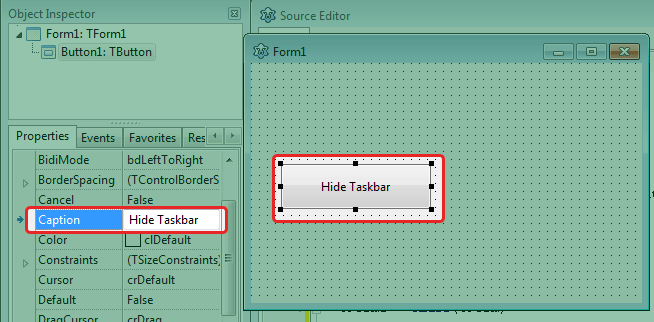
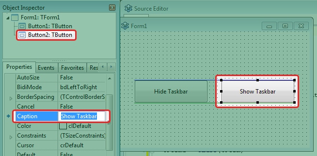
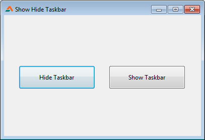

If you want to build some uncommon software which needs hiding the taskbar then check out this article.  
  
  
Windows Taskbar is the bar which sits at the very bottom of the screen. This bar has the Start orb (or the Start Button) and some of our favorite program icons and some other Tray icons on the right as well. It is a prominent feature of a windows desktop.  
  
There are times when we need to hide it, and may be show it again. For example, if you are doing a fullscreen and for some reason the taskbar keeps popping and annoying you or if you just want to have some fun, hiding the taskbar is a nice thing to do.  
  
In this short tutorial, we'll see how to hide the taskbar and show it again. For hiding and showing a window which is not from our project, we will have to use the Windows API. And basically every form, window or component we see in the screen is a "window" to the Windows API. When a form, window or component appears in the screen, windows gives it a special ID to it. It is called HWND. An HWND is like a roll number. As each student in a class have one unique number, HWND is just like that. We can use this HWND to identify a window. We'll learn about that in a minute.

### The code

  
Now draw another **TButton**. (Or you can copy and paste Button1 as another option.) This button should automatically be named **Button2**. Set it's caption to "**Show Taskbar**". Size and position it as you like.  
  
  
  
You can change the name of the buttons as you like but then change the code accordingly.  
  
Now press **F12** to switch to code view. Add the **windows** unit to the **uses** clause:  
  

uses  
  Classes, SysUtils, ..., ...,  
  windows;

  
Press **F12** to switch to Form view again.  
  
Double click **Button1** and enter the following code:  
  

procedure TForm1.Button1Click(Sender: TObject);  
begin  
  ShowWindow(  
      FindWindowEx(0, 0, MAKEINTATOM($C017), 'Start'),  
      SW\_HIDE);  
  ShowWindow(FindWindow('Shell\_TrayWnd', nil), SW\_HIDE);  
end;

  
Switch to Form view (**F12**). Double click **Button2** and enter the following code:  
  

procedure TForm1.Button2Click(Sender: TObject);  
begin  
  ShowWindow(FindWindow('Shell\_TrayWnd', nil), SW\_SHOW);  
  ShowWindow(  
      FindWindowEx(0, 0, MAKEINTATOM($C017), 'Start'),  
      SW\_SHOW);  
end;

  
Now Run the project (Run -> Run or F9).  
  
  
Click both the buttons to show and hide task bar.  
  

### Download Sample Code ZIP

You can download the above example tutorial project's source code from here: [https://db.tt/Nca39jNf](https://db.tt/Nca39jNf)  
Size: 522 KB  
The package contains compiled executable EXE file.  
  
Ref: [http://embarcadero.newsgroups.archived.at/public.delphi.nativeapi/201008/1008113955.html](http://embarcadero.newsgroups.archived.at/public.delphi.nativeapi/201008/1008113955.html)