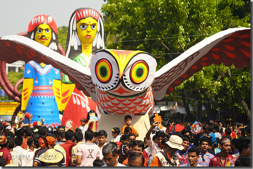
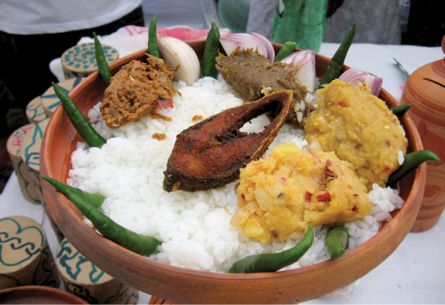

Today is 14 April 2013, the first day of Bangla calendar. And in this auspicious day, an idea for a cartoon figure, as a mascot for LazPlanet has come to my mind. Here is the first image of him...
<!-- more -->

Today is the first day of Bangla year 1420. The first month in Bangla calendar is called Baishakh. So the day is called Pahela Baishakh or First \[day of\] Baishakh. On this day the Banglalis say "Shuvo Noborsho" to each other, which means "Have an auspicious new year".

The day is celebrated with a lot of fun and enthusiasm. There has been...
Rallies...

Those of you who don't know, this is _Mongol Shovajatra_ (Rally for Good). It is believed that with the joy and happiness of the rally, the sadness and bad from the old year is washed away from people's lives.

Food ...

Women with sarees (white saree with red border is a tradition)...

.jpg)

Face painting...

And some body painting as well... :-)

We, the _Banglalis_ are lucky to have a day like this.

And I am very lucky to have an idea coming to my mind on this very day. The idea is to have a mascot for this site. When I thought of it, I thought, LazPlanet is a planet, right? A planet for [Lazarus](http://www.lazarus.freepascal.org/) fans. So this planet should have an alien mascot (well, because its a planet). So, on the next second I took some paper and drew out a character by one chance. And this is what I came up with:

I named it AlienGuy, for now of course. But a better name can be adapted later.

I am thinking of adding it to the website design. I sketched a cartoon of a flying spaceship (or UFO) with AlienGuy in it. Other ideas may also come to my mind. Till then, enjoy!

Shuvo Noboborsho
