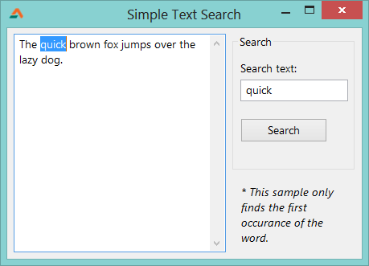

Searching is one of the tasks of programing that reduces so much of our work and hardship. Today we see a **very** simple string search sample code...
<!-- more -->

For second variation/update of this program [see this article](http://lazplanet.blogspot.com/2013/04/search-text-all-words.html).

Text search is very easy through a function named [PosEx](http://www.freepascal.org/docs-html/rtl/strutils/posex.html) from the strutils unit. The function is given a substring (which part we want to search) and a string (which is the _whole text_ in which we search).

There are many syntax. We would need this syntax:

```pascal
function PosEx(
  const SubStr: string;
  const S:
):Integer;
```

You can test this function with a code like this:

```pascal
Ret = PosEx('pet', 'I have a big pet dinosaur');
```

Ret would return `14`, as the text 'pet' is found on 14th position of the given string.


### Quick Tutorial

Start [Lazarus](https://lazarus-ide.org).

Create a new Application Project. **Project -> New Project -> Application -> OK**.
Create a **TMemo**, a **TEdit**, and a **TButton**. Select the TMemo and set its `Scrollbars` property to `ssAutoVertical`.
Add `strutils` to the `uses` clause:

```pascal
uses
  ...
  , strutils;
```

Double click the button and write the following code:

```pascal
var
  findpos: integer;

begin
  // find the occurance of the text
  findpos := PosEx(Edit1.Text, Memo1.Text);

  // we start our selection
  Memo1.SelStart := findpos - 1;

  // we set the length of our selection
  Memo1.SelLength := Length(Edit1.Text);

  // we set focus to memo to show the selection to
  // the user
  Memo1.SetFocus;

end;
```


### Explanation

```pascal
Memo1.SelStart := findpos - 1;
```

SelStart is 0-based (starts from `0`). `PosEx` on the other hand is 1-based (starts from `1`). So `findpos` is 1-based. We `-1` from `findpos` to make it zero-based, for `SelStart`.


### Run It

Go to **Run -> Run** or **F9**. Write something in the memo and then write something in the editbox then click the button.



