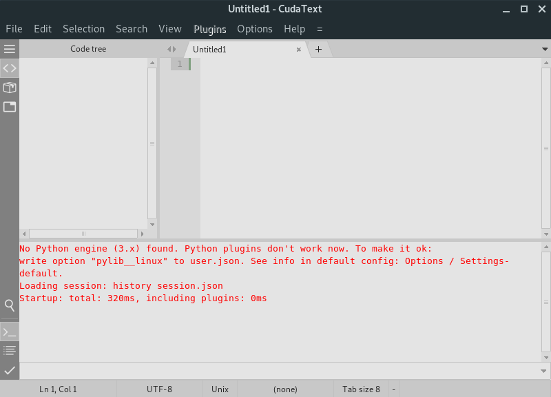
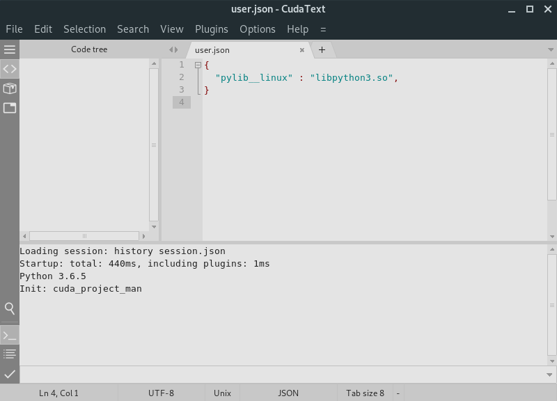
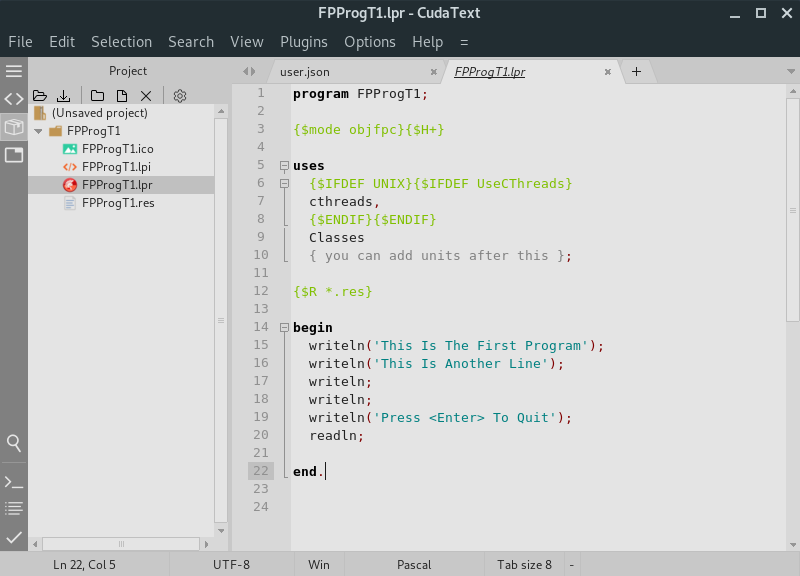
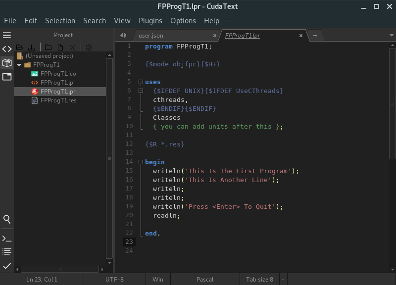
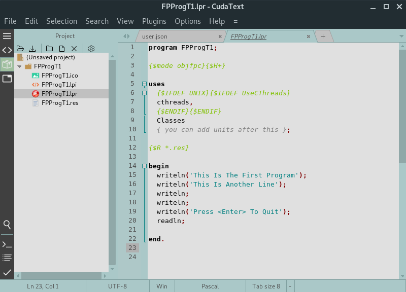
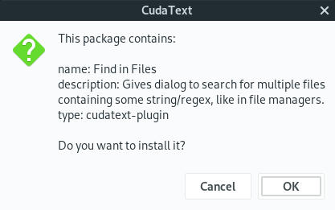

Care for a replacement of Sublime Text, but Open Source? We got you covered...!
<!-- more -->
  
By the way, congrats to LazPlanet for its 100th post! Congrats to you all readers for such a great community!  
  
  
Sublime Text is one of my favorites. It has many features that power users need. I love it so much, but I hate the fact that it is not open source. Well, guess what...? There is an alternative to Sublime Text, and it is [written in Lazarus](http://wiki.freepascal.org/CudaText)! And the best part is, it can use plugins from Sublime. Cool!  
  
If nothing else, I would request you to [visit CudaText homepage](http://www.uvviewsoft.com/cudatext/). When it comes to websites it is not one of the flashiest ones, but the features and animations present there are bound to impress at least many of us. I got a feeling that it will impress you for sure. Just take 2 minutes to see those animations, and you'll like it even more.  
  
If you are interested to use it in your text editing, let's dive in...  
  

### Installation

  
You can just download the files from here: [https://sourceforge.net/projects/cudatext/files/release/](https://sourceforge.net/projects/cudatext/files/release/)  
  
They have versions for Windows, Linux, Linux-arm (for Raspberry Pi etc.) Mac and BSD. Such a nice coverage!  
  
On Windows, you can just install with the setup file given. Python is preinstalled with the package.  
On linux/debian It is as easy as installing a deb file. You should be able to install it with a command:  

sudo dpkg -i "/path/to/cudatext.deb" && sudo apt-get -f install  

  
If you are not using debian (you don't have apt or dpkg), you may have to look into the tar.xz files, extract and run it directly from a directory, such as /opt or ~/bin. You can create a desktop file for it on /usr/share/local/applications or ~/.local/share/applications to show the shortcut on your Application menu. Such a .desktop file might be like this:  
  

\[Desktop Entry\]  
Name=CudaText  
GenericName=Text Editor  
Comment=Advanced code editor. Syntax highlighting for 190+ languages. Supports all major encoding. Multi-carets and multi-selections. Implemented many editing commands found in common text editors. UI with tabs and sidebar. Search and replace with regex.  
Exec=/usr/bin/cudatext %F  
Terminal=false  
Type=Application  
StartupNotify=true  
MimeType=text/plain;  
Categories=Utility;TextEditor;  
Icon=cudatext  
  

  
\* Make sure to change the Exec line above to match the directory where you installed it.  
  
Arch Linux also has a great way of installing CudaText. Just run:  

yaourt -S cudatext --noconfirm  

### Running and Tweaking it

  
If you are on linux, when you run it, you will probably get a screen like this:  
  

  
  
It might have an error saying:  

No Python engine (3.x) found. Python plugins don't work now. To make it ok:  
write option "pylib\_\_linux" to user.json. See info in default config: Options / Settings-default.  
Loading session: history session.json  
Startup: total: 320ms, including plugins: 0ms  

  
This happens only in Linux and is easy to fix.  
  
Just run:  

find /usr -name 'libpython3.\*so\*' 2>/dev/null  

  
You will get some output for where python library files are. I got an output like this on my system:  

/usr/lib/libpython3.so  
/usr/lib/libpython3.6m.so  
/usr/lib/libpython3.6m.so.1.0  

  
We would need that in a minute. Now go to **Options - Settings - user**. Now paste in this code:  

{  
  "pylib\_\_linux" : "libpython3.so",  
}  

  
Notice that I have used only filename and not path. If this filename does not work, try the above code with the filenames you get on your system. Save and Restart. The error should be gone.  
  

  
  
To make some space, you can click **View - Toggle Bottom Panel and View - Toggle Side Panel**.  
  
Then you can also click on the Project icon on the Sidebar to reveal the Project Manager, which you can use to open browse and view files within a folder.  
  
  

  
  
To spice up things a bit, you can choose an UI theme from **Options - Color Themes - UI**. If it prompts there is a Syntax theme with the same name, click OK.  
  
To get the same look as Sublime, you can choose ebony or sub. If you like the color of Atom, you should choose darkwolf or zeus. Although they are not exact, you can finetune it by mixing different Syntax themes with UI themes.  
  

  
  
I am a fan of the darker ones, but there are lighter themes if you feel like it.  
  

  
  
When using darker ones, I have changed the icon color of the Project Manager toolbar, by clicking the cog icon and choosing feather\_white\_16x16 and restarting CudaText.  
  
Also, I entered these in my **Options - Settings - user**:  

{  
  "pylib\_\_linux" : "libpython3.so",  
  "tab\_size" : 4,  
  "font\_name\_\_linux" : "DejaVu Sans Mono",  
  "font\_size\_\_linux" : 11,  
  "minimap\_show": true,  
  "minimap\_sel\_always": true,  
  "minimap\_sel\_border": false  
}  

  
This is some fonts, indentation and minimap stuff. You can find more settings in Options - Settings - default to find out more settings you can tweak. Just copy the entry to the user file and change the setting as you want.  
  

### Testing and Features

  
If you like the ctrl+p in Sublime or ctrl+shift+p in Atom, you can press F1 to bring in the Command Palette. This lists all the commands available in menus and such.  
  
You have very much everything that you need by default. Multi caret, Multi Selection, Snippets, Project Manager - everything I miss from Sublime.  
  
If I miss something dearly, I can install the sublime plugin for that thing.  
  

### Plugins

  
Which brings us to a great feature - _Sublime Plugins on CudaText_. To install such a plugin simply go to **Plugins - Addons Manager - Install**. Now you can type in some name of a plugin, for example, "find in files". Select your desired option and press enter. Within some seconds you will get a message if you are sure you want to install it.  
  

  
  
Click OK. Then it will install and show the summary in a dialog box. It may tell you to restart CudaText.  
  
When you right click on a folder on Project Manager - Selected Directory - Find in Directory it will find your text in that folder. Neat!  
  
  
Honestly, it is a very close alternative to Sublime. What is even better is to have a replacement made in Lazarus. If you need any further info or help, [visit this wiki page for CudaText](http://wiki.freepascal.org/CudaText).