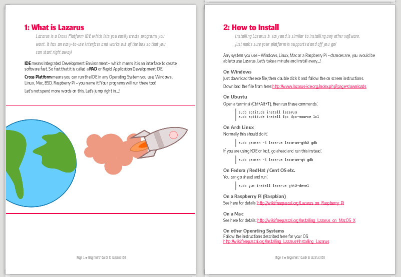
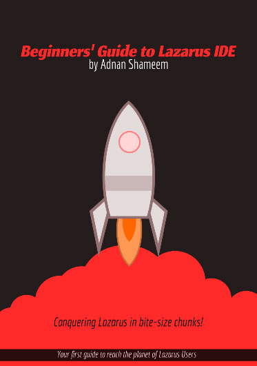

Many have the will to start learning Lazarus, but could not find an easy way to start. This e-book will give them the fuel to get started.
<!-- more -->

Happy Holidays! What a joyful time of the year to get an e-book!

I have written an e-book for beginners in Lazarus. This is great for people who want the very basics of programming and just wants to start somewhere. This free e-book is very short, concise and organized in such a way that anyone with a least effort can follow along, have fun and start coding in Lazarus.

The pages are colorful so that it is fun to read and engaging

### The chapters in the book

1: What is Lazarus?
2: How to Install
3: How to Create Your First Program
4: How to Position Stuff on a Form
5: How to Customize your
6: How to use Events
7: How to Save your Project
8: How to Extend Code with Custom Functions and Variables
9: Sharing Your Project
10: Compiling and Sharing Your Executable

The chapters are so short and so basic that anyone should be able to enjoy the journey towards the end.

Another great thing is that this e-book is totally open source, licensed as CC BY 4.0. You can get the source files for the book here: [https://github.com/adnan360/lazarus-beginners-guide](https://github.com/adnan360/lazarus-beginners-guide). Everything from fonts to graphics, you can edit everything and you can release your own version of the e-book if you want. You can use this in commercial purpose as well.

Since this is holiday season, sharing this as a virtual gift to your friends and close ones would be a great idea.

### Get it from here

[Download PDF](https://github.com/adnan360/lazarus-beginners-guide/releases/download/v1.0.0/lazarus-beginners-guide.pdf)

[Download in XHTML](https://github.com/adnan360/lazarus-beginners-guide/releases/download/v1.0.0/lazarus-beginners-guide.xhtml)
[Releases page](https://github.com/adnan360/lazarus-beginners-guide/releases) - will have any future releases

This is the first release of this book.

Good luck on your journey to LazPlanet!
