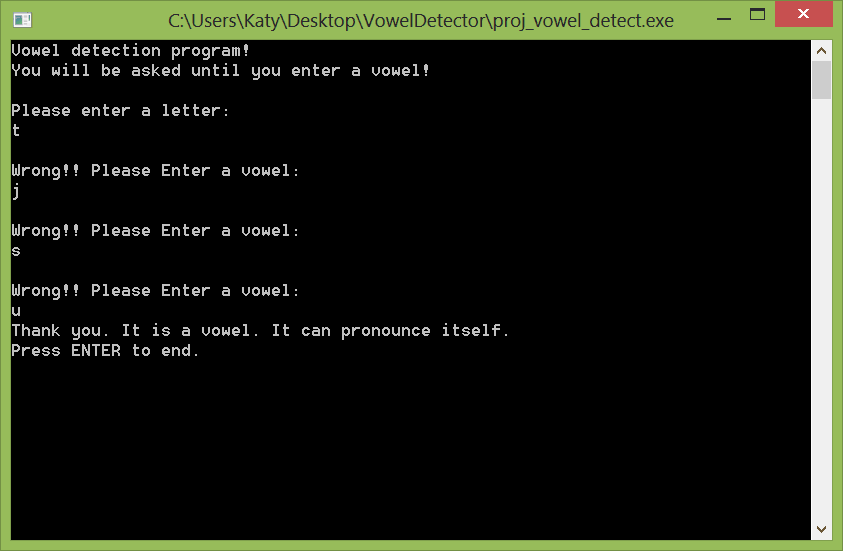

Have you tried finding anything in your life?! You sure did! But now we will let our program find/detect a vowel. User is asked to enter a letter until he enters a vowel. The user will be asked again and again when the user enters consonants. When the user enters a vowel, the program quits saying thanks.
<!-- more -->
  
  
This idea came to me while writing the FAQ page.  
  
Start Lazarus. Go to **Project -> New Project -> Program -> OK**. Then copy-paste the code below:  

### The Code

var  
  letter: char;  
  foundvowel: boolean = false;  
  
begin  
  
  WriteLn('Vowel detection program!');  
  WriteLn('You will be asked until you enter a vowel!');  
  WriteLn('');  
  WriteLn('Please enter a letter:');  
  ReadLn(letter);  
  letter:=lowercase(letter);  
  
  while foundvowel = false do  
  begin  
    case letter of  
       'a', 'e', 'i', 'o', 'u': foundvowel := True;  
       else foundvowel := False;  
    end;  
  
    if foundvowel = True then begin  
      WriteLn('Thank you. It is a vowel. It can pronounce itself.');  
      WriteLn('Press ENTER to end.');  
    end else begin  
      WriteLn('');  
      WriteLn('Wrong!! Please Enter a vowel:');  
      ReadLn(letter);  
      letter:=lowercase(letter);  
    end;  
  
  end;  
  
  ReadLn(); // we keep the console window from closing  
  
end.

  

### Run it!

Press F9 to compile and run the tiny little program.  
  

  
You will be asked to enter a letter. If you enter a consonant, it will ask again to enter a letter. Try different consonants first. You may enter lowercase or uppercase. That is why we used the lowercase() commands. (See below for explanation.) It will keep asking. When you enter any of the vowels (a, e, i, o, u)the program will thank you and end.  
  

### Explanation

We have a while...do loop. We know that while...do loop is good for repeating some task until something is found or some expression gets true. We loop our question asking until we have found a vowel.  
  
We have used lowercase letters in our case block.  
'a', 'e', 'i', 'o', 'u': foundvowel := True;  
So in this case when an user enters uppercase letter, like E, the case will not work. So we have converted the possible input E to a lowercase e by using the line below:  
letter := lowercase(letter);  
Now, e will become e and E will also become e. So our case will be able to catch the input.  
  

### Download Source Zip

Download the Source Zip from here: [http://db.tt/2yxbam0f](http://db.tt/2yxbam0f)  
  
Or here: [http://www.gdriveurl.com/?idl=613644094399&out=1](http://www.gdriveurl.com/?idl=613644094399&out=1)  
  
It includes executable (exe).  
  
Have fun with FreePascal/Lazarus!  
Written by Adnan Shameem  
Image: 123rf.com