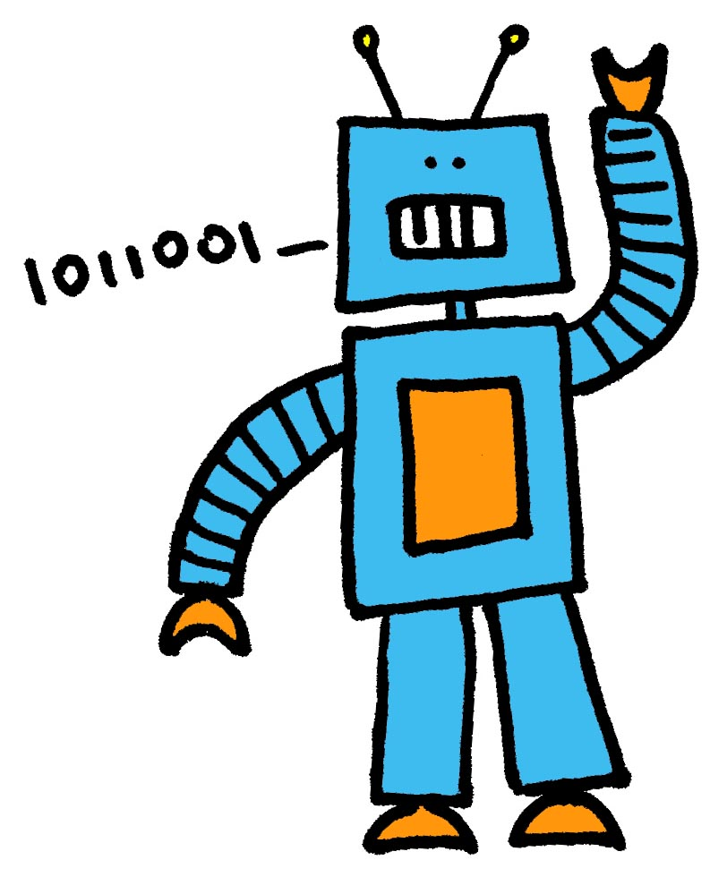

### Welcome to LazPlanet!

Laz Planet is devoted to providing you with [Lazarus](http://www.lazarus.freepascal.org/) source code examples and tutorials. The categories range from everything to simple file managers, image viewers to advanced system utilities.

  
  

Lazarus is a Delphi-like open source free IDE which uses [Free Pascal](http://en.wikipedia.org/wiki/Free_Pascal) as its language. (See [Wikipedia](http://en.wikipedia.org/wiki/Lazarus_%28IDE%29)) FreePascal (FPC) is known for its easy, readable syntax and its cross platform compatibility. With Lazarus you can design your forms graphically and compile the same code under Windows/Linux/Mac OS. Thus the slogan "Write Once, Compile Anywhere". It is like a VB6 with cross-platform compatibility.  
  
  

Once you learn how to use it, its super easy. And you also get the fun of programing. Plus, you don't need any dependency files/library for running the executables made with Lazarus. When you create a software with VB6 you need at least one dll file to run it (msvbvm60.dll). With VB.Net you need 300-400 mb Dot NET Framework to run your simplest of softwares! That's non sense. With Lazarus, you need no dll files to run the executables (unless you want to or need to). So if you want to design your forms graphically, Lazarus is the way to go.  
  
  

  

#### (This website is being constructed. So be patient.)