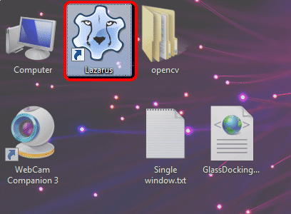
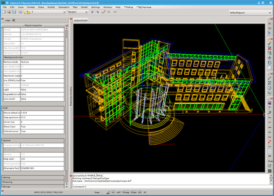
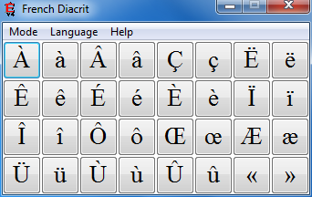
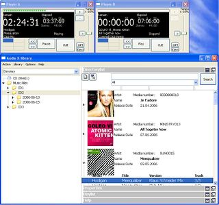

What is it with Lazarus? What Lazarus has and other IDEs don't? For beginners, is it a good option? For switchers, would it be difficult to switch from other IDEs/Languages? - Read on to get the answers...  
  
  
  
I recommend [Lazarus](http://www.lazarus.freepascal.org/) as an IDE. Well, it is quite obvious, because this website is named after it, right? No. But mainly because Lazrus is open source, cross-platform and free as a bird. It is smoothly runs on Windows, Linux, BSD, Mac OS and [many platforms](http://lazplanet.blogspot.com/2013/03/how-to-install-lazarus.html) and cuts gigantic cubes of butter like a hot knife! Lazarus supports so many platforms where almost _no IDE has gone before_.  
  
Lazarus allows you to graphically design your forms which is a delicacy to newbies through expert programers. Form designer makes it easier to create large scale (and small scale) softwares to be built with ease and peace of mind. Language is not religion. So new languages can be learned. Delphi and VisualBasic users will feel at home using Lazarus form designer and coding style. Delphi sources can be converted to Lazarus very easily and can be made cross-platform by tweaking the code a little bit.  
  

### IDE

  
I found Lazarus to be the best IDE for programing cross-platform component-rich softwares that run on Windows/MacOS/Linux. It has a form designer by which you can design your software graphically. It is Free and open-source software ([FOSS](http://en.wikipedia.org/wiki/Free_and_open-source_software)) and it uses FreePascal as the language which is also FOSS.  
  
  

### Lazarus in the Fish pond

  
Lazarus follows almost the same syntax, coding style, and interface of Delphi, a commercial IDE powered by Pascal. Delphi is known to be a friendly interface for developing software, so is Lazarus. Lazarus is also much similar with Visual basic (VB). If you are a VB user then you will be amazed how similar the coding process is. The form designer is quite similar to VB's. Lazarus has the ability to link the libraries statically, which means you don't need any dll files to go with your exe file. You don't even need any extra Framework to run it. (Pheww! No more mind boggling 300 mb install for a 500kb exe file! Psst... .NET Framework)  
  
If you ask, how capable is Lazarus, I will have to ask another question in return - do you know that Lazarus is made with Lazarus itself? Yes, it is true. Amazing isn't it? So obviously it is capable of doing what C++ / C / C# codes can do. ([See detailed Comparison](http://en.wikipedia.org/wiki/Comparison_of_Pascal_and_C))  
  

### Many uses

  
If you want to build Database applications then Lazarus is definitely a neat solution.  
  
There are also plenty of commercial and non-commercial softwares built  with Lazarus: [http://wiki.freepascal.org/Lazarus\_Application\_Gallery](http://wiki.freepascal.org/Lazarus_Application_Gallery) The page features softwares ranging from winzip alternatives to media players to games to accounting softwares to painting programs to almost anything. If you learn Lazarus in your computer, you can build your own applications for your own needs in minutes!  
  

  
  
So, [get started here](http://lazplanet.blogspot.com/p/getting-started.html) to use Lazarus with your programing life!