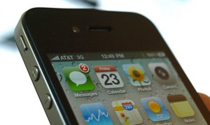
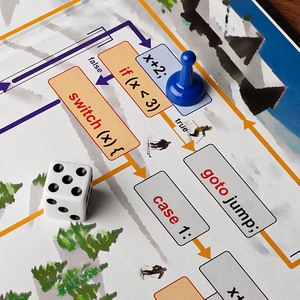

Programing is like a magic. Programmers are like wizards of future. With programing "you can ... sit down and make something completely new from scratch."-Mark Zuckerberg (Founder of Facebook) There are thousands more reasons why you should learn to code.
<!-- more -->

Computer is a dumb machine. It has power of millions of brain cells, complex circuits, amazing calculation power and yet it cannot do anything on its own. If you don't instruct it to do something, it would sit idle the whole day. It would be a complete waste of this marvelous power if we keep it idle. Computers need somebody to tell them what to do. That's why use Operating Systems and Softwares for listening to songs, drawing pictures and what not. Computers need instructions to operate. Instructing the computer with code is programing.

In other words, Programing "activates" the computer.

### Programing is all around us

We use Facebook. We share our status every now and then, message friends, like comments, create pages and groups. But have we ever imagined how Facebook is able to do all that? Programing of course. Facebook is remembering our passwords, our favorite music artists and it never gets scrambled. Stuff of Peter does not appear as Paul's and vice-versa. It is all done with programing.

Take any mobile device, let it be a 12 year old monochrome-screen Motorolla or a newer Samsung Galaxy or iPhone set, it has an operating system that has been built by programing. It has apps which obviously are also built with programing. If you see stock market scrolls, washing machine displays, car's GPS navigation system -- they all are the result of programing. If you play games like GTA, Need For Speed, Half Life, Pacman etc. then don't think they got created by themselves. They were created by Programers.

If you drive a car, you should learn how the car engine works, right? Similarly if you use computers, you should learn how to code, you know, for having a better grip of things.

### Play with it

What do you want it to do? You have processing power of nearly super computers sitting in your desktop. You can do anything with it if you learn programing. Do you want it to say "Hello World" to you, add 1 to 1000 numbers, convert Celsius to Ferenheit temperature, calculate distance between two places, draw a circle or a rectangle, record how much distance your mouse cursor has traveled during a day? It is all possible with a bit of programing knowledge.

You can create what you want. You can turn your imaginations into reality. You can learn magic!

### Being famous

Bill Gates, Mark Zuckerberg are famous. But why? Because they have delivered us the softwares that made our life easier. How did they do it? Programing. There are many names in the industry that are uttered everyday just because they code.

Is facebook that complex? Not too much, because there are other facebook clones in the web. But being creative is the key. Creativity can make you reach success.

### Showing off Creativity

Is Facebook, Youtube, Dropbox creative? According to me- yes. Mark Juckerberg, the founder of Facebook says:

> 
>
> "Programing is one of the only things in the world that you can do where you can sit down and make something completely new from scratch, ... whatever you want."

**You can start small.** You don't have to know everything about coding when you create your first code. Drew Houston is the founder of Dropbox. His first program was one that could calculate a person's age from his birth date. It is really simple. Anyone with a basic knowledge of any programing language can create that. But you when you start to improve that simple piece of code, add features, you will be amazed at your own creativity. For example, your age calculator may say "Your age is 19. Oh! And you were born on Wednesday!" The weekday part would be a surprise. 8-)

You can be a boss of your own computer. What you tell it, it would  do it.

### Be proud of yourself

You friends know how to _use_ a computer. But not all of them know how to _code_. Creating softwares and sharing with them and other people would make you feel proud of yourself.

It is like painting a picture like an artist and showing it to them. You will feel proud when they praise your software (or your art).

### Learn about how computer works

When learning computer programing you have to learn how the computer does something. For example, when we rename a file, we are actually creating a copy of the old file with the new name, and deleting the old. I cannot tell you how many times troubleshooting has been easier for me. I can understand and solve problems better than the others who don't code.

To conclude, see [this video](http://www.youtube.com/watch?v=dU1xS07N-FA):

**Ref:**
[https://www.youtube.com/watch?v=dU1xS07N-FA](https://www.youtube.com/watch?v=dU1xS07N-FA)
[http://www.code.org](http://www.code.org/)
[http://www.cprogramming.com/whyprogram.html](http://www.cprogramming.com/whyprogram.html)
