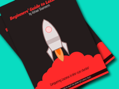
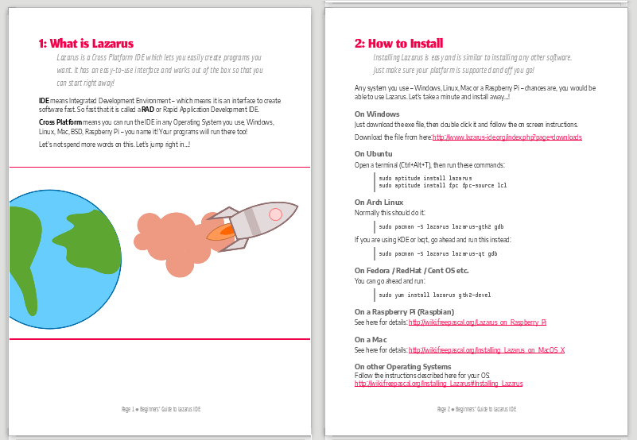
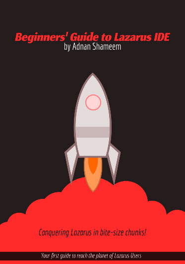

Many have the will to start learning Lazarus, but could not find an easy way to start. This e-book will give them the fuel to get started.

This is an e-book to get you started easily. Has colorful pages and short-concise text to make it fun to learn. It also sports helpful graphics so you don't have to think too hard!

This is great for people who want the very basics of programming and just wants to start somewhere. This free e-book is very short, concise and organized in such a way that anyone with a least effort can follow along, have fun and start coding in Lazarus.

If you already know Lazarus still it's a good read.
Also, you can share with someone who does not know Lazarus. It will be good for him.

### The chapters in the book

1: What is Lazarus?
2: How to Install
3: How to Create Your First Program
4: How to Position Stuff on a Form
5: How to Customize your
6: How to use Events
7: How to Save your Project
8: How to Extend Code with Custom Functions and Variables
9: Sharing Your Project
10: Compiling and Sharing Your Executable

The chapters are so short and so basic that anyone should be able to enjoy the journey towards the end.

### Cover

### Source is also Available to Tinker

Another great thing is that this e-book is totally open source, licensed as CC BY 4.0\. You can get the source files for the book here: [https://gitlab.com/adnan360/lazarus-beginners-guide](https://gitlab.com/adnan360/lazarus-beginners-guide). Everything from fonts to graphics, you can edit them and you can release your own version of the e-book if you want. You can use this in commercial purpose as well.

### Get it from here

**Free E-book: Beginners' Guide to Lazarus IDE**

[Download PDF](https://github.com/adnan360/lazarus-beginners-guide/releases/download/v1.0.0/lazarus-beginners-guide.pdf)
[Download in XHTML](https://github.com/adnan360/lazarus-beginners-guide/releases/download/v1.0.0/lazarus-beginners-guide.xhtml)
[Releases page](https://github.com/adnan360/lazarus-beginners-guide/releases) - will have any future releases, plus development versions

Good luck on your journey to LazPlanet!
