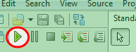
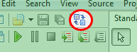
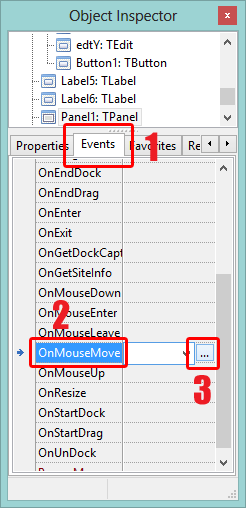

**:**

*   
*   Who is a Programer?
*   Why should I learn programing?
*   Can I really learn programing?
*   Is it necessary to ace in math?
*   Can I get a job for programing?
*   Where can I start?

**:**

*   What is an IDE?
*   What is Lazarus?
*   Why should we use Lazarus?
*   What does it mean by Cross-Platform?
*   What is a Compiler?
*   What is FreePascal or FPC?
*   What are the System Requirements of Lazarus?
*   How can I install Lazarus?
*   Are there any books, tutorials, learning materials available?

**:**

*   How can I create a new project?
*   How can I save a project?
*   How can I build/create an EXE?
*   Why are the EXE files so big? What can I do to reduce its size?
*   How can I change the icon of the EXE?
*   How can I change the EXE file name?
*   Do I need any DLL file(s) or Frameworks to be distributed with the EXE?
*   How do I switch to Form view and back to Source code?

**:**

*   How is the structure of a pascal unit like?
*   How do I use comments?
*   How do I declare/create variables?
*   How do I convert integer/number to a string/text?
*   How do I do something based on some condition/logic? (if...then...else)
*   How do I use case in Free Pascal?
*   How can I do something for n times? (for loop)
*   How can I repeat some task based on condition? (do...while)
*   How do I declare or write procedures?
*   How do I declare or write functions?
*   How can I use/include a library without rebuilding Lazarus?
*   How to format a double for decimal places?
*   How do I do something on some event?

**:**

*   Can I use Lazarus to build commercial applications?


<a id="h_genq"></a>
### 

#### 

Computers are stupid machines. It cannot do anything by itself. Somebody has to tell it what to do. This act of instructing the computer using a _computer language_ is called programing.

We cannot really use English or any other humane language to instruct computers, because computer has its own languages. Such languages are known as _Programing Languages_. Programing languages are designed in a manner that computers can easily analyze and understand. But the fact is, Computer Languages have evolved to be close to a humane languages. High-Level languages have been created to make that possible. These languages use dictionary words (or abbreviated form of dictionary words) which makes it easy to learn and program on a computer. Example of programing languages can be: C#, C++, C, PHP, Pascal, FORTRAN, Smalltalk, Java, BASIC, Python etc.

FreePascal is a High-Level programing language.

#### Who is a Programer?

You may know by now, a computer does not speak English! It understands programing languages. A programer is a person who knows how to instruct computers by writing in programing languages. He "is a person who writes computer software." [-[Wikipedia](http://en.wikipedia.org/wiki/Programmer)]

A Programer can be known as a Coder, Software Developer, Computer Programer. What a programer writes is known as Code.

Some of the famous programers are: [Bill Gates](http://en.wikipedia.org/wiki/Bill_Gates) (Microsoft), [Mark Zuckerberg](http://en.wikipedia.org/wiki/Mark_Zuckerberg) (Facebook), [Linus Torvalds](http://en.wikipedia.org/wiki/Linus_Torvalds) (Linux), [Larry Page](http://en.wikipedia.org/wiki/Larry_Page) and [Sergey Brin](http://en.wikipedia.org/wiki/Sergey_Brin) (Google), [Bjarne Stroustrup](http://en.wikipedia.org/wiki/Bjarne_Stroustrup) (C++), [Jack Dorsey](http://en.wikipedia.org/wiki/Jack_Dorsey) (Twitter) and so on.

#### Why should I learn programing?

These are some general reasons:

* You can play with computing power
* You have enormous computing power sitting at your desktop, the full power being almost not used
* You can practice your skills by creating something you want, when you want, where you want
* Your creation may do good for humanity, or ease lives (Wikipedia, Facebook, Dropbox, Youtube, Freerice.com are all made by programers)
* Computers can do anything for you - be a boss and control things
* Share an idea through implementation (as a practical example, rather than just theory)
* Be a hero to friends

There could be many other reasons. .

#### Can I really learn programing?

Yes. If you can type, or do word processing and have a good computer knowledge then you can learn to code. But it depends on the mindset of the learner that how much effort he has to put in to learning it.

#### Is it necessary to ace in math?

No. Not really. Not every software has complex mathematics involved. Some have a mild calculation involved and some others don't have any. If you know the basics of math, that is enough for starters. If you want to build complex mathematical softwares, well, you need complex mathematical knowledge. But in general, a common overview is enough.

But keep in mind that you have to know how to use what you know.

#### Can I get a job for programing?

Yes. And if you are lucky, you can also _create_ jobs. Bill Gates (founder of Microsoft), Mark Zuckerberg (founder of Facebook) are famous programers who earned millions and billions of dollars with programing skills and created thousands of jobs. Even third world countries are joining in with the programing jobs through outsourcing. Competition is harder for newbies, but for experienced programers, it is a much better scenario.

#### Where can I start?

You can start programing today, this minute, this moment. But do keep in mind that like any other things that you learn, programing can also get intimidating at times. When you first learned to ride a bicycle or baked a cake for the first time, it was intimidating. With repetition and practice now you don't feel the same. This is normal. When you learn to code and practice the codes, you will be able to think like a coder and produce codes at a greater pace and greater ease. I know I can, and nobody taught me programing in the first place. It is very easy, and gets easier like baking a cake, or riding a bicycle.

You can get started very easily. But here me through, to keep yourself in the game, you should:
- Learn new stuff when you get a chance
- Read example/sample codes and try to understand what is happening with each line (it makes code easier, trust me)
- Type them yourself, do not copy-paste
- Modify/update your code - take challenges! Create new codes to do similar but whole new different things!

.


<a id="h_basicq"></a>
### 

#### What is an IDE?

An IDE (or Integrated Development Environment) is software for creating softwares. It integrates with the programing language to allow you to write codes more easily and in less time. For example, in an IDE you may type only the first few letters of a command and the rest would be automatically suggested. It is known as _code auto complete_. It also handles the burden of creating and managing compiler settings, form layout files, embedded resource files, project files etc.

Examples of IDEs would be: MS Visual C++ (MSVC++), Qt Creator, Eclipse, NetBeans, Lazarus, Anjuta, Emacs, Code::Blocks, Visual Basic (VB) etc.

[Learn more on Wikipedia](http://en.wikipedia.org/wiki/Integrated_development_environment).

#### What is Lazarus?

Lazarus is an IDE for creating cross-platform softwares in a graphical interface. It is free and open-source. It uses FreePascal as its programing language, which is an Object Pascal dialect of Pascal. You can visually design your application forms through a form designer. It has many interactive components ready to be used in the form designer in an easy drag-and-drop interface. Components range from buttons, drop-down menus, image holders, check buttons, radio buttons, spinbuttons, calendar/date chooser, file open/save/print dialog and many more. These components are LCL which means they act the same on Windows/MacOS/Linux and so on.

Those who use the proprietory Delphi IDE, should note that Lazarus can be used as a Delphi alternative as well. It has a Delphi to Lazarus conversion feature. LCL is also similar to VCL of Delphi.

[Learn more on Wikipedia](http://en.wikipedia.org/wiki/Lazarus_(IDE)).

#### Why should we use Lazarus?

Because:

* Lazarus is cross-platform, runs on Windows/MacOS/Linux and more
* Easy to learn through the form designer's drag and drop interface
* Easy to learn the programing language FreePascal because of its humane nature
* No need for extra DLL files or huge Frameworks to run the generated EXEs
* Same software written with Lazarus can be (compiled and) run on Windows/MacOS/Linux and so on
* Creating software for Windows CE/Android is possible

.

#### What does it mean by Cross-Platform?

Cross platform means that something can be run on multiple platforms. For example VLC Media Player or Firefox is cross-platform. They can be run on Windows/MacOS/Linux Operating Systems.
[Learn more on Wikipedia](http://en.wikipedia.org/wiki/Cross-platform).

#### What is a Compiler?

A compiler is a program to convert source code to an excutable/object code/another language. Computer only knows [Machine code](http://en.wikipedia.org/wiki/Machine_code). So compilers do the hard work of converting the source code to Machine code so that they can be run on computers. To make machine code more easier to program, the programers invented the [Assembly language](http://en.wikipedia.org/wiki/Assembly_language). To make Assembly language more easier to use, programers created [High Level Languages](http://en.wikipedia.org/wiki/High-level_programming_language) which use dictionary words (or abbreviated form of dictionary words) that the human beings can understand better, and code easily. FreePascal is a High-Level language.

Computers have not changed the way it sees codes even in the 21st century! It still only understands Machine code. So a compiler is needed to convert your code to machine code or [bytecode](http://en.wikipedia.org/wiki/Bytecode). Then you can run/use the software. Learn more on [Wikipedia](http://en.wikipedia.org/wiki/Compiler).

#### What is Free Pascal Compiler or FPC?

FreePascal is a language which follow the "[Write once, compile anywhere](http://en.wikipedia.org/wiki/Write_once,_compile_anywhere)" philosophy. This philosophy is also shared by C, C++, Ada etc. It is supported in possibly every platform of today: Windows/MacOS/Linux/iOS/Android and [many more](http://en.wikipedia.org/wiki/Free_Pascal#Targets). (Note: Lazaus runs in a lot less platforms that FPC supports. But [they are plenty](http://wiki.freepascal.org/Installing_Lazarus) for development.)

FPC is the compiler which converts FreePascal source code to machine understandable code. Learn more on [Wikipedia](http://en.wikipedia.org/wiki/Free_Pascal).

#### What are the System Requirements of Lazarus?

Lazarus can run on minimal hardware. In a 500Mhz processor with 256 MB RAM. But the compiler might be slow.

Any modern day computer is enough to use lazarus. Recommended system requirements would be: 1Ghz or higher processor with 1GB or greater RAM. The operating system could be any one supported. Besides that you would need peripherals such as a keyboard to write codes and a mouse to interact with the interface.

Lazarus [can be run on Raspberry Pi](http://wiki.freepascal.org/Lazarus_on_Raspberry_Pi) as well (the credit card sized minimalistic hardware).

#### How can I install Lazarus?

Lazarus can be installed in various platforms. If you know how to install software you can [download](http://sourceforge.net/projects/lazarus/files/) and install Lazarus yourself. If you are not sure how to,  for a step by step installation guide (with screenshots).

#### Are there any books, tutorials, learning materials available?

Yes. There are loads of books, blogs, webpages, learning materials, reference manual listed here at the .


<a id="h_commq"></a>
### 

#### How can I create a new project?

It is easy. Go to **Project -> New project**.
(A) Click "**Application**" from the list for Graphical interface application with form designer.
(B) If you like to build a Console application without form designer then select "**Program**". _(There is an item named "Console Application", but it is another thing. Use the "Program" item for simple command line code writing.)_ Then click ok.

If you run Lazarus for the first time (after installation), you will see a blank Graphical "Application" project already created for you. You can either start developing right away or create a new project anyway.

#### How can I save a project?

When you create and modify a project, you would want to keep it for future use. In that case:

*   Go to **File -> Save all...**
*   First the project's main file would be up for saving. It is better to change the default "project1.lpi" filename to something more identifyable, such as "proj_hello.lpi". Name that file that you can know what the project is about from the filename.
*   Then the form's source code unit would be up. Change "unit1.pas" to something more understandable, such as "frm_main.pas". _(Program projects don't have .pas file to save, unless you create any.)_

Once you saved all the files, you may use **Ctrl+S** for saving later changes.

Note: The filenames can only contain a-z, A-Z and 0-9 and _ (underscore), not - (hyphen/minus) or spaces in the name. It is better to keep the filenames in lowercase.

#### How can I build/create an EXE?

When you are happy with your created software, you can distribute it as an .exe (or any other executable format) file. All you need to do is Press **F9** or go to **Run -> Run** or Click the green play button in the toolbar.



You will see the software running. If you only want to build and exe and not run, then Press **Shift+F9** or click **Run -> Build**.

#### Why are the EXE files so big? What can I do to reduce its size?

 on how to reduce the EXE file size to 1.3 MB or even below to 700 KB. _(Please do remember that this size is for a simple form application. The more libraries, codes and components you use the greater the exe file size may become.)_

#### How can I change the icon of the EXE?

Go to **Project -> Project Options**. Click **Load icon** button and open an icon. Click **OK**. Then **Build** (Shift+F9) or **Run** (F9) the project.

#### How can I change the EXE file name?

Go to **Project -> Project options -> Compiler options -> Paths**. You will find a text box named "**Target file name (-o)**". Type the desired exe file name (without .exe extension). Click **OK**.

#### Do I need any DLL file(s) or Frameworks to be distributed with the EXE?

No. Unless you explicitly link dynamic libraries (.dll on windows, .so on linux), you do not need to distribute any dll files or framework with your exe file. Only the EXE file is necessary. But do keep in mind that if you load any file(s) with your codes (for example, you may load a .jpg image file from the project directory) then you will have to distribute the file(s) with your EXE.

#### How do I switch to Form view and back to Source code?

Its easy. Press F12\. It will toggle the form view/designer. There is also a toolbar button:




<a id="h_progq"></a>
### 

#### How is the structure of a pascal unit like?

Both pascal unit and program unit have the same file extension: **.pas**. How can we differentiate them? The simple technique is to look in the first line the words `program` or `unit`. So obvious, isn't it?

A pascal `program` file is the main file which is run. Further `units` can be included in the main program file.

A program has a main part where the commands rest. This part begins with, simply `begin` and ends with `end.` (not `end;` with the semi-colon for if, while, for code blocks. `end.` with a full stop or period.) The `end.` with the full stop or period means the end of the `.pas` file.

```pascal
program myprog99

uses ...;

begin

  // main body

end.
```


Any variables, constants, types, procedures, functions should be declared before they can be used (before `begin`).

A pascal unit file has the same rules, except these few:
- `unit` instead of `program`
- `implementation` instead of `begin`
- `function`/`procedure` declaration before `implementation` and full body afterwards

When you include an unit in the main program, all the variables, constants, types, procedures, functions get as if "copy-pasted" before the main program's `begin` clause.

A simple unit structure is given below:

```pascal
program myprog99

uses ...;
 begin
  // main body
end.
```

Now we look at both the structures more elaborately:

```pascal
unit my_unit;

interface

uses
  my_unit1, my_unit2;

const
  // any constants here

type
  // any type block here

var
  // variables declared here is usable throughout the unit

// procedure or function declaration
implementation

  // procedure or function full body

end.
```

A pascal `program` file structure is like the following:

```pascal
program my_program;
uses
  my_unit3, my_unit4;
var
// variable for use throughout the unit
// procedures full body
// functions full body
begin

  // main program code

end.
```

You can "include" any **unit**'s name (not file name) in the `uses` clause to include procedures, functions, variables etc. containing in that unit. The unit names are separated by comma (`,`) and the clause is ended with a semi-colon (`;`).

_Further Reading:_
[http://wiki.freepascal.org/Program_Structure](http://wiki.freepascal.org/Program_Structure)
[http://en.wikibooks.org/wiki/Pascal_Programming/Syntax_and_functions](http://en.wikibooks.org/wiki/Pascal_Programming/Syntax_and_functions)
[http://free-pascal-general.1045716.n5.nabble.com/Sample-unit-code-td2822456.html](http://free-pascal-general.1045716.n5.nabble.com/Sample-unit-code-td2822456.html)

#### How do I use comments?

You can use two slashes one after another to comment a line.

```pascal
// single line comment
```

You can use Third brackets {} for a comment stream:

```pascal
{ This is a multiline comment
which is long... }
```

Details: [http://wiki.freepascal.org/Program_Structure](http://wiki.freepascal.org/Program_Structure)

#### How do I declare/create variables?

Simple.

```pascal
var
  my_variable_name: variable_type;
```

or

```pascal
var
  my_variable_name: variable_type = initial_value;
```

**Some common variable types are:**

* `integer` (for storing numbers from -32768 to 32767)
* `real` (number having a range from 3.4x10<sup>-38</sup> to 3.4x10<sup>38</sup>)
* `boolean` (true or false)
* `string` (storing text- text should be enclosed in single quotes ['example text'])
* `char` (single character- should be enclosed in single quotes)

More [information about variable types can be found here](http://wiki.freepascal.org/Variables_and_Data_Types).

But first you will have to decide that where do you want your variable to be usable. You can either use your variable in the whole unit or in a procedure/function.

For using the variable throughout the unit, declare it at the top, under the first occurrence of `var`.

For using the variable only inside a procedure or function type in `var` before the begin phrase and then declare your variable. You need to type `var` only once and not for every variable.

For example:

```pascal
var
  number1: integer;
  number2: integer;
  sometext: string;
```

You can also declare multiple variables of the same type in one line:

```pascal
var
  number1, number2: integer;
  firstname, lastname: string;
```

Here, both `number1` and `number2` are declared as `integer`s.

You can also assign initial value to the variables:

```pascal
var
  myname: string = 'John Doe';
```

You have to use single quotes ( `'...'` ) when entering string text.

**Important note for creation of class variables:**
Please note that unit variables are freed when the unit finishes execution and procedure variables are freed when the procedure finishes its work. But when you create a class and assign it to a variable, you need to free that variable after you are finished working with it. (With `variable_name.free;`)

#### How do I convert integer/number to a string/text?

```pascal
procedure TForm1.FormCreate(Sender: TObject);
var num: Integer;
begin
  num := StrToInt('2');
  num := num + 2;
  Caption := IntToStr(num);
end;
```

`IntToStr` converts integer to string.
`StrToInt` converts string to integer.

#### How do I do something based on some condition/logic? (if...then...else)

What if the world ends tomorrow? I don't know about that, but you can use code to take decision based on some condition or situation. For example, you have got the age of the user. Now you want to show a message based on the age, if he is teenager or not. How can you do that? Through `if...then...else` statement.

Here is an example. Create a new project (**Project->New Project->Program->OK**). Paste the code below the uses clause:

```pascal
var
  myage: integer;
begin
  WriteLn('Please enter your age');
  ReadLn(myage); // we get user input for age

  if (myage >= 13) and (myage <= 19) then
    WriteLn('You are a teenager.')
  else
    WriteLn('You are not a teenager.');

  ReadLn(); // we keep the console window from closing
```

Run it (**F9** or **Run->Run**). Enter an age and you will see that it can take decision based on the input you enter. This is achieved with if statement.

The Syntax (or format) is:

```pascal
if condition then
  // do something
```

If you have more than two commands then use a `begin ... end` block:

```pascal
if condition then
begin

  // do something
  // do another thing

end;
```

If you have two conditions/situations:

```pascal
if condition then
begin

  // do something
  // do another thing

end
else
begin

  // do something
  // do another thing

end;
```

**Simple if statement:** You can skip the begin and end; part if you only have one line of code under each condition (see the above teenage program example). If this is the case, put the semi-colon at the end of the whole `if...then...else` statement, and not anywhere inside the whole `if...then...else` statement.

There are several Relational Operators to define logic/expression:

* `<`  : less than
* `>`  : greater than
* `=`  : equal to
* `<=` : less than or equal to
* `>=` : greater than or equal to
* `<>` : not equal to

There are also Boolean Operators for defining multiple logic/expressions:

* `not` : negation (~)
* `and` : conjunction (^)
* `or`  : disjunction (v)
* `xor` : exclusive-or

For example:

```pascal
if (age >= 18) and (male = true) then
  // do something with the 18+ year old men!
```

Note: The brackets are a must when using more than one expressions. However, they are optional for single expression.

Read more here:
[http://wiki.freepascal.org/IF](http://wiki.freepascal.org/IF)
[http://wiki.freepascal.org/Else](http://wiki.freepascal.org/Else)
[http://wiki.freepascal.org/Boolean_Expressions](http://wiki.freepascal.org/Boolean_Expressions)

#### How do I use case in Free Pascal?

An example of case is as follows:

```pascal
case place of
   1: ShowMessage('Gold medal');
   2: ShowMessage('Silver medal');
   3: ShowMessage('Bronze medal');
   else ShowMessage('Better luck next time');
end;
```

Is it also possible to use range:

```pascal
function WhatIsChar( c:char ):string;
 var
   s : string;
 begin
   s := '';
   case c of
     '0' .. '9' : s := 'digit (0-9)';
     'a' .. 'z' : s := 'lowercase letter (a-z)';
     'A' .. 'Z' : s := 'uppercase letter (A-Z)';
     '+' , '-'  : s := 'sign (+ or -)';
   end;
   result := s;
 end;
```

[Here is a wiki with more details and examples](http://wiki.freepascal.org/Case).

#### How can I do something for n times? (for loop)

```pascal
var
  i: integer;

begin
  for i := 1 to 10 do
  begin

    WriteLn('This is number ' + i);

  end;
end;
```

The above script/code runs the `WriteLn()` code 10 times (starting from `1` to `10`). For every loop value of `i` gets increased by `1`.

We can also run it backwards by using `downto` instead of `to`. We would have to modify the line like this:

```pascal
for i := 10 downto 1 do
  ...
```

[For info and examples look here](http://wiki.freepascal.org/for-in_loop).

#### How can I repeat some task based on condition? (while...do)

It is simple.

```pascal
while BooleanExpression do
  something();
```

The loop is run until the `BooleanExpression` is `true`. When it becomes `false`, it no longer executes the command. It is better for finding anything until it is found.

Here is a fun example:

```pascal
var

  yr: integer;
  leapyear: boolean = false;

begin

  WriteLn('Leap year detection program!');
  WriteLn('You will be asked until you enter a leap year!');
  WriteLn('');
  WriteLn('Please enter a leap year:');
  ReadLn(yr);

  while leapyear=false do
  begin
    if (yr mod 4) = 0 then begin
      leapyear:=true; // the while loop will not run next time
      WriteLn('Thank you, it is a leap year. The February of this year is of 29 days.');
      WriteLn('Press ENTER to end.');
    end else begin
      WriteLn('');
      WriteLn('Wrong!! Please enter a leap year:');
      ReadLn(yr);
    end;
  end;

  ReadLn(); // we hold the console window

end.
```

The program will ask you for a year until you enter a leap year. It will keep asking you to enter a year until it finds a leap year. Try these years: 2013, 2014, 2015, 2016.

Take a challenge! Write a code that will keep asking for a vowel until a vowel has been entered. (Hint: You can store the input in a `char` and create a variable named `foundvowel`.)

#### How do I declare or write procedures?

Procedure is a routine. Routine is a collection of code that is separated from the main program. Procedures do not return any value.

```pascal
procedure aboutme();
begin
  WriteLn('This software is made by Mr. X');
end;
```

It allows flexibility in the program. As the same procedure can be run throughout whole program, changing the procedure would be enough for an adoption of new code. (For example, the program may be bought by a company and Mr. X can be replaced by X Company by only changing the code in the procedure.)

Procedure can take inputs. In that case we would include them inside the brackets () after the procedure name and separate them with a semi-colon (`;`):

```pascal
procedure PrintNameAge(name:string; age:integer);
begin

  WriteLn('My name is ', name, ' and age is ', age);

end;
```

Variables can be directly modified by using the term "`var`" before any variable name:

```pascal
procedure IncreaseByTwo(var i: integer);
begin

  i := i + 2;

end;
```

When using a procedure in graphical "Application" add the form class name (usually `TForm1`). Add the procedure after the `implementation` and "`{$R *.lfm}`" line:

```pascal
procedure TForm1.IncreaseByTwo(var i: integer);
begin

  i := i + 2;

end;
```

Put your cursor between the name of the procedure. Then press **Ctrl+Shift+C**. That will add the declaration inside the `TForm1` class.

For details [see this page](http://wiki.freepascal.org/Procedure).

#### How do I declare or write functions?

Functions are quite similar to procedures, with a difference that it can return a value.

```pascal
function AddNumbers(num1:integer; num2:integer) : integer;
begin
  Result := num1+num2;

end;
```

The above function adds `num1` and `num2` and returns the sum of two numbers as integer. `Result` is the variable which will be returned.

[More on this subject here](http://wiki.freepascal.org/Functions).

#### How can I use/include a library without rebuilding Lazarus?

Get where the library files are.  You may store them on a single folder for convenience.
Open the desired project. Go to Project->Project Settings->Compiler Options->Paths. In the "Other unit files (-Fu)" type the relative path to the library.
In the uses clause, add the library's unit name.

[See here](http://wiki.freepascal.org/BGRABitmap_tutorial_1#By_adding_BGRABitmap_units_to_the_search_path) how BGRA Bitmap Library has been installed.

#### How to format a double for decimal places?

```pascal
var
  mydouble: double = 12.3456789;
begin
  WriteLn(mydouble:1:2);
  ReadLn;
```

The syntax (or "format") is: `(double_variable):(space):(decimal place)`
[Details](http://online-judge.uva.es/board/viewtopic.php?f=15&t=6971).

#### How do I do something on some event?

Its easy. If you want something quick you can double click the component. It depends on the component that what event would come by default. For example, if you double click a **TButton** then you will see **OnClick** event, if you double click a **TEdit** then you will see an **OnChange** event.

Or... if you want some specific event then go to **Events** tab in the **Object Inspector** then click on the **[...]** button on the right. The image below shows you a **OnMouseMove** event example:




<a id="h_otherq"></a>
### 

#### Can I use Lazarus to build commercial applications?

Yes. [Details here](http://wiki.freepascal.org/Lazarus_Faq#Can_I_make_commercial_applications_with_Lazarus.3F).


**Reference:**
http://www.cprograming.com
http://wiki.freepascal.org
