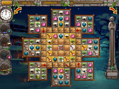
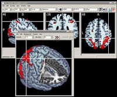
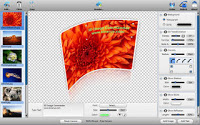
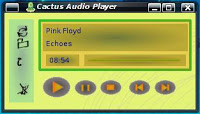
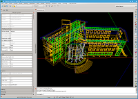

Do you want to get started with programing on Lazarus? You are at the right place. Just follow this article and get started with programing in 10 minutes!

You can check out our , if you haven't got the answers you wanted.

### Why learn programing/coding?

Computers are like your employees. It does what you say it to do. And programing is a fun way to command the computers. Suddenly you may find it necessary for calculating someone's age from birthdate, finding the pictures that are larger than 1mb size and compress them into a .zip file or creating your own web browser or adding up numbers from 1 to 100, there are almost limitless possibilities of what you can do when you learn programing. If you are a computer science student, then you can design and test your algorithms in Lazarus and share it with your friends or whomever.

*   Have fun commanding the computer
*   Do almost anything you want with the sheer power that your computer possess
*   Show creativity
*   Create something new yourself
*   Surprise friends
*   Automate your daily tasks
*   Make computer do all the calculations
*   Learn how computers work (memory, storage etc.)
*   Get jobs
*   Get famous like Bill Gates, Mark Zuckerberg...

"In sum, programming lets you work with your mind to free yourself to create things that are interesting or useful instead of being limited by the confines of what others have done before, and even when using those other things, you'll find that you can better appreciate and understand them." ([source](https://www.cprogramming.com/whyprogram.html))

You can check out an article: 

### What is Lazarus IDE and why do we need it?

An IDE makes coding easier. An IDE (or Integrated Development Environment) is a software which let's you focus on your software rather than creating hundreds of files with common codes, fiddling with compiler paths/options, positioning your components on a form pixel by pixel etc. If you don't remember all the function names letter by letter, you can use code completion of the IDE to code easier and faster. An IDE takes care of many repetitive tasks that a programers would be required to do.

Lazarus is a slim-trim IDE which is Free and Open-source (FOSS). This free-as-a-bird IDE supports easy form designer which comes with so many components already prepared for designing modern user interfaces (Spin buttons, open/save/print dialogs, charts/graphs, date/file/directory chooser and hundreds more). It runs on Windows/MacOS/Linux/BSD and others such as credit card sized [Raspberry Pi](https://en.wikipedia.org/wiki/Raspberry_Pi)! Lazarus proudly supports Windows API, Windows CE API, GDI, GTK+, Qt, Carbon (Mac), Cocoa (Mac), fpGUI widget sets.

See many softwares created with Lazarus/FreePascal [here](https://wiki.freepascal.org/Lazarus_Application_Gallery) or [here](https://en.wikipedia.org/wiki/Free_Pascal#Software_produced_with_Free_Pascal) or [here](https://en.wikipedia.org/wiki/Lazarus_%28IDE%29#Applications_produced_with_Lazarus). There are compression utilities, accounting softwares, media players, DVD utilities, 3D/2D image viewers, desktop utilities, games, painting softwares, research softwares, wifi application, notes manager, backup tool, alerm software, medical image visualization, wireless order application for mini bar and many more created with Lazarus/FreePascal.

So  The reasons in a nutshell are given below:

*   [Lazarus](https://en.wikipedia.org/wiki/Lazarus_(IDE)) is a Powerful, Modern IDE supporting Rapid Application Development (Form Designer, Code completion etc.)
*   Easier to build applications with graphical components (which require less coding)
*   Wide range of components ready to be used with your code! (File open/save dialogs, spin buttons, calendar component, directory/file select box and many more) 8-)
*   You can design most of the application graphically (e.g.design form resize scenario with no codes!)
*   No extra dlls or Frameworks necessary (so, small size exe/installation; usually less than 1mb)
*   Easier to build Database applications (requires less code and with less stupidity)
*   Easier to adopt for Delphi/VB users
*   Many Third-party libraries to extend the functionality of Lazarus
*   Uses Powerful [FreePascal](https://en.wikipedia.org/wiki/Free_Pascal) Language which can compete with C++/C#/C
*   Humanly readable codes (using words as "begin" "end" "array...of" "if...then")
*   [Lazarus Forums](https://www.lazarus.freepascal.org/index.php?action=forum)/[mailing list](http://lists.lazarus.freepascal.org/mailman/listinfo)/and other help over the internet
*   Same code runs on different platforms (thanks to [LCL](https://en.wikipedia.org/wiki/Lazarus_%28IDE%29#Lazarus_Component_Library))
*   Free and Open source
*   Regular releases (new releases every 2-3 months)
*   Supports UTF-8/Unicode
*   Possible to [build android applications](https://wiki.freepascal.org/Custom_Drawn_Interface/Android)
*   Takes 10 minutes to get the basics! (read on...)

So why not! Try your programing skills with one of the leading IDEs of the programing world!

Suddenly you need a software, you can build it yourself in Lazarus!

### Download Lazarus and Install

#### Download Lazarus (for Windows 32bit) from here: [https://sourceforge.net/projects/lazarus/files/latest/download](https://sourceforge.net/projects/lazarus/files/latest/download)

For others: [https://sourceforge.net/projects/lazarus/files/](https://sourceforge.net/projects/lazarus/files/)

If you know how to install softwares, you can install it yourself. But if you need a detailed instruction or want to install in MacOS or Linux, you can see .

Take your time to install, and then come back here to continue your Getting Started with Lazarus.

### Coding for the first time with Lazarus

You can look here for a great 10 minute [Getting Started Tutorial and an interface tour](https://wiki.freepascal.org/Lazarus_Tutorial) as well.

(TODO: Create our own 10-minute getting started tutorial.)

**Ref:**
[https://www.cprogramming.com/whyprogram.html](https://www.cprogramming.com/whyprogram.html)
